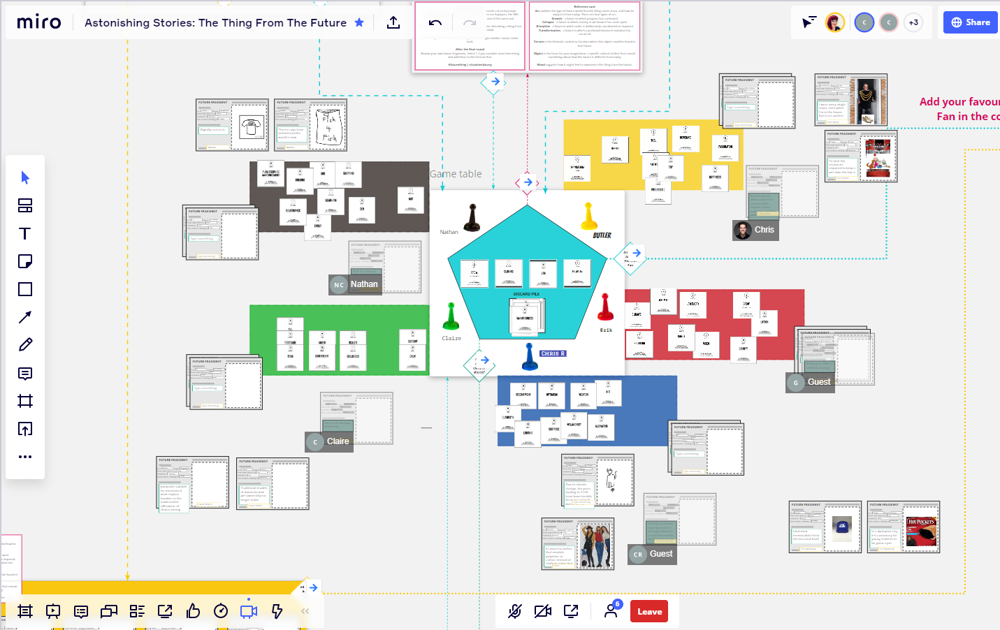

> Check out @vaughn_tan's new newsletter, "#35: Patterning, herding, programming". https://uncertaintymindset.substack.com/p/35-patterning-herding-programming

 [Wed Jul 01 14:04:15 +0000 2020](https://twitter.com/yak_collective/status/1278328569144446976)

----

> Check out @tomcritchlow's new post, "Quotebacks for Firefox is here!". http://tomcritchlow.com/2020/07/02/quotebacks-firefox/

 [Thu Jul 02 01:54:11 +0000 2020](https://twitter.com/yak_collective/status/1278507228912324611)

----

> Event coming up on Yak Collective discord in &lt; 15 minutes! Yak Collective: Reza Negarestani's Intelligence &amp; Spirit, Jul 01, 2020 08:00PM. Get invite link here: http://zpr.io/t47UH

 [Thu Jul 02 02:56:44 +0000 2020](https://twitter.com/yak_collective/status/1278522969296384003)

----

> Check out @anthilemoon's new post, "Inner child and inner critic: a battle for creativity". https://nesslabs.com/inner-child-and-inner-critic?utm_source=rss&utm_medium=rss&utm_campaign=inner-child-and-inner-critic

 [Thu Jul 02 15:26:01 +0000 2020](https://twitter.com/yak_collective/status/1278711535079211009)

----

> In 20 minutes, @alexdw5 and @hewhocutsdown host the #YakNewbie Q&amp;A Chat on on the Yak Discord channel.
> 
> If you'd like to attend, become a Yak via the link:
> 
> https://www.yakcollective.org/join

 [Thu Jul 02 15:40:44 +0000 2020](https://twitter.com/yak_collective/status/1278715235738804230)

----

> Event coming up on Yak Collective discord in &lt; 15 minutes! New Yak Q&amp;A – Hosted by Alex Wagner and Jordan Peacock, Jul 02, 2020 09:00AM. Get invite link here: http://zpr.io/t47UH

 [Thu Jul 02 15:48:10 +0000 2020](https://twitter.com/yak_collective/status/1278717107161772032)

----

> Check out @anthilemoon's new post, "Quote the web with Quotebacks". https://nesslabs.com/quotebacks?utm_source=rss&utm_medium=rss&utm_campaign=quotebacks

 [Thu Jul 02 16:26:20 +0000 2020](https://twitter.com/yak_collective/status/1278726712382144512)

----

> Event coming up on Yak Collective discord in &lt; 15 minutes! Online governance study group hosted by vgr, Jul 03, 2020 09:00AM. Get invite link here: http://zpr.io/t47UH

 [Fri Jul 03 15:50:58 +0000 2020](https://twitter.com/yak_collective/status/1279080198542102530)

----

> Check out the latest edition of the Yak Talk newsletter, "Yaks Do Innovation Consulting". https://yakcollective.substack.com/p/yaks-do-innovation-consulting

 [Fri Jul 03 18:31:23 +0000 2020](https://twitter.com/yak_collective/status/1279120568403582976)

----

> Check out the latest edition of the Yak Talk newsletter, "Reminder: Call for Project Contributors for Yak Project Proposals". https://yakcollective.substack.com/p/reminder-call-for-project-contributors

 [Fri Jul 03 19:31:09 +0000 2020](https://twitter.com/yak_collective/status/1279135611560120320)

----

> Check out @vgr's new newsletter, "After Westphalia: Introduction". https://breakingsmart.substack.com/p/after-westphalia-introduction

 [Sat Jul 04 03:46:10 +0000 2020](https://twitter.com/yak_collective/status/1279260186855825410)

----

> Event coming up on Yak Collective discord in &lt; 15 minutes! #infrastructure chat with Darren, Jul 04, 2020 10:30AM. Get invite link here: http://zpr.io/t47UH

 [Sat Jul 04 17:22:29 +0000 2020](https://twitter.com/yak_collective/status/1279465620610912256)

----

> Event coming up on Yak Collective discord in &lt; 15 minutes! Yak Innovation: Round 2 Planning Meeting, Jul 05, 2020 11:30AM. Get invite link here: http://zpr.io/t47UH

 [Sun Jul 05 18:19:06 +0000 2020](https://twitter.com/yak_collective/status/1279842256141332486)

----

> Event coming up on Yak Collective discord in &lt; 15 minutes! Yak Chat led by Pamela Hobart, Jul 05, 2020 02:00PM. Get invite link here: http://zpr.io/t47UH

 [Sun Jul 05 20:50:28 +0000 2020](https://twitter.com/yak_collective/status/1279880347073818624)

----

> Check out @anthilemoon's new post, "50 lessons I learned from writing 50 newsletters". https://nesslabs.com/50-lessons-50-newsletters?utm_source=rss&utm_medium=rss&utm_campaign=50-lessons-50-newsletters

 [Sun Jul 05 22:26:18 +0000 2020](https://twitter.com/yak_collective/status/1279904463042613251)

----

> Check out @freeshreeda's new newsletter, "Internet Writer Workflows". https://shreeda.substack.com/p/internet-writer-workflows

 [Mon Jul 06 15:35:10 +0000 2020](https://twitter.com/yak_collective/status/1280163387205443584)

----

> Event coming up on Yak Collective discord in &lt; 15 minutes! Yak chat hosted by Sachin Benny, Jul 06, 2020 04:00PM. Get invite link here: http://zpr.io/t47UH

 [Mon Jul 06 22:49:44 +0000 2020](https://twitter.com/yak_collective/status/1280272750154846210)

----

> What projects should the Yak Collective work on over the next year? (we’ve completed 2, with 4 more in flight, see link) https://www.yakcollective.org/projects/

 [Wed Jul 08 01:06:41 +0000 2020](https://twitter.com/yak_collective/status/1280669600137441280)

----

> RT @jfairbairn: @yak_collective Climate - transitioning the normies

 [Wed Jul 08 01:13:07 +0000 2020](https://twitter.com/yak_collective/status/1280671220594180096)

----

> Event coming up on Yak Collective discord in &lt; 15 minutes! YAK CHAT: BUILD A RIGHT BRAIN / NATURE THEATRE, Jul 07, 2020 06:30PM. Get invite link here: http://zpr.io/t47UH

 [Wed Jul 08 01:25:19 +0000 2020](https://twitter.com/yak_collective/status/1280674290841653248)

----

> Check out @antlerboy's new post, "The Force in organisational life and becoming a Jedi — The Beginning". https://medium.com/@antlerboy/the-force-in-organisational-life-and-becoming-a-jedi-the-beginning-808805c1f672?source=rss-97852f5a56ae------2

 [Wed Jul 08 08:07:11 +0000 2020](https://twitter.com/yak_collective/status/1280775422624571394)

----

> Check out @vaughn_tan's new newsletter, "#36: Ready for the unexpected". https://uncertaintymindset.substack.com/p/36-ready-for-the-unexpected

 [Wed Jul 08 13:04:24 +0000 2020](https://twitter.com/yak_collective/status/1280850221875036160)

----

> Check out @tomcritchlow's new post, "Setting up a Discord Room for my Blog". http://tomcritchlow.com/2020/07/08/discord/

 [Wed Jul 08 19:54:25 +0000 2020](https://twitter.com/yak_collective/status/1280953406140690440)

----

> Check out @anthilemoon's new post, "Managing risk with the NASA Risk Matrix". https://nesslabs.com/nasa-risk-matrix?utm_source=rss&utm_medium=rss&utm_campaign=nasa-risk-matrix

 [Thu Jul 09 11:26:22 +0000 2020](https://twitter.com/yak_collective/status/1281187940383801350)

----

> Check out @anthilemoon's new post, "Fail like a scientist". https://nesslabs.com/fail-like-a-scientist?utm_source=rss&utm_medium=rss&utm_campaign=fail-like-a-scientist

 [Thu Jul 09 13:26:28 +0000 2020](https://twitter.com/yak_collective/status/1281218161417818113)

----

> Event coming up on Yak Collective discord in &lt; 15 minutes! New Yak Q&amp;A – Hosted by Alex Wagner and Jordan Peacock, Jul 09, 2020 09:00AM. Get invite link here: http://zpr.io/t47UH

 [Thu Jul 09 15:51:59 +0000 2020](https://twitter.com/yak_collective/status/1281254781802217474)

----

> Event coming up on Yak Collective discord in &lt; 15 minutes! Online governance study group hosted by vgr, Jul 10, 2020 09:00AM. Get invite link here: http://zpr.io/t47UH

 [Fri Jul 10 15:53:56 +0000 2020](https://twitter.com/yak_collective/status/1281617662410240001)

----

> Check out the latest edition of the Yak Talk newsletter, "Yak Talk: Week of July 10th". https://yakcollective.substack.com/p/yak-talk-week-of-july-10th

 [Fri Jul 10 18:31:24 +0000 2020](https://twitter.com/yak_collective/status/1281657287346716673)

----

> Check out @vgr's new newsletter, "The Next Experiments in Elitism". https://breakingsmart.substack.com/p/the-next-experiments-in-elitism

 [Fri Jul 10 22:46:19 +0000 2020](https://twitter.com/yak_collective/status/1281721440904138757)

----

> Event coming up on Yak Collective discord in &lt; 15 minutes! #infrastructure chat with Darren, Jul 11, 2020 10:30AM. Get invite link here: http://zpr.io/t47UH

 [Sat Jul 11 17:25:36 +0000 2020](https://twitter.com/yak_collective/status/1282003118062960641)

----

> Event coming up on Yak Collective discord in &lt; 15 minutes! Yak Chat led by Pamela Hobart, Jul 12, 2020 02:00PM. Get invite link here: http://zpr.io/t47UH

 [Sun Jul 12 20:56:04 +0000 2020](https://twitter.com/yak_collective/status/1282418471339425792)

----

> Check out @tobyshorin's new post, "re: garden of forking memes". http://subpixel.space/entries/re-garden-of-forking-memes/

 [Sun Jul 12 22:16:10 +0000 2020](https://twitter.com/yak_collective/status/1282438627805536265)

----

> Event coming up on Yak Collective discord in &lt; 15 minutes! Yak chat hosted by Sachin Benny, Jul 13, 2020 04:00PM. Get invite link here: http://zpr.io/t47UH

 [Mon Jul 13 22:49:29 +0000 2020](https://twitter.com/yak_collective/status/1282809401812934657)

----

> Check out @anthilemoon's new post, "Investing into the unknown with Lawrence Yeo". https://nesslabs.com/lawrence-yeo-interview?utm_source=rss&utm_medium=rss&utm_campaign=lawrence-yeo-interview

 [Tue Jul 14 15:26:15 +0000 2020](https://twitter.com/yak_collective/status/1283060246886387712)

----

> Event coming up on Yak Collective discord in &lt; 15 minutes! YAK CHAT: BUILD A RIGHT BRAIN / NATURE THEATRE, Jul 14, 2020 06:30PM. Get invite link here: http://zpr.io/t47UH

 [Wed Jul 15 01:29:33 +0000 2020](https://twitter.com/yak_collective/status/1283212071736430593)

----

> Check out @vaughn_tan's new newsletter, "#37: Open space". https://uncertaintymindset.substack.com/p/37-open-space

 [Wed Jul 15 16:04:14 +0000 2020](https://twitter.com/yak_collective/status/1283432192140619777)

----

> Check out @anthilemoon's new post, "The Dunning–Kruger effect: you don’t know what you don’t know". https://nesslabs.com/dunning-kruger-effect?utm_source=rss&utm_medium=rss&utm_campaign=dunning-kruger-effect

 [Wed Jul 15 18:26:06 +0000 2020](https://twitter.com/yak_collective/status/1283467896560193536)

----

> Check out @tobyshorin's new post, "Come for the Network, Pay for the Tool". http://subpixel.space/entries/come-for-the-network-pay-for-the-tool/

 [Wed Jul 15 20:16:05 +0000 2020](https://twitter.com/yak_collective/status/1283495573241331712)

----

> Event coming up on Yak Collective discord in &lt; 15 minutes! Yak Collective: Reza Negarestani's Intelligence &amp; Spirit, Jul 15, 2020 08:00PM. Get invite link here: http://zpr.io/t47UH

 [Thu Jul 16 02:45:05 +0000 2020](https://twitter.com/yak_collective/status/1283593468137308160)

----

> RT @WabiSabiFutures: Favourite thing this week: facilitating #futurething sessions with the @yak_collective 
> 
> 

 [Thu Jul 16 03:01:29 +0000 2020](https://twitter.com/yak_collective/status/1283597596699684864)

----

> Check out @anthilemoon's new post, "From closed mind to open mind". https://nesslabs.com/closed-mind-to-open-mind?utm_source=rss&utm_medium=rss&utm_campaign=closed-mind-to-open-mind

 [Thu Jul 16 10:26:03 +0000 2020](https://twitter.com/yak_collective/status/1283709474679685120)

----

> Check out @tomcritchlow's new post, "Opening up in Open Spaces". http://tomcritchlow.com/2020/07/16/salons/

 [Thu Jul 16 14:54:28 +0000 2020](https://twitter.com/yak_collective/status/1283777021500428293)

----

> In 20 minutes via Yak Discord, @alexdw5 and @quickdrawyall lead the Yak Newbie Chat, in which Jordan and Alex answer questions about how to participate in Yak Collective. 
> 
> If interested, you can join Yak at http://www.yakcollective.org/join.
> 
> (We are meeting in the #general voice channel)

 [Thu Jul 16 15:44:17 +0000 2020](https://twitter.com/yak_collective/status/1283789559034261504)

----

> Event coming up on Yak Collective discord in &lt; 15 minutes! New Yak Q&amp;A – Hosted by Alex Wagner and Jordan Peacock, Jul 16, 2020 09:00AM. Get invite link here: http://zpr.io/t47UH

 [Thu Jul 16 15:45:49 +0000 2020](https://twitter.com/yak_collective/status/1283789946394947585)

----

> Event coming up on Yak Collective discord in &lt; 15 minutes! Discussion on Structural Design of Yak Network Map - hosted by Vinay Débrou, Jul 16, 2020 10:00AM. Get invite link here: http://zpr.io/t47UH

 [Thu Jul 16 16:47:43 +0000 2020](https://twitter.com/yak_collective/status/1283805522987233280)

----

> Event coming up on Yak Collective discord in &lt; 15 minutes! Online governance study group hosted by vgr, Jul 17, 2020 09:00AM. Get invite link here: http://zpr.io/t47UH

 [Fri Jul 17 15:46:07 +0000 2020](https://twitter.com/yak_collective/status/1284152408243929088)

----

> This week in Yak Talk, the weekly YC newsletter:
> 
> https://yakcollective.substack.com/p/are-k-pop-stans-the-future-of-activism

 [Fri Jul 17 20:02:22 +0000 2020](https://twitter.com/yak_collective/status/1284216896162758656)

----

> Check out the latest edition of the Yak Talk newsletter, "Are K-Pop Stans the Future of Activism?". https://yakcollective.substack.com/p/are-k-pop-stans-the-future-of-activism

 [Fri Jul 17 20:31:06 +0000 2020](https://twitter.com/yak_collective/status/1284224126954213383)

----

> Check out @vgr's new newsletter, "Operating in Time". https://breakingsmart.substack.com/p/operating-in-time

 [Fri Jul 17 22:46:20 +0000 2020](https://twitter.com/yak_collective/status/1284258160769892360)

----

> Event coming up on Yak Collective discord in &lt; 15 minutes! #Final-Frontiers Discussion Week 1, Jul 18, 2020 09:30AM. Get invite link here: http://zpr.io/t47UH

 [Sat Jul 18 16:21:27 +0000 2020](https://twitter.com/yak_collective/status/1284523689468469253)

----

> Event coming up on Yak Collective discord in &lt; 15 minutes! #infrastructure chat with Darren, Jul 18, 2020 10:30AM. Get invite link here: http://zpr.io/t47UH

 [Sat Jul 18 17:21:42 +0000 2020](https://twitter.com/yak_collective/status/1284538850019344384)

----

> Check out @p_millerd's new post, "The best advice on working remotely your boss doesn’t want you to see". https://think-boundless.com/remote-work-tips/?utm_source=rss&utm_medium=rss&utm_campaign=remote-work-tips

 [Sun Jul 19 16:43:10 +0000 2020](https://twitter.com/yak_collective/status/1284891542247923713)

----

> Event coming up on Yak Collective discord in &lt; 15 minutes! Yak chat hosted by Sachin Benny, Jul 20, 2020 04:00PM. Get invite link here: http://zpr.io/t47UH

 [Mon Jul 20 22:49:58 +0000 2020](https://twitter.com/yak_collective/status/1285346240163610625)

----

> Event coming up on Yak Collective discord in &lt; 15 minutes! YAK CHAT: BUILD A RIGHT BRAIN / NATURE THEATRE, Jul 21, 2020 06:30PM. Get invite link here: http://zpr.io/t47UH

 [Wed Jul 22 01:21:39 +0000 2020](https://twitter.com/yak_collective/status/1285746798695415808)

----

> Check out @anthilemoon's new post, "GPT-3 and the future of human productivity". https://nesslabs.com/gpt-3-future-productivity?utm_source=rss&utm_medium=rss&utm_campaign=gpt-3-future-productivity

 [Wed Jul 22 10:26:25 +0000 2020](https://twitter.com/yak_collective/status/1285883892365496326)

----

> Check out @vaughn_tan's new newsletter, "#38: Agathonicity". https://uncertaintymindset.substack.com/p/38-agathonicity

 [Wed Jul 22 15:04:08 +0000 2020](https://twitter.com/yak_collective/status/1285953781637750790)

----

> Event coming up on Yak Collective discord in &lt; 15 minutes! Yak Collective: Reza Negarestani's Intelligence &amp; Spirit, Jul 22, 2020 08:00PM. Get invite link here: http://zpr.io/t47UH

 [Thu Jul 23 03:00:03 +0000 2020](https://twitter.com/yak_collective/status/1286133949186613248)

----

> Check out @bentonheimsath's new post, "Cross-Laminated Timber". https://www.bentonheimsath.com/writing/cross-laminated-timber

 [Thu Jul 23 03:05:26 +0000 2020](https://twitter.com/yak_collective/status/1286135303741345793)

----

> Check out @antlerboy's new post, "Debora, please see the twitter thread started by Sonja Blignaut posting this: https://twitter.com/so". https://medium.com/@antlerboy/debora-please-see-the-twitter-thread-started-by-sonja-blignaut-posting-this-https-twitter-com-so-1583ee85e3c0?source=rss-97852f5a56ae------2

 [Thu Jul 23 07:07:18 +0000 2020](https://twitter.com/yak_collective/status/1286196173691334657)

----

> Check out @anthilemoon's new post, "How to evaluate the validity and reliability of your mental models". https://nesslabs.com/validity-reliability-mental-models?utm_source=rss&utm_medium=rss&utm_campaign=validity-reliability-mental-models

 [Thu Jul 23 09:26:03 +0000 2020](https://twitter.com/yak_collective/status/1286231091955851270)

----

> Check out @anthilemoon's new post, "Temporal discounting: the battle between present and future self". https://nesslabs.com/temporal-discounting?utm_source=rss&utm_medium=rss&utm_campaign=temporal-discounting

 [Thu Jul 23 12:26:14 +0000 2020](https://twitter.com/yak_collective/status/1286276435485892608)

----

> Event coming up on Yak Collective discord in &lt; 15 minutes! New Yak Q&amp;A – Hosted by Alex Wagner and Jordan Peacock, Jul 23, 2020 09:00AM. Get invite link here: http://zpr.io/t47UH

 [Thu Jul 23 15:49:50 +0000 2020](https://twitter.com/yak_collective/status/1286327671530622976)

----

> Check out @tomcritchlow's new post, "The Indie Consulting Business Model Canvas V0.1". http://tomcritchlow.com/2020/07/23/indie-biz-canvas/

 [Thu Jul 23 17:54:05 +0000 2020](https://twitter.com/yak_collective/status/1286358940297695238)

----

> Check out @tomcritchlow's new post, "Some notes on Thinking in Public". http://tomcritchlow.com/2020/07/23/thinking-in-public/

 [Thu Jul 23 18:54:28 +0000 2020](https://twitter.com/yak_collective/status/1286374137418653697)

----

> Check out @tomcritchlow's new post, "Updates to Quotebacks". http://tomcritchlow.com/2020/07/24/quotebacks-update/

 [Fri Jul 24 14:54:05 +0000 2020](https://twitter.com/yak_collective/status/1286676029004709889)

----

> Event coming up on Yak Collective discord in &lt; 15 minutes! Online governance study group hosted by vgr, Jul 24, 2020 09:00AM. Get invite link here: http://zpr.io/t47UH

 [Fri Jul 24 15:51:19 +0000 2020](https://twitter.com/yak_collective/status/1286690433175871488)

----

> This week in Yak Talk, our weekly newsletter:
> 
> • GPT-3 and "The New Fake Intelligence"
> • The Democratization of Simulation
> • Envisioning Transnational Governments 
> 
> As well as the first known YC irl meet-up 😷🏞
> 
> https://yakcollective.substack.com/p/gpt-3-and-the-new-fake-intelligence

 [Fri Jul 24 16:38:23 +0000 2020](https://twitter.com/yak_collective/status/1286702277122809856)

----

> Check out the latest edition of the Yak Talk newsletter, "GPT-3 and "The New Fake Intelligence"". https://yakcollective.substack.com/p/gpt-3-and-the-new-fake-intelligence

 [Fri Jul 24 17:31:24 +0000 2020](https://twitter.com/yak_collective/status/1286715618671112193)

----

> Check out @vgr's new newsletter, "Thinking Out Loud: Year One". https://breakingsmart.substack.com/p/thinking-out-loud-year-one

 [Fri Jul 24 20:46:15 +0000 2020](https://twitter.com/yak_collective/status/1286764654744817665)

----

> Event coming up on Yak Collective discord in &lt; 15 minutes! Final Frontiers Week 2 Discussion, Jul 25, 2020 09:30AM. Get invite link here: http://zpr.io/t47UH

 [Sat Jul 25 16:15:24 +0000 2020](https://twitter.com/yak_collective/status/1287058881307455489)

----

> Event coming up on Yak Collective discord in &lt; 15 minutes! #infrastructure chat with Darren, Jul 25, 2020 10:30AM. Get invite link here: http://zpr.io/t47UH

 [Sat Jul 25 17:17:59 +0000 2020](https://twitter.com/yak_collective/status/1287074629543251979)

----

> Check out @HiredThought's new post, "Ten Heuristics for Bad Times". https://hiredthought.com/2020/07/26/ten-heuristics-for-bad-times/

 [Sun Jul 26 05:38:12 +0000 2020](https://twitter.com/yak_collective/status/1287260914899652608)

----

> Event coming up on Yak Collective discord in &lt; 15 minutes! Yak chat hosted by Sachin Benny, Jul 27, 2020 04:00PM. Get invite link here: http://zpr.io/t47UH

 [Mon Jul 27 22:55:44 +0000 2020](https://twitter.com/yak_collective/status/1287884404874858496)

----

> Event coming up on Yak Collective discord in &lt; 15 minutes! YAK CHAT: BUILD A RIGHT BRAIN / NATURE THEATRE, Jul 28, 2020 06:30PM. Get invite link here: http://zpr.io/t47UH

 [Wed Jul 29 01:27:01 +0000 2020](https://twitter.com/yak_collective/status/1288284865419448320)

----

> Check out @vaughn_tan's new newsletter, "#39: Remove the plow and hive". https://uncertaintymindset.substack.com/p/39-remove-the-plow-and-hive

 [Wed Jul 29 14:04:22 +0000 2020](https://twitter.com/yak_collective/status/1288475457441148933)

----

> Event coming up on Yak Collective discord in &lt; 15 minutes! Yak chat hosted by Jordan Peacock, Jul 29, 2020 08:00PM. Get invite link here: http://zpr.io/t47UH

 [Thu Jul 30 02:53:22 +0000 2020](https://twitter.com/yak_collective/status/1288668981340049409)

----

> Event coming up on Yak Collective discord in &lt; 15 minutes! Yak Collective: Reza Negarestani's Intelligence &amp; Spirit, Jul 29, 2020 08:00PM. Get invite link here: http://zpr.io/t47UH

 [Thu Jul 30 02:53:23 +0000 2020](https://twitter.com/yak_collective/status/1288668986763284481)

----

> In half an hour, @alexdw5 leads the weekly New Yak Q&amp;A Chat. Join via the Discord in the #general voice channel.
> 
> If you're not on the Yak Discord yet, you can join here:
> 
> http://www.yakcollective.org/join

 [Thu Jul 30 15:34:14 +0000 2020](https://twitter.com/yak_collective/status/1288860460511526914)

----

> Event coming up on Yak Collective discord in &lt; 15 minutes! New Yak Q&amp;A – Hosted by Alex Wagner and Jordan Peacock, Jul 30, 2020 09:00AM. Get invite link here: http://zpr.io/t47UH

 [Thu Jul 30 15:50:50 +0000 2020](https://twitter.com/yak_collective/status/1288864638122196992)

----

> RT @p_millerd: Congrats @vinaydebrou for his @yak_collective project!
> 
> Emergent Ventures India, second cohort of winners - https://t.co/iU3…

 [Fri Jul 31 15:14:43 +0000 2020](https://twitter.com/yak_collective/status/1289217938067607553)

----

> Event coming up on Yak Collective discord in &lt; 15 minutes! Online governance study group hosted by vgr, Jul 31, 2020 09:00AM. Get invite link here: http://zpr.io/t47UH

 [Fri Jul 31 15:54:56 +0000 2020](https://twitter.com/yak_collective/status/1289228059845918721)

----

> Check out the latest edition of the Yak Talk newsletter, "Chasing Tails, Part One". https://yakcollective.substack.com/p/chasing-tails-part-one

 [Fri Jul 31 19:31:27 +0000 2020](https://twitter.com/yak_collective/status/1289282548439199744)

----

> Check out @vgr's new newsletter, "Operating in Time - 2". https://breakingsmart.substack.com/p/operating-in-time-2

 [Sat Aug 01 03:46:23 +0000 2020](https://twitter.com/yak_collective/status/1289407099542343680)