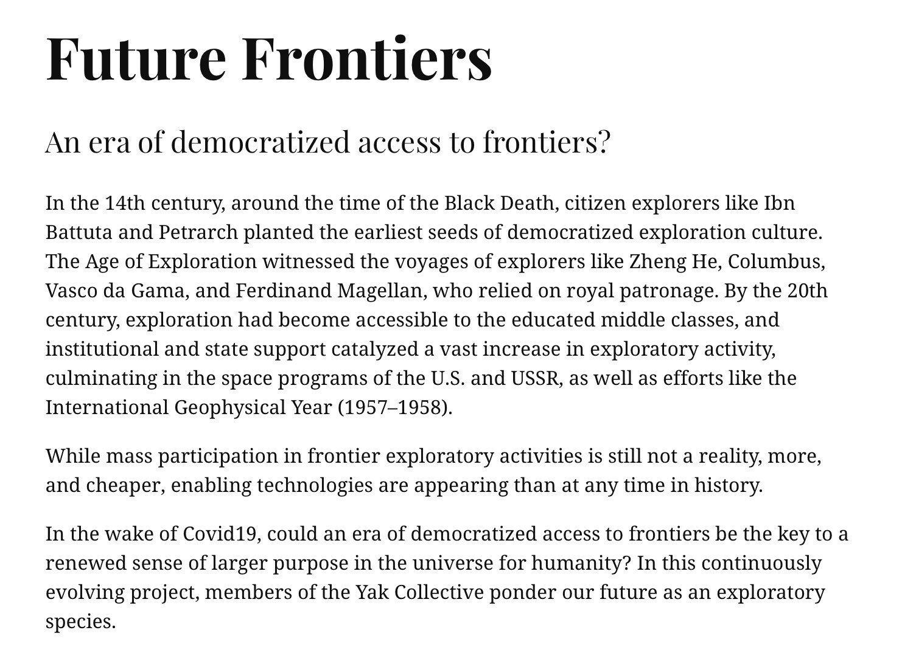
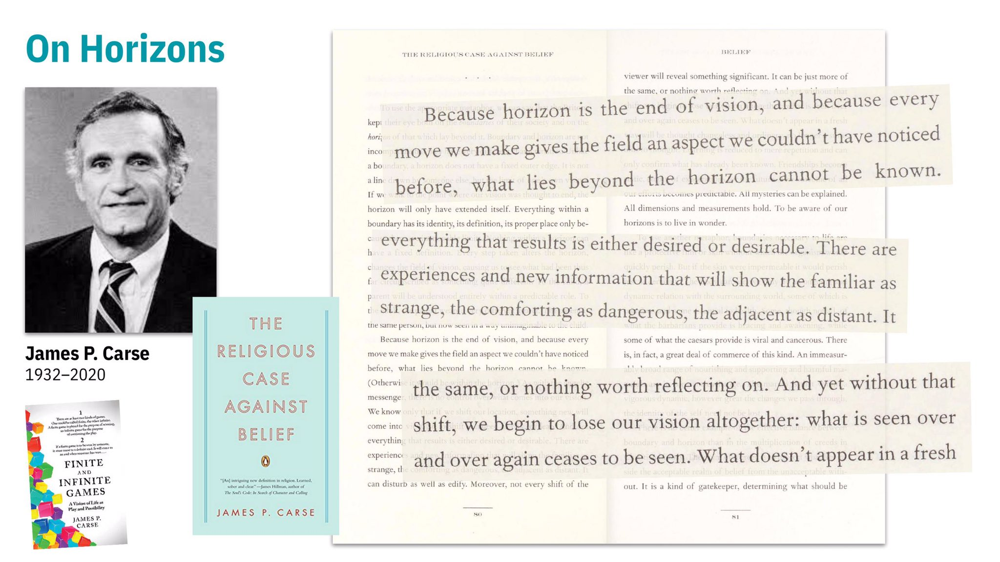
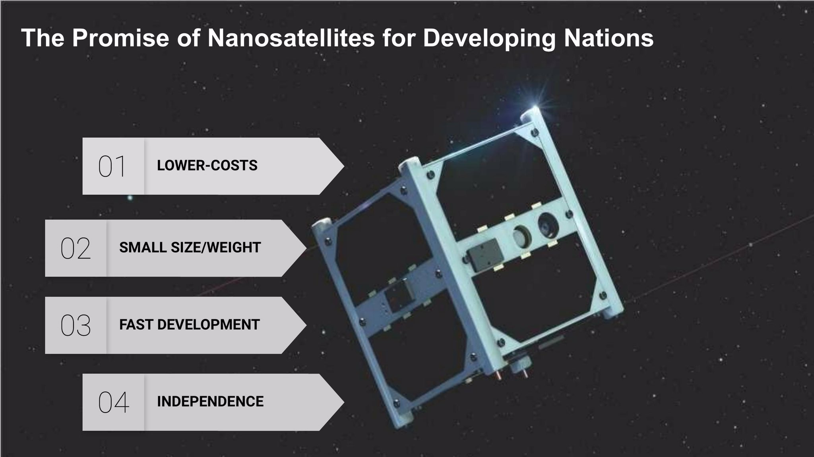
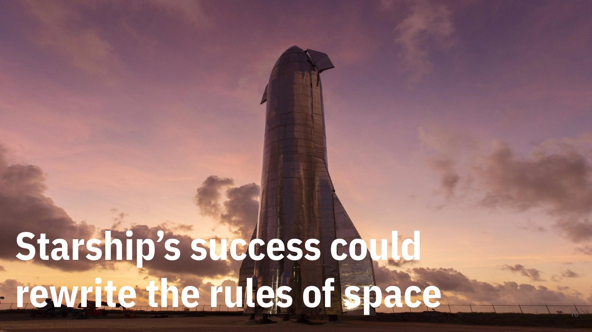
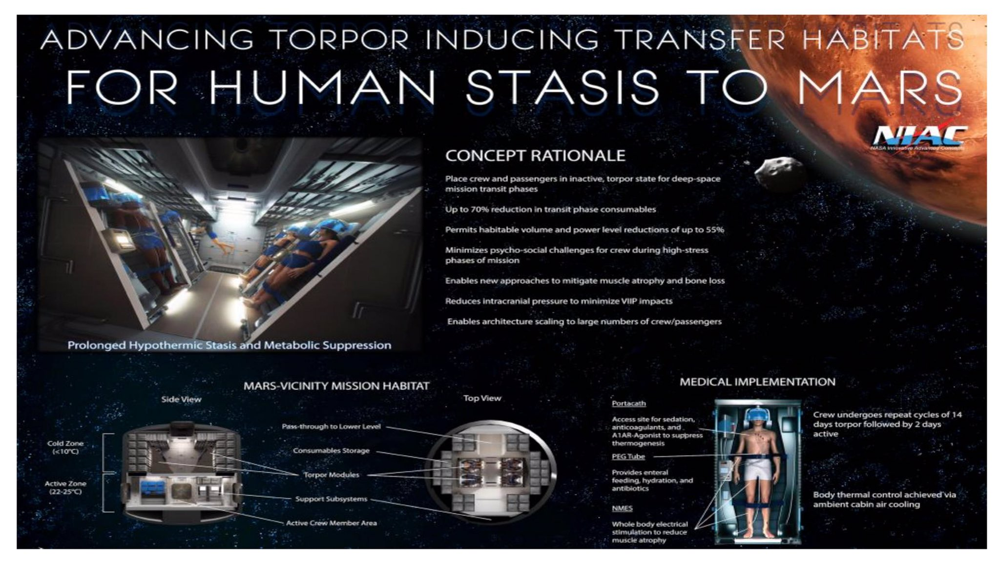
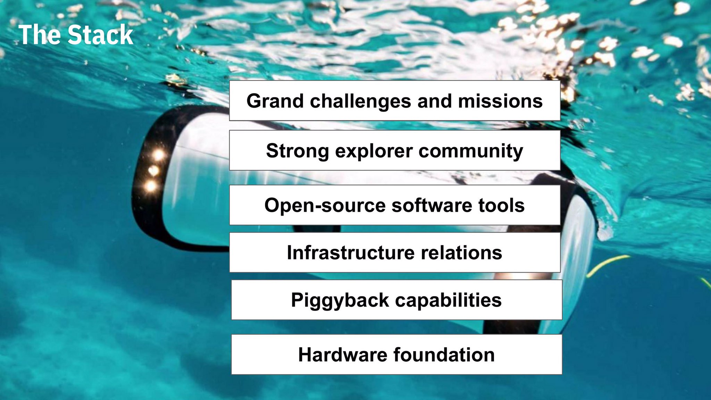
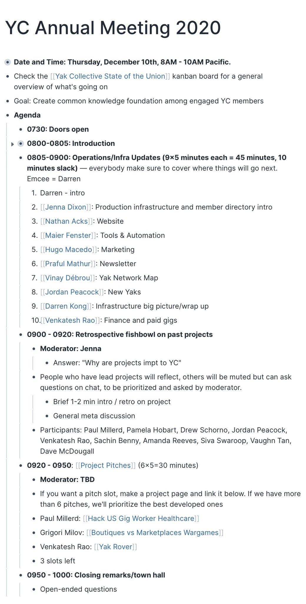

> Hmm, interesting https://twitter.com/RichDecibels/status/1333753918346719234

 [Tue Dec 01 17:47:28 +0000 2020](https://twitter.com/yak_collective/status/1333830086429052929)

----

> The Yak Collective is launching a new project ongoing project today: Future Frontier! https://www.yakcollective.org/projects/future-frontiers/

 [Tue Dec 01 17:49:06 +0000 2020](https://twitter.com/yak_collective/status/1333830497500241920)

----

Replying to [@yak_collective](https://twitter.com/yak_collective/status/1333830497500241920)

> The goal of the project is to reboot the imagination, and rekindle yearning for frontiers, after a decade of political and cultural strife and now a pandemic. 
> 
> Do you yearn for something? Future frontiers is for you 😎 
> 
> 

 [Tue Dec 01 17:52:54 +0000 2020](https://twitter.com/yak_collective/status/1333831451792478209)

----

Replying to [@yak_collective](https://twitter.com/yak_collective/status/1333831451792478209)

> Future Frontiers is presented as an evolving series of short vignettes on aspects of contemporary frontiers and exploration. Our goal is to offer you an imagination-stirring buffet of things to think about — and yearn for, as we make our way out of minds held hostage by Covid. 
> 
> 

 [Tue Dec 01 17:57:47 +0000 2020](https://twitter.com/yak_collective/status/1333832682841653249)

----

Replying to [@yak_collective](https://twitter.com/yak_collective/status/1333832682841653249)

> We are publishing the first few today and will be intermittently adding more. All members of the Yak Collective are welcome to contribute, and it’s a great way to get to know us, learn how we work, and begin carving out a role for yourself in the Tak Collective.

 [Tue Dec 01 17:59:53 +0000 2020](https://twitter.com/yak_collective/status/1333833210426396672)

----

Replying to [@yak_collective](https://twitter.com/yak_collective/status/1333833210426396672)

> First up: Venkatesh Rao introduces the project with a meditation on horizons and frontiers inspired by the life and work of James Carse, who passed away recently. https://www.yakcollective.org/projects/future-frontiers/#projects-future-frontiers-01-philosophy-01-on-horizons-01 
> 
> 

 [Tue Dec 01 18:02:13 +0000 2020](https://twitter.com/yak_collective/status/1333833799596064775)

----

Replying to [@yak_collective](https://twitter.com/yak_collective/status/1333833799596064775)

> Next, Kannen Ramasamy looks at the promise of nanosatellites for developing nations. https://www.yakcollective.org/projects/future-frontiers/#projects-future-frontiers-02-trends-02-the-promise-of-nanosatellites-for-developing-nations-01 
> 
> 

 [Tue Dec 01 18:03:36 +0000 2020](https://twitter.com/yak_collective/status/1333834144770527234)

----

Replying to [@yak_collective](https://twitter.com/yak_collective/status/1333834144770527234)

> Charlie Bisland asks: could SpaceX’s Starship program spark a new space gold rush? https://www.yakcollective.org/projects/future-frontiers/#projects-future-frontiers-03-exploitation-01-starship-gold-rush-01 
> 
> 

 [Tue Dec 01 18:05:19 +0000 2020](https://twitter.com/yak_collective/status/1333834578654420992)

----

Replying to [@yak_collective](https://twitter.com/yak_collective/status/1333834578654420992)

> Jay Kalawar looks at how advances in hibernation and neuroscience could take humans from Mars to interstellar space with designer metabolism and minds. https://www.yakcollective.org/projects/future-frontiers/#projects-future-frontiers-05-lifestyles-03-designer-metabolism-01 
> 
> 

 [Tue Dec 01 18:07:39 +0000 2020](https://twitter.com/yak_collective/status/1333835164120596480)

----

Replying to [@yak_collective](https://twitter.com/yak_collective/status/1333835164120596480)

> And to close out this first drop of modules, Venkatesh Rao looks at the potential for democratizing oceanic exploration due to consumer-grade submersibles like the Sofar (née OpenROV) Trident. https://www.yakcollective.org/projects/future-frontiers/#projects-future-frontiers-02-trends-01-democratized-underwater-exploration-01 
> 
> 

 [Tue Dec 01 18:09:55 +0000 2020](https://twitter.com/yak_collective/status/1333835737066733568)

----

Replying to [@yak_collective](https://twitter.com/yak_collective/status/1333835737066733568)

> More coming soon. A big thanks to Jenna Dixon for producing and designing this project, and Nathan Acks for building out our newest publishing capability — the online-native vertical text-annotated deck format used for this project.
> 
> Stay tuned, more future frontiers coming soon!

 [Tue Dec 01 18:12:36 +0000 2020](https://twitter.com/yak_collective/status/1333836410357391360)

----

Replying to [@yak_collective](https://twitter.com/yak_collective/status/1333836410357391360)

> And in the meantime, check out our 3 other 2020 projects:
> 
> * Don’t Waste the Covid19 Reboot, on navigating the recovery
> 
> * New Old Homes, on how homes might change
> 
> * Astonishing Stories, an evolving speculative fiction zine on near-futures. https://www.yakcollective.org/projects/

 [Tue Dec 01 18:18:13 +0000 2020](https://twitter.com/yak_collective/status/1333837824701788160)

----

> Today's featured yak: Jenna Dixon (@jdbb) - design+build :: print+digital https://yakcollective.org/members/dixon-jenna/

 [Wed Dec 02 02:12:22 +0000 2020](https://twitter.com/yak_collective/status/1333957148406067205)

----

> Event coming up on Yak Collective discord in &lt; 15 minutes! YC weekly marketing call, Dec 02, 2020 09:00AM. Get invite link here: http://zpr.io/t47UH

 [Wed Dec 02 16:46:03 +0000 2020](https://twitter.com/yak_collective/status/1334177019186253826)

----

> Check out @anthilemoon's new post, "JavaScript plugins for Roam Research [[roam/js]]". https://nesslabs.com/roam-research-javascript-plugins?utm_source=rss&utm_medium=rss&utm_campaign=roam-research-javascript-plugins

 [Wed Dec 02 21:51:04 +0000 2020](https://twitter.com/yak_collective/status/1334253777109520385)

----

> Check out @p_millerd's new post, "How workers became career-driven performers". https://think-boundless.com/careerism-performers/?utm_source=rss&utm_medium=rss&utm_campaign=careerism-performers

 [Wed Dec 02 23:48:18 +0000 2020](https://twitter.com/yak_collective/status/1334283279369981954)

----

> Check out @anthilemoon's new post, "High-leverage activities: how to identify your energy multipliers". https://nesslabs.com/high-leverage-activities?utm_source=rss&utm_medium=rss&utm_campaign=high-leverage-activities

 [Thu Dec 03 09:51:12 +0000 2020](https://twitter.com/yak_collective/status/1334435005825683457)

----

> Today's featured yak: Chris Clark (@chrisclark1729) - Freelance Data Projects https://yakcollective.org/members/clark-chris/

 [Thu Dec 03 09:51:27 +0000 2020](https://twitter.com/yak_collective/status/1334435069289762817)

----

> Check out @anthilemoon's new post, "The benefits of laziness: why being a lazy person can be good for you". https://nesslabs.com/benefits-of-laziness?utm_source=rss&utm_medium=rss&utm_campaign=benefits-of-laziness

 [Thu Dec 03 15:11:10 +0000 2020](https://twitter.com/yak_collective/status/1334515526559821824)

----

> Check out @HiredThought's new post, "Meaning Making Machines (Jennifer Carlston)". https://hiredthought.com/2020/12/03/meaning-making-machines-jennifer-carlston/

 [Thu Dec 03 20:53:06 +0000 2020](https://twitter.com/yak_collective/status/1334601578737758212)

----

> Event coming up on Yak Collective discord in &lt; 15 minutes! Online governance study group, Dec 04, 2020 09:00AM. Get invite link here: http://zpr.io/t47UH

 [Fri Dec 04 16:58:49 +0000 2020](https://twitter.com/yak_collective/status/1334905007905386500)

----

> Today's featured yak: Sachin Benny (@sachinb91) https://yakcollective.org/members/benny-sachin/

 [Fri Dec 04 17:06:05 +0000 2020](https://twitter.com/yak_collective/status/1334906836487692291)

----

> Check out @vgr's new newsletter, "Involvement Capitalism". https://breakingsmart.substack.com/p/involvement-capitalism

 [Sat Dec 05 01:33:24 +0000 2020](https://twitter.com/yak_collective/status/1335034506433228800)

----

> Today's featured yak: Vaughn Tan (@vaughn_tan) https://yakcollective.org/members/tan-vaughn/

 [Sun Dec 06 17:06:24 +0000 2020](https://twitter.com/yak_collective/status/1335631689176018946)

----

> Event coming up on Yak Collective discord in &lt; 15 minutes! #infrastructure chat with Darren Kong, Dec 06, 2020 10:30AM. Get invite link here: http://zpr.io/t47UH

 [Sun Dec 06 18:15:17 +0000 2020](https://twitter.com/yak_collective/status/1335649023705948161)

----

> Event coming up on Yak Collective discord in &lt; 15 minutes! Astonishing Stories project meeting hosted by Sachin Benny, Dec 07, 2020 04:00PM. Get invite link here: http://zpr.io/t47UH

 [Mon Dec 07 23:53:14 +0000 2020](https://twitter.com/yak_collective/status/1336096461214408706)

----

> Check out @p_millerd's new post, "An Ode To Travel and What It Means (Video)". https://think-boundless.com/an-ode-to-travel-and-what-it-means-video/?utm_source=rss&utm_medium=rss&utm_campaign=an-ode-to-travel-and-what-it-means-video

 [Tue Dec 08 01:28:38 +0000 2020](https://twitter.com/yak_collective/status/1336120469959872515)

----

> Today's featured yak: Venkatesh Rao (@vgr) https://yakcollective.org/members/rao-venkatesh/

 [Tue Dec 08 01:36:21 +0000 2020](https://twitter.com/yak_collective/status/1336122411280949251)

----

> Check out @anthilemoon's new post, "The difference between efficacy, effectiveness and efficiency". https://nesslabs.com/efficacy-effectiveness-efficiency-2?utm_source=rss&utm_medium=rss&utm_campaign=efficacy-effectiveness-efficiency-2

 [Tue Dec 08 11:36:30 +0000 2020](https://twitter.com/yak_collective/status/1336273442828677121)

----

> Check out @amelapay's new post, "Second-Best Solutions". https://www.pamelajhobart.com/blog/second-best-solutions

 [Tue Dec 08 21:47:28 +0000 2020](https://twitter.com/yak_collective/status/1336427198287376384)

----

> Today's featured yak: Jordan Peacock (@hewhocutsdown) - CEO, Becoming Machinic; Founder, Sortilege https://yakcollective.org/members/peacock-jordan/

 [Wed Dec 09 00:46:35 +0000 2020](https://twitter.com/yak_collective/status/1336472274854088705)

----

> Event coming up on Yak Collective discord in &lt; 15 minutes! YC weekly marketing call, Dec 09, 2020 09:00AM. Get invite link here: http://zpr.io/t47UH

 [Wed Dec 09 16:53:56 +0000 2020](https://twitter.com/yak_collective/status/1336715718314909702)

----

> The Yak Collective Annual Meeting (public Zoom event) will be held tomorrow, Thu Dec 10, 8AM PT. All are welcome while there is capacity. We’ll talk projects old and new, evolving infrastructure, making money etc. Here is the public Google calendar invite: https://calendar.google.com/event?action=TEMPLATE&tmeid=NWoyOThhOWVtNWg1ZzlnMmtrYTZ0ZHNscTEgbzk5NW00MzE3M2Jwc2xtaGg0OW5tcnA1aTRAZw&tmsrc=o995m43173bpslmhh49nmrp5i4%40group.calendar.google.com 
> 
> 

 [Wed Dec 09 18:39:58 +0000 2020](https://twitter.com/yak_collective/status/1336742399708557312)

----

> Check out the latest edition of the Yak Talk newsletter, "First YC Annual Meeting!". https://yakcollective.substack.com/p/first-yc-annual-meeting

 [Thu Dec 10 00:21:23 +0000 2020](https://twitter.com/yak_collective/status/1336828322416877568)

----

> Check out @HiredThought's new post, "The Everyday Process of Burnout Recovery". https://hiredthought.com/2020/12/10/the-everyday-process-of-burnout-recovery/

 [Thu Dec 10 06:11:09 +0000 2020](https://twitter.com/yak_collective/status/1336916341815652353)

----

> Check out @tomcritchlow's new post, "Weak Ties &amp; Strong Intros". http://tomcritchlow.com/2020/12/10/weak-ties-strong-intros/

 [Thu Dec 10 06:32:26 +0000 2020](https://twitter.com/yak_collective/status/1336921698269093888)

----

> Check out @anthilemoon's new post, "Curiosity and consistency: thoughts on growing a newsletter". https://nesslabs.com/newsletter-curiosity-consistency?utm_source=rss&utm_medium=rss&utm_campaign=newsletter-curiosity-consistency

 [Thu Dec 10 11:56:13 +0000 2020](https://twitter.com/yak_collective/status/1337003180417314816)

----

> Event coming up on Yak Collective discord in &lt; 15 minutes! Yak Collective Annual Meeting and Holiday Party, Dec 10, 2020 08:00AM. Get invite link here: http://zpr.io/t47UH

 [Thu Dec 10 15:48:05 +0000 2020](https://twitter.com/yak_collective/status/1337061534456041473)

----

> Check out @anthilemoon's new post, "Selective ignorance: cultivating intentional knowledge in a chaotic world". https://nesslabs.com/selective-ignorance?utm_source=rss&utm_medium=rss&utm_campaign=selective-ignorance

 [Thu Dec 10 16:06:32 +0000 2020](https://twitter.com/yak_collective/status/1337066176766226432)

----

> Thanks everybody that was a great annual meeting. Here’s to a bigger, badder 2021 😎 
> 
> <video controls><source src="media/1337100105015382016-Eo5Vc4hU0AEntLB.mp4">Your browser does not support the video tag.</video>

 [Thu Dec 10 18:21:21 +0000 2020](https://twitter.com/yak_collective/status/1337100105015382016)

----

> Check out @amelapay's new post, "Timebox Your Existential Issues". https://www.pamelajhobart.com/blog/timebox-your-existential-issues

 [Thu Dec 10 19:37:14 +0000 2020](https://twitter.com/yak_collective/status/1337119198837923840)

----

> Today's featured yak: Anne-Laure Le Cunff (@anthilemoon) https://yakcollective.org/members/le-cunff-anne-laure/

 [Fri Dec 11 02:26:37 +0000 2020](https://twitter.com/yak_collective/status/1337222226400178177)

----

> Event coming up on Yak Collective discord in &lt; 15 minutes! Online governance study group, Dec 11, 2020 09:00AM. Get invite link here: http://zpr.io/t47UH

 [Fri Dec 11 16:49:30 +0000 2020](https://twitter.com/yak_collective/status/1337439375727144962)

----

> Check out @vgr's new newsletter, "In the Wake of the Eighties". https://breakingsmart.substack.com/p/in-the-wake-of-the-eighties

 [Sat Dec 12 05:58:20 +0000 2020](https://twitter.com/yak_collective/status/1337637895025401856)

----

> Event coming up on Yak Collective discord in &lt; 15 minutes! #infrastructure chat with Darren Kong, Dec 13, 2020 10:30AM. Get invite link here: http://zpr.io/t47UH

 [Sun Dec 13 18:19:39 +0000 2020](https://twitter.com/yak_collective/status/1338186840034177032)

----

> Event coming up on Yak Collective discord in &lt; 15 minutes! Newletter infrastructure needs w/Praful Mathur, Dec 13, 2020 11:30AM. Get invite link here: http://zpr.io/t47UH

 [Sun Dec 13 19:20:59 +0000 2020](https://twitter.com/yak_collective/status/1338202274972246031)

----

> Check out @amelapay's new post, "Meaning in Life is Not Propositional". https://www.pamelajhobart.com/blog/meaning-in-life-is-not-propositional

 [Tue Dec 15 05:12:33 +0000 2020](https://twitter.com/yak_collective/status/1338713535099117568)

----

> Check out @anthilemoon's new post, "Holiday gift guide for the curious minds". https://nesslabs.com/holiday-gift-guide-curious-minds?utm_source=rss&utm_medium=rss&utm_campaign=holiday-gift-guide-curious-minds

 [Tue Dec 15 14:36:32 +0000 2020](https://twitter.com/yak_collective/status/1338855467238502400)

----

> Check out @p_millerd's new post, "Why Did People Stop Caring About Developing a Meaningful Philosophy of Life in the 1970s?". https://think-boundless.com/1970-meaning-money/?utm_source=rss&utm_medium=rss&utm_campaign=1970-meaning-money

 [Tue Dec 15 20:53:34 +0000 2020](https://twitter.com/yak_collective/status/1338950347772088321)

----

> Check out @anthilemoon's new post, "Activation energy: the chemistry of getting started". https://nesslabs.com/activation-energy?utm_source=rss&utm_medium=rss&utm_campaign=activation-energy

 [Wed Dec 16 09:11:07 +0000 2020](https://twitter.com/yak_collective/status/1339135961561772032)

----

> Event coming up on Yak Collective discord in &lt; 15 minutes! YC weekly marketing call, Dec 16, 2020 09:00AM. Get invite link here: http://zpr.io/t47UH

 [Wed Dec 16 16:49:33 +0000 2020](https://twitter.com/yak_collective/status/1339251328690876416)

----

> Check out @anthilemoon's new post, "2020 year in review: chaos and community". https://nesslabs.com/annual-review-2020?utm_source=rss&utm_medium=rss&utm_campaign=annual-review-2020

 [Wed Dec 16 18:26:13 +0000 2020](https://twitter.com/yak_collective/status/1339275653728915457)

----

> Event coming up on Yak Collective discord in &lt; 15 minutes! New Yak Q&amp;A – Hosted by Jordan Peacock, Dec 17, 2020 09:00AM. Get invite link here: http://zpr.io/t47UH

 [Thu Dec 17 16:59:04 +0000 2020](https://twitter.com/yak_collective/status/1339616111961096192)

----

> Check out @tomcritchlow's new post, "Filtered for... margin notes". http://tomcritchlow.com/2021/12/17/side-notes/

 [Fri Dec 18 00:17:31 +0000 2020](https://twitter.com/yak_collective/status/1339726449507356672)

----

> Check out @tomcritchlow's new post, "Filtered for... margin notes". http://tomcritchlow.com/2020/12/17/side-notes/

 [Fri Dec 18 00:27:24 +0000 2020](https://twitter.com/yak_collective/status/1339728937086291968)

----

> Check out @amelapay's new post, "Don't "Clarify" Your Values". https://www.pamelajhobart.com/blog/dont-clarify-your-values

 [Fri Dec 18 04:27:02 +0000 2020](https://twitter.com/yak_collective/status/1339789243963600897)

----

> Event coming up on Yak Collective discord in &lt; 15 minutes! Online governance study group, Dec 18, 2020 09:00AM. Get invite link here: http://zpr.io/t47UH

 [Fri Dec 18 16:58:23 +0000 2020](https://twitter.com/yak_collective/status/1339978329005371395)

----

> Check out @vgr's new newsletter, "Darker Things". https://breakingsmart.substack.com/p/darker-things

 [Fri Dec 18 23:18:19 +0000 2020](https://twitter.com/yak_collective/status/1340073939297550337)

----

> Check out @amelapay's new post, "35th". https://www.pamelajhobart.com/blog/35th

 [Sun Dec 20 06:32:33 +0000 2020](https://twitter.com/yak_collective/status/1340545606650114055)

----

> Event coming up on Yak Collective discord in &lt; 15 minutes! #infrastructure chat with Darren Kong, Dec 20, 2020 10:30AM. Get invite link here: http://zpr.io/t47UH

 [Sun Dec 20 18:23:53 +0000 2020](https://twitter.com/yak_collective/status/1340724618575958017)

----

> Event coming up on Yak Collective discord in &lt; 15 minutes! YC weekly marketing call, Dec 23, 2020 09:00AM. Get invite link here: http://zpr.io/t47UH

 [Wed Dec 23 16:45:11 +0000 2020](https://twitter.com/yak_collective/status/1341786945668657157)

----

> Check out @p_millerd's new post, "Packy McCormick – Making Newsletters Fun (Podcast)". https://think-boundless.com/packy-mccormick/?utm_source=rss&utm_medium=rss&utm_campaign=packy-mccormick

 [Fri Dec 25 04:18:14 +0000 2020](https://twitter.com/yak_collective/status/1342323744539291649)

----

> Check out @p_millerd's new post, "Steph Smith – Carving a 21st Century Career &amp; Life (Podcast)". https://think-boundless.com/steph-smith/?utm_source=rss&utm_medium=rss&utm_campaign=steph-smith

 [Fri Dec 25 04:18:15 +0000 2020](https://twitter.com/yak_collective/status/1342323748121288705)

----

> Check out @p_millerd's new post, "Oshan Jarow: The Reality &amp; Possibilities For Work". https://think-boundless.com/oshan-jarrow/?utm_source=rss&utm_medium=rss&utm_campaign=oshan-jarrow

 [Fri Dec 25 04:18:16 +0000 2020](https://twitter.com/yak_collective/status/1342323753007673345)

----

> Check out @p_millerd's new post, "Amy McMillen – Leaving a Path That Makes Sense (Podcast)". https://think-boundless.com/amy-mcmillen/?utm_source=rss&utm_medium=rss&utm_campaign=amy-mcmillen

 [Fri Dec 25 04:18:17 +0000 2020](https://twitter.com/yak_collective/status/1342323755096403968)

----

> Event coming up on Yak Collective discord in &lt; 15 minutes! Online governance study group, Dec 25, 2020 09:00AM. Get invite link here: http://zpr.io/t47UH

 [Fri Dec 25 16:51:13 +0000 2020](https://twitter.com/yak_collective/status/1342513240723644419)

----

> Check out @vgr's new newsletter, "Complete 2020 Roundup". https://breakingsmart.substack.com/p/complete-2020-roundup

 [Fri Dec 25 19:43:26 +0000 2020](https://twitter.com/yak_collective/status/1342556580684980224)

----

> Event coming up on Yak Collective discord in &lt; 15 minutes! #infrastructure chat with Darren Kong, Dec 27, 2020 10:30AM. Get invite link here: http://zpr.io/t47UH

 [Sun Dec 27 18:28:30 +0000 2020](https://twitter.com/yak_collective/status/1343262497126682633)

----

> Check out @p_millerd's new post, "The Magic of Non-Doing". https://think-boundless.com/non-doing/?utm_source=rss&utm_medium=rss&utm_campaign=non-doing

 [Tue Dec 29 02:13:25 +0000 2020](https://twitter.com/yak_collective/status/1343741886020907009)

----

> Event coming up on Yak Collective discord in &lt; 15 minutes! YC weekly marketing call, Dec 30, 2020 09:00AM. Get invite link here: http://zpr.io/t47UH

 [Wed Dec 30 16:57:29 +0000 2020](https://twitter.com/yak_collective/status/1344326754152968196)

----

> Event coming up on Yak Collective discord in &lt; 15 minutes! New Yak Q&amp;A – Hosted by Jordan Peacock, Dec 31, 2020 09:00AM. Get invite link here: http://zpr.io/t47UH

 [Thu Dec 31 16:54:10 +0000 2020](https://twitter.com/yak_collective/status/1344688309658906626)

----

> Check out @randylubin's new post, "2020 Recap". https://blog.randylubin.com/2020-recap

 [Thu Dec 31 20:08:11 +0000 2020](https://twitter.com/yak_collective/status/1344737132712222722)