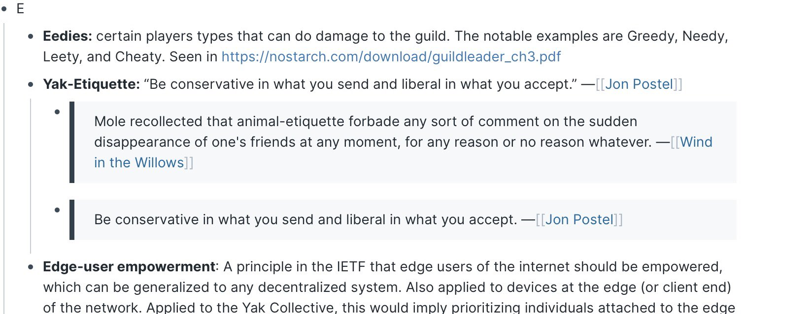

> Check out @antlerboy's new post, "What are you working hard to achieve in life, where the ‘working hard’ is self-defeating?". https://antlerboy.medium.com/what-are-you-working-hard-to-achieve-in-life-where-the-working-hard-is-self-defeating-446d81b69a23?source=rss-97852f5a56ae------2

 [Mon Nov 01 08:33:02 +0000 2021](https://twitter.com/yak_collective/status/1455090491687583746)

----

> Today's featured yak: Rodrigo Pinto (@Rodrigo_plp) https://www.yakcollective.org/members/pinto-rodrigo/#20211101

 [Mon Nov 01 08:34:43 +0000 2021](https://twitter.com/yak_collective/status/1455090916574875651)

----

> Check out @antlerboy's new post, "Do you want to do the work of the future, or the past?". https://antlerboy.medium.com/do-you-want-to-do-the-work-of-the-future-or-the-past-89cb9842c088?source=rss-97852f5a56ae------2

 [Wed Nov 03 08:43:51 +0000 2021](https://twitter.com/yak_collective/status/1455817990629478405)

----

> Today's featured yak: Zhan Li (@thezhanly) - Scenarios, Foresight, Futurist Studies &amp; PE/VC https://www.yakcollective.org/members/li-zhan/#20211103

 [Wed Nov 03 08:54:19 +0000 2021](https://twitter.com/yak_collective/status/1455820625679949824)

----

> Today's featured yak: Drew Shiel (@gothwalk) - Independent Domestic Historian https://www.yakcollective.org/members/shiel-drew/#20211104

 [Thu Nov 04 18:29:53 +0000 2021](https://twitter.com/yak_collective/status/1456327857366568971)

----

> Check out @anthilemoon's new post, "How to manage “Can I pick your brain?” requests". https://nesslabs.com/can-i-pick-your-brain?utm_source=rss&utm_medium=rss&utm_campaign=can-i-pick-your-brain

 [Thu Nov 04 18:30:45 +0000 2021](https://twitter.com/yak_collective/status/1456328079090102277)

----

> Check out @vgr's new newsletter, "Here We Go Again". https://studio.ribbonfarm.com/p/here-we-go-again

 [Thu Nov 04 23:57:52 +0000 2021](https://twitter.com/yak_collective/status/1456410399637528576)

----

> One of the governance norms we follow is Yak Ettiquette, a mashup of Postal’s law and the idea of “animal ettiquette” from Wind in the Willows. This means you’re welcome to drop in and out as you like based on your life situation. 
> 
> 

 [Fri Nov 05 21:49:37 +0000 2021](https://twitter.com/yak_collective/status/1456740512342282240)

----

> Check out @antlerboy's new post, "Transduction — leading transformation — Issue #23". https://antlerboy.medium.com/transduction-leading-transformation-issue-23-eec9b554cef6?source=rss-97852f5a56ae------2

 [Sat Nov 06 17:03:33 +0000 2021](https://twitter.com/yak_collective/status/1457030906980483072)

----

> Today's featured yak: Jordan Peacock (@hewhocutsdown) - CEO, Becoming Machinic; Founder, Sortilege https://www.yakcollective.org/members/peacock-jordan/#20211106

 [Sat Nov 06 17:09:35 +0000 2021](https://twitter.com/yak_collective/status/1457032425465319425)

----

> the yak collective now has a multisig gnosis safe set up wonder what's brewing  👀 #yakbot

 [Sat Nov 06 17:35:00 +0000 2021](https://twitter.com/yak_collective/status/1457038823020503047)

----

> The yakcollective is in the $WRITE token race on mirror https://mirror.xyz/race?candidate=vgr #yakbot

 [Sat Nov 06 19:25:42 +0000 2021](https://twitter.com/yak_collective/status/1457066682795573248)

----

> Check out @antlerboy's new post, "Why is it so hard to get people engaged in paid online events these days?". https://antlerboy.medium.com/why-is-it-so-hard-to-get-people-engaged-in-paid-online-events-these-days-6abab242c145?source=rss-97852f5a56ae------2

 [Mon Nov 08 08:18:16 +0000 2021](https://twitter.com/yak_collective/status/1457623492627734529)

----

> Today's featured yak: Darren Kong (@varietalxyz) https://www.yakcollective.org/members/kong-darren/#20211108

 [Mon Nov 08 08:19:05 +0000 2021](https://twitter.com/yak_collective/status/1457623697368432643)

----

> Check out @p_millerd's new post, "How a Trader Models The Solo Creative Journey – Kris Abdelmessih (Podcast)". https://think-boundless.com/kris/?utm_source=rss&utm_medium=rss&utm_campaign=kris

 [Wed Nov 10 02:41:31 +0000 2021](https://twitter.com/yak_collective/status/1458263523147063300)

----

> Today's featured yak: Tom Critchlow (@tomcritchlow) https://www.yakcollective.org/members/critchlow-tom/#20211110

 [Wed Nov 10 02:49:18 +0000 2021](https://twitter.com/yak_collective/status/1458265478548295682)

----

> The yak collective is in the mirror $WRITE token race... if you'd like to see us start a Web3 native publication, vote for us (metamask extension required) https://mirror.xyz/race?candidate=vgr

 [Wed Nov 10 19:51:17 +0000 2021](https://twitter.com/yak_collective/status/1458522670853615617)

----

> Check out @anthilemoon's new post, "An introduction to applied neuroscience". https://nesslabs.com/applied-neuroscience-introduction?utm_source=rss&utm_medium=rss&utm_campaign=applied-neuroscience-introduction

 [Wed Nov 10 20:55:42 +0000 2021](https://twitter.com/yak_collective/status/1458538884036431873)

----

> Check out @anthilemoon's new post, "Making the most of your memories with Suman Kanuganti, CEO of http://Personal.ai". https://nesslabs.com/personal-ai-featured-tool?utm_source=rss&utm_medium=rss&utm_campaign=personal-ai-featured-tool

 [Thu Nov 11 16:10:52 +0000 2021](https://twitter.com/yak_collective/status/1458829589761990659)

----

> Today's featured yak: Ben Mosior (@HiredThought) https://www.yakcollective.org/members/mosior-ben/#20211111

 [Thu Nov 11 16:19:16 +0000 2021](https://twitter.com/yak_collective/status/1458831701736632322)

----

> Check out @vgr's new newsletter, "The Best of Times, The Worst of Times...Again". https://studio.ribbonfarm.com/p/the-best-of-times-the-worst-of-timesagain

 [Fri Nov 12 03:07:39 +0000 2021](https://twitter.com/yak_collective/status/1458994872556343329)

----

> Today's featured yak: Phil Wolff (@evanwolf) https://www.yakcollective.org/members/wolff-phil/#20211112

 [Fri Nov 12 03:14:47 +0000 2021](https://twitter.com/yak_collective/status/1458996668578373632)

----

> The Yak Collective Annual Meeting will be held online on Tue Dec 14. If you're interested in learning about us, and perhaps joining us in 2022, this is your best opportunity to get onboard. The event is free but space is limited, so please register early. https://www.eventbrite.com/e/yak-collective-annual-meeting-2021-tickets-210108709807

 [Fri Nov 12 21:49:03 +0000 2021](https://twitter.com/yak_collective/status/1459277085566930945)

----

> The Yak Rover project will be holding its very first Demo Day on Sunday, Dec 12. If you're interested in joining us, this is your best opportunity to get onboard. The event is free but space is limited, so please register early.  https://www.eventbrite.com/e/yak-rover-demo-day-tickets-210102992707

 [Fri Nov 12 21:50:47 +0000 2021](https://twitter.com/yak_collective/status/1459277520780492803)

----

> Check out @tomcritchlow's new post, "7 Years on the Road". http://tomcritchlow.com/2021/11/12/7-years/

 [Sat Nov 13 02:28:33 +0000 2021](https://twitter.com/yak_collective/status/1459347421197127682)

----

> Today's featured yak: Ryan Hume  - Industrial Designer + Illustrator + Music Technologist https://www.yakcollective.org/members/hume-ryan/#20211113

 [Sat Nov 13 02:39:28 +0000 2021](https://twitter.com/yak_collective/status/1459350170949222404)

----

> Check out @antlerboy's new post, "Transduction — leading transformation — Issue #24". https://antlerboy.medium.com/transduction-leading-transformation-issue-24-404c6f386b34?source=rss-97852f5a56ae------2

 [Sat Nov 13 08:43:45 +0000 2021](https://twitter.com/yak_collective/status/1459441846363594752)

----

> Today's featured yak: Chris Reid (@careid0) https://www.yakcollective.org/members/reid-chris/#20211114

 [Sun Nov 14 17:05:22 +0000 2021](https://twitter.com/yak_collective/status/1459930468145676289)

----

> Today's featured yak: Vlad Mehakovic (@vladiim) https://www.yakcollective.org/members/100077/#20211115

 [Mon Nov 15 01:39:36 +0000 2021](https://twitter.com/yak_collective/status/1460059878261768195)

----

> Check out @antlerboy's new post, "What do you think is necessary to accelerate #digital #innovation?". https://antlerboy.medium.com/what-do-you-think-is-necessary-to-accelerate-digital-innovation-f17b045cb435?source=rss-97852f5a56ae------2

 [Mon Nov 15 07:43:35 +0000 2021](https://twitter.com/yak_collective/status/1460151480011292673)

----

> Today's featured yak: Claire Peters  https://www.yakcollective.org/members/100082/#20211116

 [Tue Nov 16 17:09:49 +0000 2021](https://twitter.com/yak_collective/status/1460656365135880195)

----

> Check out @antlerboy's new post, "Where is your organisation on the learning ladder of purpose?". https://antlerboy.medium.com/where-is-your-organisation-on-the-learning-ladder-of-purpose-eb0e71c48bd2?source=rss-97852f5a56ae------2

 [Wed Nov 17 08:03:37 +0000 2021](https://twitter.com/yak_collective/status/1460881295853203458)

----

> Today's featured yak: Justice (@being_on_line) - everything digital https://www.yakcollective.org/members/100048/#20211117

 [Wed Nov 17 08:09:18 +0000 2021](https://twitter.com/yak_collective/status/1460882725880147969)

----

> Check out @anthilemoon's new post, "Take control over your smartphone usage with Jorn Rigter, co-founder of Unpluq". https://nesslabs.com/unpluq-featured-tool?utm_source=rss&utm_medium=rss&utm_campaign=unpluq-featured-tool

 [Thu Nov 18 16:30:41 +0000 2021](https://twitter.com/yak_collective/status/1461371290200256519)

----

> Today's featured yak: Kannen Ramsamy  - Writer | Communications | Policy https://www.yakcollective.org/members/100085/#20211118

 [Thu Nov 18 16:34:06 +0000 2021](https://twitter.com/yak_collective/status/1461372150644977664)

----

> Today's featured yak: Vinay Débrou (@vinaydebrou) https://www.yakcollective.org/members/100019/#20211119

 [Fri Nov 19 17:09:49 +0000 2021](https://twitter.com/yak_collective/status/1461743529076609035)

----

> Check out @vgr's new newsletter, "Through a Scanner, Darkly". https://studio.ribbonfarm.com/p/through-a-scanner-darkly

 [Fri Nov 19 20:27:16 +0000 2021](https://twitter.com/yak_collective/status/1461793218199175174)

----

> Today's featured yak: Charlie Bilsland (@charliebilsland) - Space / Strategy / Commercials https://www.yakcollective.org/members/100059/#20211120

 [Sat Nov 20 17:09:20 +0000 2021](https://twitter.com/yak_collective/status/1462105793537454088)

----

> Check out @antlerboy's new post, "Transduction — leading transformation — Issue #25". https://antlerboy.medium.com/transduction-leading-transformation-issue-25-dc12f3389afb?source=rss-97852f5a56ae------2

 [Sat Nov 20 23:03:09 +0000 2021](https://twitter.com/yak_collective/status/1462194835780247566)

----

> Today's featured yak: Pamela Hobart (@amelapay) - Philosopher, Mother of 3 https://www.yakcollective.org/members/100068/#20211121

 [Sun Nov 21 17:09:45 +0000 2021](https://twitter.com/yak_collective/status/1462468285908373514)

----

> Check out @antlerboy's new post, "What capability do public services most need in 2022 and beyond?". https://antlerboy.medium.com/what-capability-do-public-services-most-need-in-2022-and-beyond-fd01fd117fed?source=rss-97852f5a56ae------2

 [Mon Nov 22 08:08:30 +0000 2021](https://twitter.com/yak_collective/status/1462694463306928136)

----

> Today's featured yak: Benjamin Smith  - Qualitative researcher https://www.yakcollective.org/members/100046/#20211122

 [Mon Nov 22 08:14:19 +0000 2021](https://twitter.com/yak_collective/status/1462695928834539522)

----

> The Yak Collective now has a proper Web3 initiative going. We don't know whether or not we'll end up as a strict DAO, but we'll definitely be exploring Web3 mechanisms a lot in 2022.

 [Mon Nov 22 19:12:10 +0000 2021](https://twitter.com/yak_collective/status/1462861481309925377)

----

Replying to [@yak_collective](https://twitter.com/yak_collective/status/1462861481309925377)

> We now have a weekly blockchain governance chat at 8AM Pacific (UTC-8) on our Discord chat channel. If you're interested in these topics, you're welcome to join in. Sign up for the Discord at https://yakcollective.org and just show up.

 [Mon Nov 22 19:14:01 +0000 2021](https://twitter.com/yak_collective/status/1462861946785386500)

----

Replying to [@yak_collective](https://twitter.com/yak_collective/status/1462861946785386500)

> We have a Mirror publication set up now, and a Gnosis treasury, so we've gotten our toes wet. https://yakcollective.mirror.xyz

 [Mon Nov 22 19:15:24 +0000 2021](https://twitter.com/yak_collective/status/1462862294308716545)

----

Replying to [@yak_collective](https://twitter.com/yak_collective/status/1462862294308716545)

> At our kickoff meeting last week, we did some introductions and level-setting on knowledge levels and interests/priors.

 [Mon Nov 22 19:16:01 +0000 2021](https://twitter.com/yak_collective/status/1462862450596802560)

----

Replying to [@yak_collective](https://twitter.com/yak_collective/status/1462862450596802560)

> At our second meeting this morning, we discussed ways to manage publishing collectively on Mirror, and policies/philosophies for sharing revenues. Specifically what share should go to the YC treasury as a tax/tithe/indirect-cost-support. It was a very interesting discussion.

 [Mon Nov 22 19:18:08 +0000 2021](https://twitter.com/yak_collective/status/1462862984275918850)

----

Replying to [@yak_collective](https://twitter.com/yak_collective/status/1462862984275918850)

> In future meetings, we will be exploring how to divide and conquer the various research/learning topics we have to master, what sort of Web3 mission we want to pursue, how to drum up more participation where we're weak, etc.

 [Mon Nov 22 19:19:15 +0000 2021](https://twitter.com/yak_collective/status/1462863264321138691)

----

Replying to [@yak_collective](https://twitter.com/yak_collective/status/1462863264321138691)

> Web3 future plans will be on the agenda at our Annual Meeting on Dec 14, among various other topics, so if you're interested, please do join us. We'll share a hopefully more developed view of our state-of-play and roadmap at that time. https://twitter.com/yak_collective/status/1459277085566930945?s=20

 [Mon Nov 22 19:20:48 +0000 2021](https://twitter.com/yak_collective/status/1462863653649010689)

----

> Today's featured yak: Vaughn Tan (@vaughn_tan) https://www.yakcollective.org/members/100092/#20211123

 [Tue Nov 23 17:09:04 +0000 2021](https://twitter.com/yak_collective/status/1463192889895403527)

----

> Check out @antlerboy's new post, "What Law would bear your name?". https://antlerboy.medium.com/what-law-would-bear-your-name-8c424025ae3b?source=rss-97852f5a56ae------2

 [Wed Nov 24 08:28:17 +0000 2021](https://twitter.com/yak_collective/status/1463424218830450690)

----

> Today's featured yak: Nathan Chen (@iam_nChen) https://www.yakcollective.org/members/100015/#20211124

 [Wed Nov 24 08:34:29 +0000 2021](https://twitter.com/yak_collective/status/1463425776905293828)

----

> Check out @antlerboy's new post, "What’s your most controversial view about digital transformation?". https://antlerboy.medium.com/whats-your-most-controversial-view-about-digital-transformation-4de8c8d3c0d2?source=rss-97852f5a56ae------2

 [Thu Nov 25 14:18:10 +0000 2021](https://twitter.com/yak_collective/status/1463874659208757251)

----

> Today's featured yak: Martha Balaile (@MythologyStudio) https://www.yakcollective.org/members/100057/#20211125

 [Thu Nov 25 14:19:05 +0000 2021](https://twitter.com/yak_collective/status/1463874888842760196)

----

> Check out @anthilemoon's new post, "Building a social knowledge base with Dmitriy Fabrikant, founder of Knovigator". https://nesslabs.com/knovigator-featured-tool?utm_source=rss&utm_medium=rss&utm_campaign=knovigator-featured-tool

 [Thu Nov 25 17:10:47 +0000 2021](https://twitter.com/yak_collective/status/1463918098558472206)

----

> Today's featured yak: Amanda Reeves (@WabiSabiFutures) https://www.yakcollective.org/members/100086/#20211126

 [Fri Nov 26 17:04:32 +0000 2021](https://twitter.com/yak_collective/status/1464278914793148425)

----

> Today's featured yak: Venkatesh Rao (@vgr) - Independent consultant https://www.yakcollective.org/members/100041/#20211127

 [Sat Nov 27 17:04:59 +0000 2021](https://twitter.com/yak_collective/status/1464641414898372617)

----

> Check out @antlerboy's new post, "Transduction — leading transformation — Issue #26". https://antlerboy.medium.com/transduction-leading-transformation-issue-26-b003cf8dcd3d?source=rss-97852f5a56ae------2

 [Sat Nov 27 22:53:11 +0000 2021](https://twitter.com/yak_collective/status/1464729041194397699)

----

> Today's featured yak: Drew Schorno (@dschorno) - Clown school graduate; Failed startup alumni https://www.yakcollective.org/members/100089/#20211128

 [Sun Nov 28 17:04:11 +0000 2021](https://twitter.com/yak_collective/status/1465003601248595972)

----

> Check out @antlerboy's new post, "I believe that the future of work is — no jobs.". https://antlerboy.medium.com/i-believe-that-the-future-of-work-is-no-jobs-20d8a3a7bee5?source=rss-97852f5a56ae------2

 [Mon Nov 29 08:38:15 +0000 2021](https://twitter.com/yak_collective/status/1465238665525923843)

----

> Today's featured yak: Nathan Acks (@nathan_acks) - Armchair futurist. Defense against the dark arts. https://www.yakcollective.org/members/100007/#20211129

 [Mon Nov 29 08:39:19 +0000 2021](https://twitter.com/yak_collective/status/1465238934628323330)

----

> Check out @tomcritchlow's new post, "Chatting Consulting with Andi Jarvis on the Eximo Podcast". http://tomcritchlow.com/2021/11/30/eximo-podcast/

 [Tue Nov 30 15:57:13 +0000 2021](https://twitter.com/yak_collective/status/1465711523620290567)

----

> Today's featured yak: Michael Colin (@divinix_chi) - Supply Chain; Logistics; Freight Tech https://www.yakcollective.org/members/100062/#20211130

 [Tue Nov 30 15:59:41 +0000 2021](https://twitter.com/yak_collective/status/1465712145862115329)