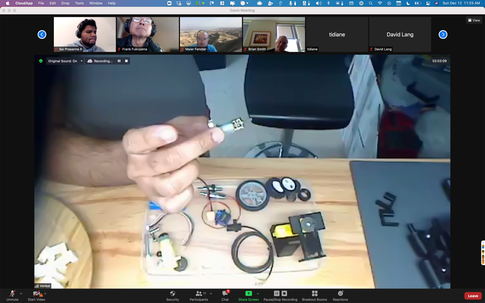

> Check out @antlerboy's new post, "Will you come to a conference that doesn’t have all the answers?". https://antlerboy.medium.com/will-you-come-to-a-conference-that-doesnt-have-all-the-answers-5c739d342304?source=rss-97852f5a56ae------2

 [Wed Dec 01 08:13:46 +0000 2021](https://twitter.com/yak_collective/status/1465957278482325505)

----

> Today's featured yak: Murilo Loureiro  https://www.yakcollective.org/members/100073/#20211201

 [Wed Dec 01 08:19:44 +0000 2021](https://twitter.com/yak_collective/status/1465958781146304512)

----

> Check out @vaughn_tan's new newsletter, "“Leaky beans.”". https://uncertaintymindset.substack.com/p/leaky-beans

 [Thu Dec 02 11:03:39 +0000 2021](https://twitter.com/yak_collective/status/1466362420591570954)

----

> Today's featured yak: Eric Platon (@not_replica) - (GOF)AI, Consciousness, Biology, Space https://www.yakcollective.org/members/100037/#20211202

 [Thu Dec 02 11:09:37 +0000 2021](https://twitter.com/yak_collective/status/1466363920449421321)

----

> Check out @anthilemoon's new post, "Living and working outside your inbox with the co-founder of Mailman". https://nesslabs.com/mailman-featured-tool?utm_source=rss&utm_medium=rss&utm_campaign=mailman-featured-tool

 [Thu Dec 02 15:35:06 +0000 2021](https://twitter.com/yak_collective/status/1466430735087247364)

----

> Check out @vgr's new newsletter, "Magic Beans". https://studio.ribbonfarm.com/p/magic-beans

 [Fri Dec 03 02:52:40 +0000 2021](https://twitter.com/yak_collective/status/1466601250049380355)

----

> Today's featured yak: Michael de la Maza  https://www.yakcollective.org/members/100064/#20211203

 [Fri Dec 03 02:59:16 +0000 2021](https://twitter.com/yak_collective/status/1466602910184267776)

----

> Check out @antlerboy's new post, "How to hack LinkedIn". https://antlerboy.medium.com/how-to-hack-linkedin-600ff43c3b5a?source=rss-97852f5a56ae------2

 [Sat Dec 04 00:28:41 +0000 2021](https://twitter.com/yak_collective/status/1466927403863793664)

----

> Today's featured yak: Jascha  https://www.yakcollective.org/members/100005/#20211204

 [Sat Dec 04 00:34:07 +0000 2021](https://twitter.com/yak_collective/status/1466928771097837568)

----

> Check out @antlerboy's new post, "Transduction — leading transformation — Issue #27". https://antlerboy.medium.com/transduction-leading-transformation-issue-27-df41f1f38ee3?source=rss-97852f5a56ae------2

 [Sat Dec 04 08:23:36 +0000 2021](https://twitter.com/yak_collective/status/1467046917561540611)

----

> Cleaned up `@yak_collective` Discord bots and updated the join page options. `@nathan_acks` `@jdbb` `@anurajenp` #yakbot

 [Sat Dec 04 18:04:38 +0000 2021](https://twitter.com/yak_collective/status/1467193142445228039)

----

> Today's featured yak: Jordan Allen (@quickdrawyall) - Business Development &amp; Revenue Generation https://www.yakcollective.org/members/100055/#20211205

 [Sun Dec 05 17:04:38 +0000 2021](https://twitter.com/yak_collective/status/1467540426886426626)

----

> Check out @antlerboy's new post, "What do you think when you see someone flying this flag?". https://antlerboy.medium.com/what-do-you-think-when-you-see-someone-flying-this-flag-8f4a932a19ea?source=rss-97852f5a56ae------2

 [Mon Dec 06 08:43:03 +0000 2021](https://twitter.com/yak_collective/status/1467776587990982658)

----

> Today's featured yak: Ryan Hume  - Industrial Designer + Illustrator + Music Technologist https://www.yakcollective.org/members/100069/#20211206

 [Mon Dec 06 08:49:41 +0000 2021](https://twitter.com/yak_collective/status/1467778258318106626)

----

> A group of about 12 yaks just agreed to play with setting up a channel archiving bot. A good example of a 2-way door decision #yakbot

 [Mon Dec 06 17:19:33 +0000 2021](https://twitter.com/yak_collective/status/1467906571422289932)

----

> Check out the latest edition of the Yak Talk newsletter, "YC Annual Meeting, Yak Rover Demo Day". https://yakcollective.substack.com/p/yc-annual-meeting-yak-rover-demo

 [Mon Dec 06 18:39:42 +0000 2021](https://twitter.com/yak_collective/status/1467926741146554375)

----

> Heads-up! Two Yak Collective events coming up: Yak Rover demo day on Sunday, Dec 12 and YC Annual Meeting, Tuesday Dec 14. If you've been waiting for the right opportunities to dive in, these are it. Details and registration links within. https://yakcollective.substack.com/p/yc-annual-meeting-yak-rover-demo

 [Mon Dec 06 21:34:56 +0000 2021](https://twitter.com/yak_collective/status/1467970840918577152)

----

> Check out @antlerboy's new post, "An outline approach to organisation or service review". https://antlerboy.medium.com/an-outline-approach-to-organisation-or-service-review-1e611460dbd4?source=rss-97852f5a56ae------2

 [Wed Dec 08 08:13:12 +0000 2021](https://twitter.com/yak_collective/status/1468493853166653443)

----

> Today's featured yak: Paul Millerd (@p_millerd) https://www.yakcollective.org/members/100078/#20211208

 [Wed Dec 08 08:19:40 +0000 2021](https://twitter.com/yak_collective/status/1468495481907167233)

----

> Check out @antlerboy's new post, "My top LinkedIn posts (you won’t BELIEVE number 77!) ;-)". https://antlerboy.medium.com/my-top-linkedin-posts-you-wont-believe-number-77-eb3f8956fd1?source=rss-97852f5a56ae------2

 [Thu Dec 09 09:43:41 +0000 2021](https://twitter.com/yak_collective/status/1468879011317223430)

----

> Today's featured yak: Grigori Milov  https://www.yakcollective.org/members/100079/#20211209

 [Thu Dec 09 09:49:49 +0000 2021](https://twitter.com/yak_collective/status/1468880555693555715)

----

> Check out @anthilemoon's new post, "How to measure meaning in life". https://nesslabs.com/how-to-measure-meaning-in-life?utm_source=rss&utm_medium=rss&utm_campaign=how-to-measure-meaning-in-life

 [Thu Dec 09 13:40:49 +0000 2021](https://twitter.com/yak_collective/status/1468938686477778952)

----

> Check out @anthilemoon's new post, "Redefining knowledge management with Kevin Lin, founder of Dendron". https://nesslabs.com/dendron-featured-tool?utm_source=rss&utm_medium=rss&utm_campaign=dendron-featured-tool

 [Thu Dec 09 16:05:36 +0000 2021](https://twitter.com/yak_collective/status/1468975125143773191)

----

> Today's featured yak: Tracy Brinkerhoff  https://www.yakcollective.org/members/100060/#20211210

 [Fri Dec 10 17:09:14 +0000 2021](https://twitter.com/yak_collective/status/1469353526778290180)

----

> Check out @vgr's new newsletter, "The Backstopper Economy". https://studio.ribbonfarm.com/p/the-backstopper-economy

 [Fri Dec 10 21:12:05 +0000 2021](https://twitter.com/yak_collective/status/1469414639905689606)

----

> Check out @antlerboy's new post, "Transduction — leading transformation — Issue #28". https://antlerboy.medium.com/transduction-leading-transformation-issue-28-57addb668312?source=rss-97852f5a56ae------2

 [Sat Dec 11 09:38:42 +0000 2021](https://twitter.com/yak_collective/status/1469602532712407048)

----

> Today's featured yak: Erik Sandberg  https://www.yakcollective.org/members/100088/#20211211

 [Sat Dec 11 09:49:44 +0000 2021](https://twitter.com/yak_collective/status/1469605311413633029)

----

> Sneak preview... all the rovers you will meet tomorrow at the first Yak Rover demo day! https://www.eventbrite.com/e/yak-rover-demo-day-tickets-210102992707 
> 
> 

 [Sat Dec 11 19:39:18 +0000 2021](https://twitter.com/yak_collective/status/1469753681134305280)

----

> Starting at the top of the hour https://twitter.com/yak_collective/status/1469753681134305280

 [Sun Dec 12 14:28:51 +0000 2021](https://twitter.com/yak_collective/status/1470037938494976007)

----

> RT @not_replica: We’re going to show some of the work done. Hardware, software, remote only, distributed across time zones, motivation and…

 [Sun Dec 12 14:53:07 +0000 2021](https://twitter.com/yak_collective/status/1470044048215973890)

----

> ... annnd we're off

 [Sun Dec 12 15:13:19 +0000 2021](https://twitter.com/yak_collective/status/1470049128407261188)

----

> Ways to join in the project 
> 
> 

 [Sun Dec 12 15:26:09 +0000 2021](https://twitter.com/yak_collective/status/1470052361322348546)

----

Replying to [@yak_collective](https://twitter.com/yak_collective/status/1470052361322348546)

> Running through fun interesting quick intros from first builders than others on the call

 [Sun Dec 12 15:37:59 +0000 2021](https://twitter.com/yak_collective/status/1470055337411624970)

----

Replying to [@yak_collective](https://twitter.com/yak_collective/status/1470055337411624970)

> 

 [Sun Dec 12 15:44:57 +0000 2021](https://twitter.com/yak_collective/status/1470057091079487490)

----

Replying to [@yak_collective](https://twitter.com/yak_collective/status/1470057091079487490)

> 

 [Sun Dec 12 15:45:33 +0000 2021](https://twitter.com/yak_collective/status/1470057243617943556)

----

Replying to [@yak_collective](https://twitter.com/yak_collective/status/1470057243617943556)

> 

 [Sun Dec 12 15:47:09 +0000 2021](https://twitter.com/yak_collective/status/1470057644178161669)

----

Replying to [@yak_collective](https://twitter.com/yak_collective/status/1470057644178161669)

> 

 [Sun Dec 12 15:47:31 +0000 2021](https://twitter.com/yak_collective/status/1470057737589600258)

----

Replying to [@yak_collective](https://twitter.com/yak_collective/status/1470057737589600258)

> 

 [Sun Dec 12 15:49:23 +0000 2021](https://twitter.com/yak_collective/status/1470058206697340928)

----

Replying to [@anurajenp](https://twitter.com/yak_collective/status/1470058206697340928)

> is building YR Infinity and Beyond 
> 
> 
> 
> 
> 
> 
> 
> 

 [Sun Dec 12 15:50:52 +0000 2021](https://twitter.com/yak_collective/status/1470058580871192582)

----

Replying to [@anurajenp](https://twitter.com/yak_collective/status/1470058206697340928)

> getting the live demo going 
> 
> 

 [Sun Dec 12 15:53:59 +0000 2021](https://twitter.com/yak_collective/status/1470059362739793924)

----

Replying to [@anurajenp](https://twitter.com/yak_collective/status/1470059362739793924)

> 

 [Sun Dec 12 16:01:17 +0000 2021](https://twitter.com/yak_collective/status/1470061203041009672)

----

Replying to [@anurajenp and @rhettford](https://twitter.com/yak_collective/status/1470061203041009672)

> is working on YR Stubborn Pursuit of a Path 
> 
> 
> 
> 
> 
> 

 [Sun Dec 12 16:03:03 +0000 2021](https://twitter.com/yak_collective/status/1470061647763021824)

----

Replying to [@rhettford](https://twitter.com/yak_collective/status/1470061647763021824)

> Live action — Rhett showed the rover knowing to stop when it runs into an obstacle. Operator can then back up and snap a pic of the obstacle 
> 
> 

 [Sun Dec 12 16:12:12 +0000 2021](https://twitter.com/yak_collective/status/1470063948984692750)

----

Replying to [@yak_collective](https://twitter.com/yak_collective/status/1470063948984692750)

> next up @vgr showing his YR Nature is Murder 
> 
> 
> 
> 
> 
> 
> 
> 

 [Sun Dec 12 16:15:57 +0000 2021](https://twitter.com/yak_collective/status/1470064890677186561)

----

Replying to [@vgr](https://twitter.com/yak_collective/status/1470064890677186561)

> YR Nature is Murder build decisions 
> 
> 
> 
> 
> 
> 
> 
> 

 [Sun Dec 12 16:36:05 +0000 2021](https://twitter.com/yak_collective/status/1470069959380418566)

----

Replying to [@yak_collective](https://twitter.com/yak_collective/status/1470069959380418566)

> Francis Fukayama showing his rover project 
> 
> 
> 
> 

 [Sun Dec 12 16:56:15 +0000 2021](https://twitter.com/yak_collective/status/1470075032881803280)

----

Replying to [@sai_prasanna](https://twitter.com/yak_collective/status/1470075032881803280)

> showing YR Gradient Ascent 
> 
> 
> 
> 
> 
> 
> 
> 

 [Sun Dec 12 17:00:32 +0000 2021](https://twitter.com/yak_collective/status/1470076110167814153)

----

Replying to [@sai_prasanna](https://twitter.com/yak_collective/status/1470076110167814153)

> YR Gradient Ascent live demo w @ProjectJupyter live code 
> 
> 
> 
> 

 [Sun Dec 12 17:03:10 +0000 2021](https://twitter.com/yak_collective/status/1470076776504254471)

----

> Today's featured yak: Thomas Hollands (@tdoggyholhol) - Marketing Strategy and Strategic Marketing https://www.yakcollective.org/members/100023/#20211212

 [Sun Dec 12 17:09:16 +0000 2021](https://twitter.com/yak_collective/status/1470078310352928770)

----

Replying to [@not_replica](https://twitter.com/yak_collective/status/1470076776504254471)

> showing YR Go and See by Build Leader Victor Hill (who had to work today) 
> 
> 
> 
> 

 [Sun Dec 12 17:11:51 +0000 2021](https://twitter.com/yak_collective/status/1470078961443033097)

----

Replying to [@maierfenster](https://twitter.com/yak_collective/status/1470078961443033097)

> showing YR Wonderful Wandering Growth 
> 
> 
> 
> 
> 
> 
> 
> 

 [Sun Dec 12 17:18:21 +0000 2021](https://twitter.com/yak_collective/status/1470080594780594187)

----

Replying to [@maierfenster](https://twitter.com/yak_collective/status/1470080594780594187)

> YR Wonderful Wandering Growth high-stepping out in the garden... tough obstacles to be solved include steps and weeds 
> 
> 
> 
> 
> 
> 
> 
> 

 [Sun Dec 12 17:23:50 +0000 2021](https://twitter.com/yak_collective/status/1470081976480763905)

----

Replying to [@maierfenster and @not_replica](https://twitter.com/yak_collective/status/1470081976480763905)

> back presenting on his build YR Abio Flex Wanderer 
> 
> 
> 
> 
> 
> 
> 
> 

 [Sun Dec 12 17:36:12 +0000 2021](https://twitter.com/yak_collective/status/1470085088419651586)

----

Replying to [@not_replica](https://twitter.com/yak_collective/status/1470085088419651586)

> Live action cooperatively operating rovers in Japan from around the world 
> 
> 
> 
> 
> 
> 

 [Sun Dec 12 18:06:14 +0000 2021](https://twitter.com/yak_collective/status/1470092648153292800)

----

Replying to [@yak_collective](https://twitter.com/yak_collective/status/1470058580871192582)

> Threading broke here, patching. Continues here https://twitter.com/yak_collective/status/1470059362739793924

 [Sun Dec 12 20:41:36 +0000 2021](https://twitter.com/yak_collective/status/1470131747526348801)

----

> Check out @antlerboy's new post, "Here is my theory of tomato inflation and latte carcinisation". https://antlerboy.medium.com/here-is-my-theory-of-tomato-inflation-and-latte-carcinisation-5e8ddfceb138?source=rss-97852f5a56ae------2

 [Mon Dec 13 07:43:53 +0000 2021](https://twitter.com/yak_collective/status/1470298416353845248)

----

> Today's featured yak: David McDougall (@dmcdougall) https://www.yakcollective.org/members/100076/#20211213

 [Mon Dec 13 07:49:14 +0000 2021](https://twitter.com/yak_collective/status/1470299762570244103)

----

Replying to [@rafathebuilder](https://twitter.com/rafathebuilder/status/1470359928422510596)

> What great timing for this doc, thanks Rafa. Yak Collective annual meeting is tomorrow, visitors welcome. Details at http://yakcollective.org. Different underlying model with similar goal, to connect folks

 [Mon Dec 13 13:56:32 +0000 2021](https://twitter.com/yak_collective/status/1470392196603985928)

----

> YC Annual Meeting starting now. If you're not participating live, you can still view the livestream here https://www.youtube.com/watch?v=ibukk4wcIiY

 [Tue Dec 14 15:07:26 +0000 2021](https://twitter.com/yak_collective/status/1470772426824994820)

----

Replying to [@yak_collective](https://twitter.com/yak_collective/status/1470772426824994820)

> Infrastructure map overview now on from @nathan_acks 
> 
> 

 [Tue Dec 14 15:17:37 +0000 2021](https://twitter.com/yak_collective/status/1470774987959250950)

----

Replying to [@nathan_acks](https://twitter.com/yak_collective/status/1470774987959250950)

> Now @jdbb is talking about publishing ops 
> 
> 

 [Tue Dec 14 15:34:53 +0000 2021](https://twitter.com/yak_collective/status/1470779331333001222)

----

Replying to [@nathan_acks and @jdbb](https://twitter.com/yak_collective/status/1470779331333001222)

> Overview of our most recent project, soft-launching today, the Art of Online Governance from @sachinnbenny 
> 
> 

 [Tue Dec 14 15:47:19 +0000 2021](https://twitter.com/yak_collective/status/1470782464436191245)

----

Replying to [@nathan_acks, @jdbb and @sachinnbenny](https://twitter.com/yak_collective/status/1470782464436191245)

> Nice sidebar discussion on how to measure the size/scale of an online governance situation and "surge" size of a thing vs. "operational" size

 [Tue Dec 14 16:13:32 +0000 2021](https://twitter.com/yak_collective/status/1470789060872445952)

----

Replying to [@nathan_acks, @jdbb and @sachinnbenny](https://twitter.com/yak_collective/status/1470789060872445952)

> Session on failed projects, autopsy of the whys, survival statistics expectations of why only 10% of projects proposed at spitballing will ever get to a defined project state and have a shot at succeeding

 [Tue Dec 14 16:28:45 +0000 2021](https://twitter.com/yak_collective/status/1470792889080815620)

----

Replying to [@nathan_acks, @jdbb and @sachinnbenny](https://twitter.com/yak_collective/status/1470792889080815620)

> Retrospective on Yak Rover project led by @maierfenster 
> 
> 

 [Tue Dec 14 17:00:51 +0000 2021](https://twitter.com/yak_collective/status/1470800966815731712)

----

> Today's featured yak: Anne-Laure Le Cunff (@anthilemoon) https://www.yakcollective.org/members/100071/#20211214

 [Tue Dec 14 17:09:29 +0000 2021](https://twitter.com/yak_collective/status/1470803139808874496)

----

Replying to [@nathan_acks, @jdbb, @sachinnbenny and @maierfenster](https://twitter.com/yak_collective/status/1470800966815731712)

> Now in the blockchain roadmap part of the meeting 
> 
> 

 [Tue Dec 14 17:47:12 +0000 2021](https://twitter.com/yak_collective/status/1470812631434858504)

----

Replying to [@nathan_acks, @jdbb, @sachinnbenny and @maierfenster](https://twitter.com/yak_collective/status/1470812631434858504)

> And that's a wrap! Annual Meeting #2 done, and we're on to Year 3 of the Yak Collective

 [Tue Dec 14 18:00:36 +0000 2021](https://twitter.com/yak_collective/status/1470816005655973888)

----

> Check out @tomcritchlow's new post, "Talking Buy-in and Budget with Ross at Siege Media". http://tomcritchlow.com/2021/12/14/siege-podcast/

 [Tue Dec 14 22:12:48 +0000 2021](https://twitter.com/yak_collective/status/1470879473214099462)

----

> Check out @antlerboy's new post, "What do you think of each other? How dangerous would it be if everyone knew? A partnership exercise". https://antlerboy.medium.com/what-do-you-think-of-each-other-how-dangerous-would-it-be-if-everyone-knew-a-partnership-exercise-f1f43e380fe4?source=rss-97852f5a56ae------2

 [Wed Dec 15 08:48:12 +0000 2021](https://twitter.com/yak_collective/status/1471039378030043136)

----

> Today's featured yak: Thomas Verhagen (@thomasverhagen) https://www.yakcollective.org/members/100051/#20211215

 [Wed Dec 15 08:54:17 +0000 2021](https://twitter.com/yak_collective/status/1471040905570357248)

----

> Check out the latest edition of the Yak Talk newsletter, "YC Annual Survey!". https://yakcollective.substack.com/p/yc-annual-survey

 [Wed Dec 15 19:39:39 +0000 2021](https://twitter.com/yak_collective/status/1471203317766311936)

----

Replying to [@exchgr and @vgr](https://twitter.com/exchgr/status/1470852611284914194)

> Delayed

 [Thu Dec 16 06:02:58 +0000 2021](https://twitter.com/yak_collective/status/1471360183607517184)

----

> Today's featured yak: Harry Pottash  - Philosopher &amp; Investor https://www.yakcollective.org/members/100084/#20211216

 [Thu Dec 16 17:04:20 +0000 2021](https://twitter.com/yak_collective/status/1471526621865730058)

----

> Check out @anthilemoon's new post, "2021 year in review: making friends with fear". https://nesslabs.com/annual-review-2021?utm_source=rss&utm_medium=rss&utm_campaign=annual-review-2021

 [Thu Dec 16 18:05:34 +0000 2021](https://twitter.com/yak_collective/status/1471542028727164937)

----

> Check out @anthilemoon's new post, "Designing a better reading experience with Ben Springwater, co-founder of Matter". https://nesslabs.com/matter-featured-tool?utm_source=rss&utm_medium=rss&utm_campaign=matter-featured-tool

 [Thu Dec 16 19:00:36 +0000 2021](https://twitter.com/yak_collective/status/1471555881414369281)

----

> Check out @vgr's new newsletter, "Winter Break". https://studio.ribbonfarm.com/p/winter-break

 [Thu Dec 16 22:52:45 +0000 2021](https://twitter.com/yak_collective/status/1471614299852484612)

----

> Today's featured yak: Maier Fenster (@maierfenster) - Distilling and then leveraging your ideas https://www.yakcollective.org/members/100020/#20211217

 [Fri Dec 17 17:04:48 +0000 2021](https://twitter.com/yak_collective/status/1471889123468271621)

----

> Today's featured yak: Randy Lubin (@randylubin) https://www.yakcollective.org/members/100074/#20211218

 [Sat Dec 18 17:04:08 +0000 2021](https://twitter.com/yak_collective/status/1472251346170560528)

----

> Check out @antlerboy's new post, "Transduction — Leading Transformation — Issue #29". https://antlerboy.medium.com/transduction-leading-transformation-issue-29-aa4d97b0183d?source=rss-97852f5a56ae------2

 [Sat Dec 18 23:29:04 +0000 2021](https://twitter.com/yak_collective/status/1472348215525744640)

----

> Today's featured yak: Victor Hill  https://www.yakcollective.org/members/100067/#20211219

 [Sun Dec 19 17:05:10 +0000 2021](https://twitter.com/yak_collective/status/1472613992707371013)

----

> Check out @antlerboy's new post, "Have you ever been ‘referred’ or ‘signposted’? How did it feel?". https://antlerboy.medium.com/have-you-ever-been-referred-or-signposted-how-did-it-feel-e9105601ec2b?source=rss-97852f5a56ae------2

 [Mon Dec 20 10:18:05 +0000 2021](https://twitter.com/yak_collective/status/1472873934722899968)

----

> Today's featured yak: Benjamin Taylor (@antlerboy) - systems | cybernetics | complexity https://www.yakcollective.org/members/100047/#20211220

 [Mon Dec 20 10:19:59 +0000 2021](https://twitter.com/yak_collective/status/1472874414731677702)

----

> We just discussed this excellent deck on art primitives for NFTs by @commitsvortex  in the YC blockchain roadmap study group.  https://docs.google.com/presentation/d/1e4WeafuEqZ4lhWw9xXibwVSjHZ-Fo2l5RJqXj3O8kmw/edit?usp=sharing #yakbot

 [Mon Dec 20 17:14:48 +0000 2021](https://twitter.com/yak_collective/status/1472978804184342528)

----

Replying to [@yak_collective](https://twitter.com/yak_collective/status/1472978804184342528)

> If you’re interested in joining our explorations, we meet Mondays at 12 noon UTC (8 AM US Pacific) on Mondays in our Discord voice chat. https://www.yakcollective.org/join/

 [Mon Dec 20 17:24:33 +0000 2021](https://twitter.com/yak_collective/status/1472981257503985668)

----

> Starting weekly Yak Rover meeting now, in case any interested people from the Demo Day want to join #yakbot

 [Tue Dec 21 05:48:43 +0000 2021](https://twitter.com/yak_collective/status/1473168534087909376)

----

> Today's featured yak: Drew Shiel (@gothwalk) - Independent Domestic Historian https://www.yakcollective.org/members/100090/#20211221

 [Tue Dec 21 17:09:09 +0000 2021](https://twitter.com/yak_collective/status/1473339770076119043)

----

> Today's featured yak: Jenna Dixon (@jdbb) - communications &amp; digital operations https://www.yakcollective.org/members/100018/#20211222

 [Wed Dec 22 17:04:48 +0000 2021](https://twitter.com/yak_collective/status/1473701064469848073)

----

> Check out @antlerboy's new post, "“We aren’t talking enough about power”". https://antlerboy.medium.com/we-arent-talking-enough-about-power-9f0f6741c438?source=rss-97852f5a56ae------2

 [Thu Dec 23 00:08:54 +0000 2021](https://twitter.com/yak_collective/status/1473807792347795456)

----

> Today's featured yak: Nita Baum (@bfree_live) https://www.yakcollective.org/members/100058/#20211223

 [Thu Dec 23 00:19:54 +0000 2021](https://twitter.com/yak_collective/status/1473810562748403713)

----

> Check out @antlerboy's new post, "Transduction — leading transformation — Issue #30". https://antlerboy.medium.com/transduction-leading-transformation-issue-30-1e5b46b4f1f2?source=rss-97852f5a56ae------2

 [Fri Dec 24 15:43:54 +0000 2021](https://twitter.com/yak_collective/status/1474405480684523522)

----

> Today's featured yak: Alex Dobrenko (@Dobrenkz) - Improviser / Writer / Filmmaker https://www.yakcollective.org/members/100065/#20211224

 [Fri Dec 24 15:50:01 +0000 2021](https://twitter.com/yak_collective/status/1474407022112169987)

----

> Today's featured yak: Shreeda Segan (@freeshreeda) - Design Thinker &amp; Writer https://www.yakcollective.org/members/100044/#20211225

 [Sat Dec 25 17:04:19 +0000 2021](https://twitter.com/yak_collective/status/1474788106020790277)

----

> Today's featured yak: Mike Wimsatt  https://www.yakcollective.org/members/100093/#20211226

 [Sun Dec 26 17:09:20 +0000 2021](https://twitter.com/yak_collective/status/1475151757000986629)

----

> Take the Yak Collective annual survey https://docs.google.com/forms/d/15I-jLSnLmZIiW1oA_tcaMECNFZ-WJfiJa78_ud_W5Is/prefill #yakbot

 [Sun Dec 26 19:38:25 +0000 2021](https://twitter.com/yak_collective/status/1475189274047922179)

----

> Check out @antlerboy's new post, "Self-love can make you blind". https://antlerboy.medium.com/self-love-can-make-you-blind-a139f8db3cdc?source=rss-97852f5a56ae------2

 [Mon Dec 27 08:08:47 +0000 2021](https://twitter.com/yak_collective/status/1475378112976277505)

----

> Today's featured yak: Sachin Benny (@sachinb91) https://www.yakcollective.org/members/100013/#20211227

 [Mon Dec 27 08:14:49 +0000 2021](https://twitter.com/yak_collective/status/1475379630995652613)

----

> Today's featured yak: Chris Clark (@chrisclark1729) - Freelance Data Projects https://www.yakcollective.org/members/100061/#20211228

 [Tue Dec 28 17:04:07 +0000 2021](https://twitter.com/yak_collective/status/1475875220120604678)

----

> Check out @antlerboy's new post, "When leaders have no idea of the real-life experience of their service, finding out can be a hell…". https://antlerboy.medium.com/when-leaders-have-no-idea-of-the-real-life-experience-of-their-service-finding-out-can-be-a-hell-338caa07bedc?source=rss-97852f5a56ae------2

 [Wed Dec 29 08:33:50 +0000 2021](https://twitter.com/yak_collective/status/1476109189818863618)

----

> Today's featured yak: Rodrigo Pinto (@Rodrigo_plp) https://www.yakcollective.org/members/100083/#20211229

 [Wed Dec 29 08:39:40 +0000 2021](https://twitter.com/yak_collective/status/1476110660144713731)

----

> Check out @tomcritchlow's new post, "Thinking in Public with the Leaders of Consulting Podcast". http://tomcritchlow.com/2021/12/29/leaders-consulting-podcast/

 [Wed Dec 29 16:12:34 +0000 2021](https://twitter.com/yak_collective/status/1476224633439498243)

----

> Today's featured yak: Anuraj R (@anurajenp) - Curious | Roboticist https://www.yakcollective.org/members/100039/#20211230

 [Thu Dec 30 17:04:29 +0000 2021](https://twitter.com/yak_collective/status/1476600088998948873)

----

> Check out @randylubin's new post, "2021 Recap". https://blog.randylubin.com/2021-recap

 [Thu Dec 30 23:25:33 +0000 2021](https://twitter.com/yak_collective/status/1476695984407207937)

----

> Check out @antlerboy's new post, "Transduction — leading transformation — Issue #31". https://antlerboy.medium.com/transduction-leading-transformation-issue-31-d69c76b0d007?source=rss-97852f5a56ae------2

 [Fri Dec 31 08:13:34 +0000 2021](https://twitter.com/yak_collective/status/1476828867570683907)

----

> Today's featured yak: Siva Swaroop  https://www.yakcollective.org/members/100091/#20211231

 [Fri Dec 31 08:19:36 +0000 2021](https://twitter.com/yak_collective/status/1476830385258614786)