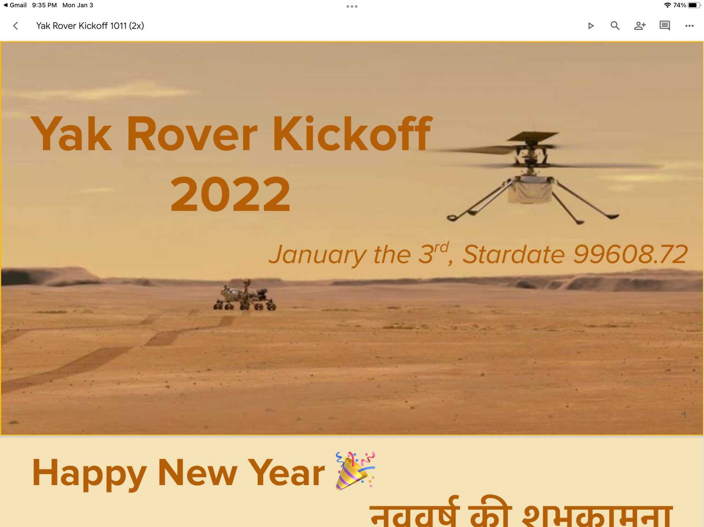
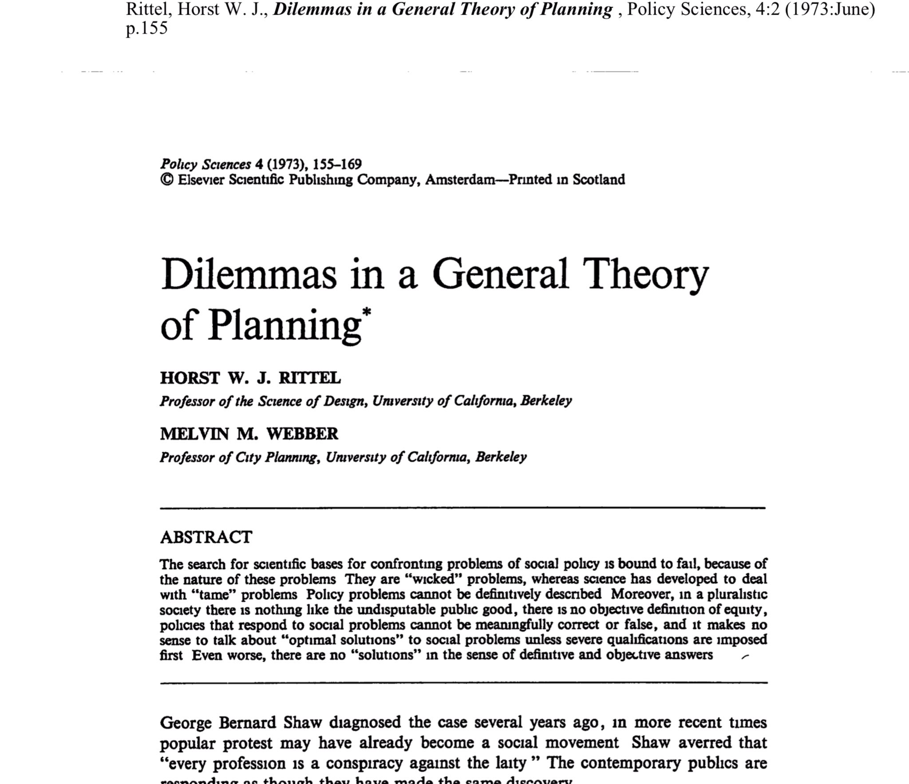
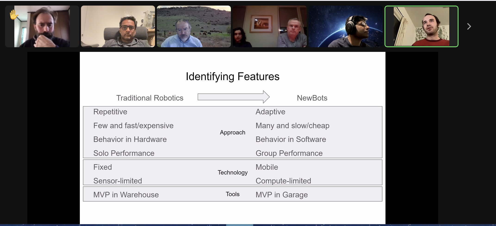
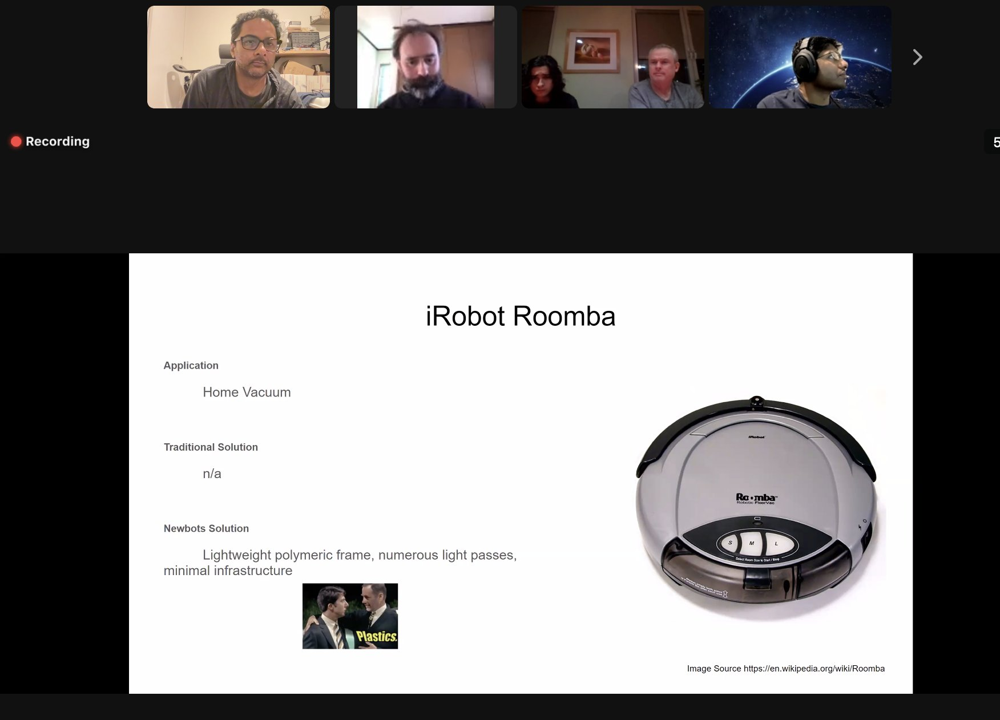

> Today's featured yak: Chris Butler (@chrizbot) - Chaotic good product manager https://www.yakcollective.org/members/100006/#20220101

 [Sat Jan 01 17:09:24 +0000 2022](https://twitter.com/yak_collective/status/1477326100669816833)

----

> Check out @randylubin's new post, "Gaming Like It’s 1926". https://blog.randylubin.com/gaming-like-it-s-1926

 [Sat Jan 01 22:05:45 +0000 2022](https://twitter.com/yak_collective/status/1477400680650485763)

----

> Today's featured yak: Tom Critchlow (@tomcritchlow) https://www.yakcollective.org/members/100063/#20220102

 [Sun Jan 02 17:04:39 +0000 2022](https://twitter.com/yak_collective/status/1477687293154451457)

----

> Check out @antlerboy's new post, "When were you last put on a waiting list?". https://antlerboy.medium.com/when-were-you-last-put-on-a-waiting-list-ae90270f0ded?source=rss-97852f5a56ae------2

 [Mon Jan 03 08:08:06 +0000 2022](https://twitter.com/yak_collective/status/1477914655007854597)

----

> Today's featured yak: Zhan Li (@thezhanly) - Scenarios, Foresight, Futurist Studies &amp; PE/VC https://www.yakcollective.org/members/100072/#20220103

 [Mon Jan 03 08:14:02 +0000 2022](https://twitter.com/yak_collective/status/1477916145554444290)

----

> Kicking off Year 2 of the rover project in a few minutes with @not_replica as new First Speaker 
> 
> 

 [Tue Jan 04 05:36:51 +0000 2022](https://twitter.com/yak_collective/status/1478238978469863425)

----

> Today's featured yak: Jordan Peacock (@hewhocutsdown) - CEO, Becoming Machinic; Founder, Sortilege https://www.yakcollective.org/members/100036/#20220104

 [Tue Jan 04 17:09:50 +0000 2022](https://twitter.com/yak_collective/status/1478413371586367505)

----

> Check out @antlerboy's new post, "How does the signal of demand get through to your organisation?". https://antlerboy.medium.com/how-does-the-signal-of-demand-get-through-to-your-organisation-5b93a60467e8?source=rss-97852f5a56ae------2

 [Wed Jan 05 08:43:48 +0000 2022](https://twitter.com/yak_collective/status/1478648415135404032)

----

> Today's featured yak: Prashant Gandhi  https://www.yakcollective.org/members/100066/#20220105

 [Wed Jan 05 08:49:46 +0000 2022](https://twitter.com/yak_collective/status/1478649915752521728)

----

> Check out @anthilemoon's new post, "Become more calm and conscious with Kai Koch, co-founder of Ahead". https://nesslabs.com/ahead-featured-tool?utm_source=rss&utm_medium=rss&utm_campaign=ahead-featured-tool

 [Thu Jan 06 14:50:53 +0000 2022](https://twitter.com/yak_collective/status/1479103179409149952)

----

> Today's featured yak: Ben Mosior (@HiredThought) - curator of strange and interesting methods https://www.yakcollective.org/members/100080/#20220106

 [Thu Jan 06 17:04:32 +0000 2022](https://twitter.com/yak_collective/status/1479136813767876612)

----

> Check out @tomcritchlow's new post, "January 2022 - Map of Inquiry". http://tomcritchlow.com/2022/01/06/jan-22-map-inquiry/

 [Thu Jan 06 23:17:46 +0000 2022](https://twitter.com/yak_collective/status/1479230741083045896)

----

> Today's featured yak: Maggie Appleton  https://www.yakcollective.org/members/100056/#20220107

 [Fri Jan 07 17:09:37 +0000 2022](https://twitter.com/yak_collective/status/1479500484272656384)

----

> YakRover 2022 Kickoff Meeting up on YouTube. Interesting discussion about Newbotics, Robot Brain-Body Architecture, Landing Rovers with Model Rockets 🚀, calculating Star Dates and more 
> 
> https://youtu.be/xjra2ZeAsMU #yakbot

 [Fri Jan 07 17:32:57 +0000 2022](https://twitter.com/yak_collective/status/1479506356302454798)

----

> Check out @antlerboy's new post, "Transduction — leading transformation — Issue #32". https://antlerboy.medium.com/transduction-leading-transformation-issue-32-102f20dd3b63?source=rss-97852f5a56ae------2

 [Sat Jan 08 09:18:48 +0000 2022](https://twitter.com/yak_collective/status/1479744385717788674)

----

> Today's featured yak: Jay Kalawar  https://www.yakcollective.org/members/100070/#20220108

 [Sat Jan 08 09:29:21 +0000 2022](https://twitter.com/yak_collective/status/1479747040645206017)

----

> Check out @p_millerd's new post, "Do We Really Want Happiness? Lessons from Socrates, Kahneman &amp; Maslow". https://think-boundless.com/happiness/?utm_source=rss&utm_medium=rss&utm_campaign=happiness

 [Sat Jan 08 17:01:18 +0000 2022](https://twitter.com/yak_collective/status/1479860779478392839)

----

> Today's featured yak: Darren Kong (@varietalxyz) https://www.yakcollective.org/members/100025/#20220109

 [Sun Jan 09 17:04:43 +0000 2022](https://twitter.com/yak_collective/status/1480224024030552064)

----

> Check out @antlerboy's new post, "What’s your Facilitrainer Inheritance?". https://antlerboy.medium.com/whats-your-facilitrainer-inheritance-edf6ca84d13e?source=rss-97852f5a56ae------2

 [Mon Jan 10 08:08:21 +0000 2022](https://twitter.com/yak_collective/status/1480451430486261760)

----

> Today's featured yak: Praful Mathur  https://www.yakcollective.org/members/100075/#20220110

 [Mon Jan 10 08:14:51 +0000 2022](https://twitter.com/yak_collective/status/1480453066025492480)

----

> Today's featured yak: Sumit Paul-Choudhury  https://www.yakcollective.org/members/100081/#20220111

 [Tue Jan 11 17:04:19 +0000 2022](https://twitter.com/yak_collective/status/1480948698792308746)

----

> Check out @anthilemoon's new post, "Attentional bias: the invisible puppeteer behind our decisions". https://nesslabs.com/attentional-bias?utm_source=rss&utm_medium=rss&utm_campaign=attentional-bias

 [Wed Jan 12 14:55:59 +0000 2022](https://twitter.com/yak_collective/status/1481278792853340166)

----

> Today's featured yak: Phil Wolff (@evanwolf) https://www.yakcollective.org/members/100053/#20220112

 [Wed Jan 12 15:04:21 +0000 2022](https://twitter.com/yak_collective/status/1481280898041454594)

----

> Check out @antlerboy's new post, "It’s just noise!". https://antlerboy.medium.com/its-just-noise-6d71aea4fabe?source=rss-97852f5a56ae------2

 [Wed Jan 12 16:43:55 +0000 2022](https://twitter.com/yak_collective/status/1481305953031139330)

----

> Check out @anthilemoon's new post, "The art and science of abstract thinking". https://nesslabs.com/abstract-thinking?utm_source=rss&utm_medium=rss&utm_campaign=abstract-thinking

 [Thu Jan 13 15:55:54 +0000 2022](https://twitter.com/yak_collective/status/1481656260282011648)

----

> Today's featured yak: Chris Reid (@careid0) https://www.yakcollective.org/members/100087/#20220113

 [Thu Jan 13 16:04:31 +0000 2022](https://twitter.com/yak_collective/status/1481658425025064966)

----

> Today's featured yak: Scott Garlinger (@scott_garlinger) - Director of Business Development, Groupmuse; A.I. Operator, Dynasty https://www.yakcollective.org/members/100022/#20220114

 [Fri Jan 14 17:09:08 +0000 2022](https://twitter.com/yak_collective/status/1482037075738304514)

----

> Check out @antlerboy's new post, "Transduction — leading transformation — Issue #33". https://antlerboy.medium.com/transduction-leading-transformation-issue-33-54afa1f9746?source=rss-97852f5a56ae------2

 [Sat Jan 15 15:53:31 +0000 2022](https://twitter.com/yak_collective/status/1482380435124592640)

----

> Today's featured yak: Vlad Mehakovic (@vladiim) https://www.yakcollective.org/members/100077/#20220115

 [Sat Jan 15 15:54:53 +0000 2022](https://twitter.com/yak_collective/status/1482380778822680591)

----

> Today's featured yak: Claire Peters  https://www.yakcollective.org/members/100082/#20220116

 [Sun Jan 16 17:09:07 +0000 2022](https://twitter.com/yak_collective/status/1482761846058848256)

----

> Check out @antlerboy's new post, "When have you seen someone change their position — and suddenly change their perspective?". https://antlerboy.medium.com/when-have-you-seen-someone-change-their-position-and-suddenly-change-their-perspective-bdde9c44ca1f?source=rss-97852f5a56ae------2

 [Mon Jan 17 09:13:28 +0000 2022](https://twitter.com/yak_collective/status/1483004535576670209)

----

> Today's featured yak: Justice (@being_on_line) - everything digital https://www.yakcollective.org/members/100048/#20220117

 [Mon Jan 17 09:19:40 +0000 2022](https://twitter.com/yak_collective/status/1483006094343561220)

----

> Check out @chrizbot's new post, "Strategy is now". https://medium.com/agileinsider/strategy-is-now-5c0201c7e10a?source=rss-ba6349c9c628------2

 [Mon Jan 17 17:57:31 +0000 2022](https://twitter.com/yak_collective/status/1483136415533830152)

----

> Check out @evanwolf's new post, "Why do you care about identity?". https://wider.team/2022/01/18/phil-cares-about-identity/

 [Tue Jan 18 15:15:39 +0000 2022](https://twitter.com/yak_collective/status/1483458068788789258)

----

> Today's featured yak: Harry Pottash  - Philosopher &amp; Investor https://www.yakcollective.org/members/100084/#20220118

 [Tue Jan 18 15:24:39 +0000 2022](https://twitter.com/yak_collective/status/1483460332240752644)

----

> Check out @randylubin's new post, "Story Synth Visual Refresh". https://blog.randylubin.com/story-synth-visual-refresh

 [Tue Jan 18 20:20:40 +0000 2022](https://twitter.com/yak_collective/status/1483534830247759880)

----

> Check out @antlerboy's new post, "Looking where we see". https://antlerboy.medium.com/looking-where-we-see-d4b7445f6e64?source=rss-97852f5a56ae------2

 [Wed Jan 19 08:58:40 +0000 2022](https://twitter.com/yak_collective/status/1483725583414616067)

----

> Today's featured yak: Vinay Débrou (@vinaydebrou) https://www.yakcollective.org/members/100019/#20220119

 [Wed Jan 19 08:59:40 +0000 2022](https://twitter.com/yak_collective/status/1483725836880695298)

----

> Check out @anthilemoon's new post, "From knowledge-management to knowledge-creation with the founders of RemNote". https://nesslabs.com/remnote-featured-tool?utm_source=rss&utm_medium=rss&utm_campaign=remnote-featured-tool

 [Thu Jan 20 14:35:49 +0000 2022](https://twitter.com/yak_collective/status/1484172818153709568)

----

> Today's featured yak: Charlie Bilsland (@charliebilsland) - Space / Strategy / Commercials https://www.yakcollective.org/members/100059/#20220120

 [Thu Jan 20 14:39:24 +0000 2022](https://twitter.com/yak_collective/status/1484173721501896708)

----

> Today's featured yak: Victor Hill  https://www.yakcollective.org/members/100067/#20220121

 [Fri Jan 21 17:09:46 +0000 2022](https://twitter.com/yak_collective/status/1484573949811957761)

----

> Check out @antlerboy's new post, "Transduction — leading transformation — Issue #34". https://antlerboy.medium.com/transduction-leading-transformation-issue-34-9b740898cc96?source=rss-97852f5a56ae------2

 [Fri Jan 21 19:33:47 +0000 2022](https://twitter.com/yak_collective/status/1484610195019939842)

----

> Check out @antlerboy's new post, "Transduction — leading transformation — Issue #34". https://antlerboy.medium.com/transduction-leading-transformation-issue-34-62a25406a489?source=rss-97852f5a56ae------2

 [Fri Jan 21 19:33:47 +0000 2022](https://twitter.com/yak_collective/status/1484610192637579264)

----

> Today's featured yak: Benjamin Smith  - Qualitative researcher https://www.yakcollective.org/members/100046/#20220122

 [Sat Jan 22 17:09:17 +0000 2022](https://twitter.com/yak_collective/status/1484936218341220357)

----

> Today's featured yak: Vaughn Tan (@vaughn_tan) https://www.yakcollective.org/members/100092/#20220123

 [Sun Jan 23 17:04:36 +0000 2022](https://twitter.com/yak_collective/status/1485297424692396036)

----

> Check out @sachinb91's new post, "#15 Ode to Freeway Exits". https://sachinsnotes.substack.com/p/15-ode-to-freeway-exits

 [Sun Jan 23 23:47:24 +0000 2022](https://twitter.com/yak_collective/status/1485398794707640332)

----

> Check out @p_millerd's new post, "Paul’s 2021 Annual Review – From Mexico to Taiwan to the US". https://think-boundless.com/2021annualreview/?utm_source=rss&utm_medium=rss&utm_campaign=2021annualreview

 [Mon Jan 24 04:06:39 +0000 2022](https://twitter.com/yak_collective/status/1485464034619052033)

----

> Today's featured yak: Nathan Chen (@iam_nChen) https://www.yakcollective.org/members/100015/#20220124

 [Mon Jan 24 04:09:35 +0000 2022](https://twitter.com/yak_collective/status/1485464775094149120)

----

> Please join us tomorrow January 25th 5:45 UTC for the first Yak Rover review on "Rover for Newbies", presented by @anurajenp --- here are the slides: https://docs.google.com/presentation/d/1YtmmXSZlU4JE1ruOgW-zZdgYQ9E_5K78ShbMAxCR-70/edit#slide=id.g1037a92bb10_0_484 #yakbot

 [Mon Jan 24 07:41:22 +0000 2022](https://twitter.com/yak_collective/status/1485518070823145481)

----

> Check out @antlerboy's new post, "What do you want to read from me?". https://antlerboy.medium.com/what-do-you-want-to-read-from-me-452e4e89796f?source=rss-97852f5a56ae------2

 [Mon Jan 24 07:58:49 +0000 2022](https://twitter.com/yak_collective/status/1485522462896889857)

----

> Check out @tomcritchlow's new post, "Quotebacks V1.1.4". http://tomcritchlow.com/2022/01/24/quotebacks-v1.1.4/

 [Mon Jan 24 17:37:56 +0000 2022](https://twitter.com/yak_collective/status/1485668203850309634)

----

> If you are curious about tomorrow's YakRover talk on "Rover for Newbies" by @anurajenp, checkout our YouTube channel for different rovers we built in 2021 - https://www.youtube.com/channel/UC9bngPbXMEZ8ivD1GHJ94aw #yakbot

 [Mon Jan 24 19:06:01 +0000 2022](https://twitter.com/yak_collective/status/1485690370172362760)

----

> Check out @randylubin's new post, "Story Synth Grant Program". https://blog.randylubin.com/story-synth-grant-program

 [Mon Jan 24 21:00:08 +0000 2022](https://twitter.com/yak_collective/status/1485719089691742217)

----

> Check out the latest edition of the Yak Talk newsletter, "Tonight! Rovers 101 Session". https://yakcollective.substack.com/p/tonight-rovers-101-session

 [Mon Jan 24 22:49:28 +0000 2022](https://twitter.com/yak_collective/status/1485746603227066374)

----

> Rovers 101 session coming up in a few hours! https://yakcollective.substack.com/p/tonight-rovers-101-session #yakbot

 [Mon Jan 24 22:49:51 +0000 2022](https://twitter.com/yak_collective/status/1485746697548570627)

----

> Today's featured yak: Martha Balaile (@MythologyStudio) https://www.yakcollective.org/members/100057/#20220125

 [Tue Jan 25 17:09:47 +0000 2022](https://twitter.com/yak_collective/status/1486023505409888260)

----

> Check out @antlerboy's new post, "Thriving in the space of service — for consultants, coaches, facilitators, business partners…". https://antlerboy.medium.com/thriving-in-the-space-of-service-for-consultants-coaches-facilitators-business-partners-213fa667e1d5?source=rss-97852f5a56ae------2

 [Wed Jan 26 08:33:31 +0000 2022](https://twitter.com/yak_collective/status/1486255969961132039)

----

> Today's featured yak: Alex Dobrenko (@Dobrenkz) - Improviser / Writer / Filmmaker https://www.yakcollective.org/members/100065/#20220126

 [Wed Jan 26 08:39:39 +0000 2022](https://twitter.com/yak_collective/status/1486257513314009090)

----

> Check out @chrizbot's new post, "Decision-Forcing Cases: Gaining experience without the hurt". https://medium.com/agileinsider/decision-forcing-cases-gaining-experience-without-the-hurt-217a4f846606?source=rss-ba6349c9c628------2

 [Wed Jan 26 15:02:52 +0000 2022](https://twitter.com/yak_collective/status/1486353952832696335)

----

Replying to [@yak_collective](https://twitter.com/yak_collective/status/1479506356302454798)

> 2/ Second YakRover weekly meetup is up on YouTube. @not_replica, @maierfenster, @vgr, @jaschawilcox, and Brian Smith discuss RoverOS
> https://www.youtube.com/watch?v=7RoVVsBByxk

 [Wed Jan 26 17:30:06 +0000 2022](https://twitter.com/yak_collective/status/1486391005620363265)

----

> Check out @tomcritchlow's new post, "Electric Tables V0.1". http://tomcritchlow.com/2022/01/26/electric-tables/

 [Wed Jan 26 18:12:49 +0000 2022](https://twitter.com/yak_collective/status/1486401755004895232)

----

> Check out @anthilemoon's new post, "Fostering authentic relationships in distributed teams with the co-founder of Remotion". https://nesslabs.com/remotion-featured-tool?utm_source=rss&utm_medium=rss&utm_campaign=remotion-featured-tool

 [Thu Jan 27 13:01:00 +0000 2022](https://twitter.com/yak_collective/status/1486685672865939461)

----

> Today's featured yak: Venkatesh Rao (@vgr) - Independent consultant https://www.yakcollective.org/members/100041/#20220127

 [Thu Jan 27 13:05:33 +0000 2022](https://twitter.com/yak_collective/status/1486686818867486720)

----

> Yak Collective Blockchain weekly call posted https://youtu.be/OegWsYTEVFk. This week’s topic was the Solana ecosystem and led by Kiran Pathakota. Calls open to Yak Collective members: http://yakcollective.org/join #yakbot

 [Fri Jan 28 16:07:25 +0000 2022](https://twitter.com/yak_collective/status/1487094973677944836)

----

> Today's featured yak: Drew Schorno (@dschorno) - Clown school graduate; Failed startup alumni https://www.yakcollective.org/members/100089/#20220128

 [Fri Jan 28 17:04:41 +0000 2022](https://twitter.com/yak_collective/status/1487109387412033536)

----

> Now reading, in the yak collective Friday online governance study group 
> 
> 

 [Fri Jan 28 17:08:29 +0000 2022](https://twitter.com/yak_collective/status/1487110341884399617)

----

> Check out @antlerboy's new post, "Transduction — leading transformation — Issue #35". https://antlerboy.medium.com/transduction-leading-transformation-issue-35-2f3acf970c85?source=rss-97852f5a56ae------2

 [Sat Jan 29 10:53:26 +0000 2022](https://twitter.com/yak_collective/status/1487378346946310145)

----

> Today's featured yak: Nathan Acks (@nathan_acks) - Armchair futurist. Defense against the dark arts. https://www.yakcollective.org/members/100007/#20220129

 [Sat Jan 29 10:59:57 +0000 2022](https://twitter.com/yak_collective/status/1487379984495050752)

----

> Today's featured yak: Michael Colin (@divinix_chi) - Supply Chain; Logistics; Freight Tech https://www.yakcollective.org/members/100062/#20220130

 [Sun Jan 30 17:04:46 +0000 2022](https://twitter.com/yak_collective/status/1487834181979754496)

----

> Check out @antlerboy's new post, "Can you see the courtly rituals still at work in our organisations and management?". https://antlerboy.medium.com/can-you-see-the-courtly-rituals-still-at-work-in-our-organisations-and-management-d0953851979d?source=rss-97852f5a56ae------2

 [Mon Jan 31 08:08:46 +0000 2022](https://twitter.com/yak_collective/status/1488061680005357569)

----

> Today's featured yak: Rodrigo Pinto (@Rodrigo_plp) https://www.yakcollective.org/members/100083/#20220131

 [Mon Jan 31 08:09:17 +0000 2022](https://twitter.com/yak_collective/status/1488061812079742979)

----

> Delighted to have @jaschawilcox at Yak Rover to talk about the present and future of "New Bots". Please join us today Feb. 1st at 5:45 UTC! https://www.yakcollective.org/join/

 [Tue Feb 01 01:41:12 +0000 2022](https://twitter.com/yak_collective/status/1488326536469958656)

----

> Talking about trad bots vs. new bots in discussion led by @jaschawilcox 
> 
> 

 [Tue Feb 01 05:59:57 +0000 2022](https://twitter.com/yak_collective/status/1488391650577575936)

----

> According to @jaschawilcox the killer feature of the Roomba was actually that it was made of plastic, which allowed the form factor to be shrunk down to domestic scale. 
> 
> 

 [Tue Feb 01 06:44:56 +0000 2022](https://twitter.com/yak_collective/status/1488402973835157504)