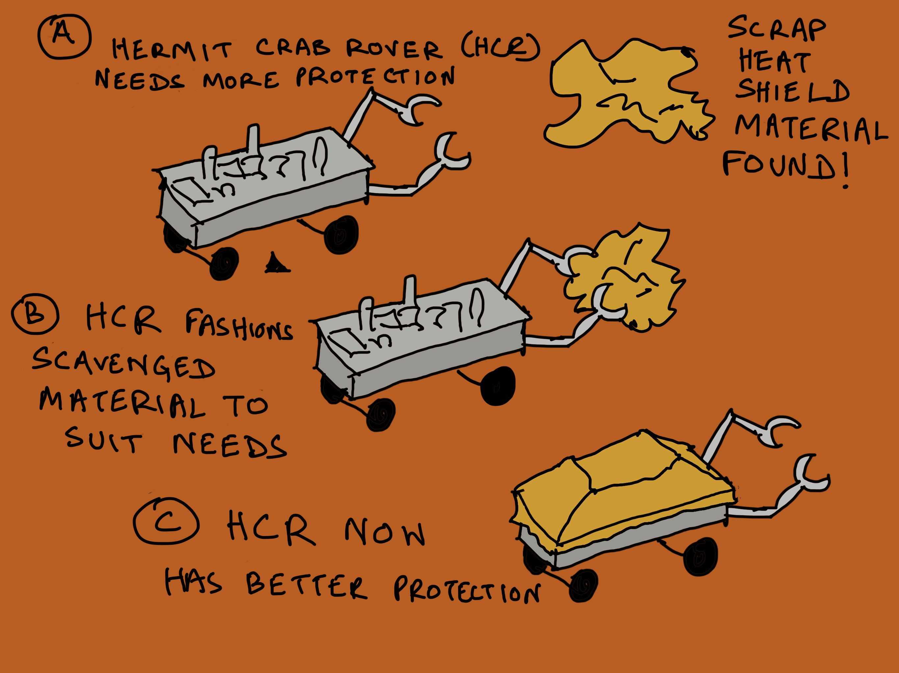
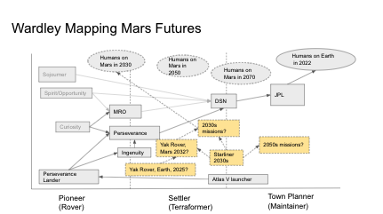
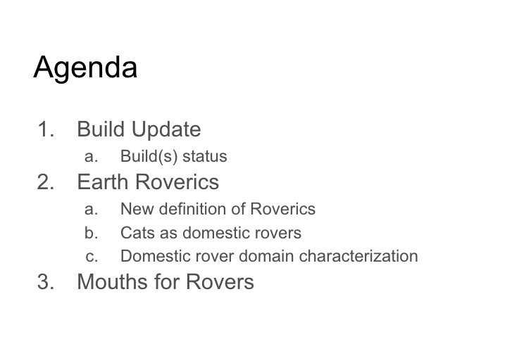

> Check out @antlerboy's new post, "Control, demand, need, or customer purpose?". https://antlerboy.medium.com/control-demand-need-or-customer-purpose-4b468bc8e8d3?source=rss-97852f5a56ae------2

 [Wed Jun 01 06:23:32 +0000 2022](https://twitter.com/yak_collective/status/1531884132359348225)

----

> Check out @p_millerd's new post, "Don’t Find A Niche, Find A Mode". https://think-boundless.com/dont-find-a-niche-find-a-mode/?utm_source=rss&utm_medium=rss&utm_campaign=dont-find-a-niche-find-a-mode

 [Wed Jun 01 13:21:40 +0000 2022](https://twitter.com/yak_collective/status/1531989356168232967)

----

> Check out @tomcritchlow's new post, "A map for indie living". http://tomcritchlow.com/2022/06/03/indie-consulting-map/

 [Fri Jun 03 17:52:41 +0000 2022](https://twitter.com/yak_collective/status/1532782337771159552)

----

> Check out @vgr's new newsletter, "Anatomy of a Graph Mind". https://studio.ribbonfarm.com/p/anatomy-of-a-graph-mind

 [Fri Jun 03 20:12:08 +0000 2022](https://twitter.com/yak_collective/status/1532817432234033154)

----

> Check out @antlerboy's new post, "Transduction — leading transformation — Issue #52". https://antlerboy.medium.com/transduction-leading-transformation-issue-52-b3f611716e04?source=rss-97852f5a56ae------2

 [Sat Jun 04 21:23:49 +0000 2022](https://twitter.com/yak_collective/status/1533197859843190786)

----

Replying to [@yak_collective](https://twitter.com/yak_collective/status/1529910252673585169)

> 11/ Closing Cycle-1 of 2022 YakRover Meetups with a planning meeting for field testing of rovers on Earth in 2022
> 
> http://bit.ly/3BLYCsr
> 
> https://www.youtube.com/watch?v=S-axwRgp23U

 [Mon Jun 06 14:33:06 +0000 2022](https://twitter.com/yak_collective/status/1533819274732654593)

----

> Yak Collective Blockchain Study Group's shared sense making of the article "The Hitchhiker's Guide to Ethereum" by Jon Charbonneau
> 
> http://bit.ly/3BLYCsr
> 
> https://www.youtube.com/watch?v=ONBZDpGUcmY

 [Mon Jun 06 14:40:42 +0000 2022](https://twitter.com/yak_collective/status/1533821188115423233)

----

> Check out @antlerboy's new post, "As I’m sending reminders to the 80 people (!)". https://antlerboy.medium.com/as-im-sending-reminders-to-the-80-people-34c86d5b8496?source=rss-97852f5a56ae------2

 [Tue Jun 07 09:03:41 +0000 2022](https://twitter.com/yak_collective/status/1534098760653066241)

----

> Check out @p_millerd's new post, "Lawrence Yeo On The Arc of The Practical Creator, Creativity &amp; Finding Work That Matters (The Pathless Path Podcast)". https://think-boundless.com/lawrence/?utm_source=rss&utm_medium=rss&utm_campaign=lawrence

 [Tue Jun 07 13:41:37 +0000 2022](https://twitter.com/yak_collective/status/1534168707177582592)

----

> Check out @antlerboy's new post, "What’s the problem with problem statements?". https://antlerboy.medium.com/whats-the-problem-with-problem-statements-20425e1d6ca2?source=rss-97852f5a56ae------2

 [Wed Jun 08 07:43:08 +0000 2022](https://twitter.com/yak_collective/status/1534440879649394694)

----

> Check out @anthilemoon's new post, "Get smarter everyday with Vladimir Oane, founder of Deepstash". https://nesslabs.com/deepstash-featured-tool?utm_source=rss&utm_medium=rss&utm_campaign=deepstash-featured-tool

 [Thu Jun 09 06:46:43 +0000 2022](https://twitter.com/yak_collective/status/1534789068218834944)

----

> Check out @p_millerd's new post, "Too Big To Think: Why Prestigious Institutions Stopped Generating Good Ideas". https://think-boundless.com/too-big-to-think/?utm_source=rss&utm_medium=rss&utm_campaign=too-big-to-think

 [Thu Jun 09 17:51:22 +0000 2022](https://twitter.com/yak_collective/status/1534956331257548800)

----

> Check out @tomcritchlow's new post, "A Podia Wishlist". http://tomcritchlow.com/2022/06/10/podia-requests/

 [Fri Jun 10 16:07:38 +0000 2022](https://twitter.com/yak_collective/status/1535292614798368768)

----

> governance studies group reading bulldozer vs. vetocracy today https://vitalik.eth.limo/general/2021/12/19/bullveto.html #yakbot

 [Fri Jun 10 16:08:05 +0000 2022](https://twitter.com/yak_collective/status/1535292727465754629)

----

> Check out @antlerboy's new post, "Transduction — leading transformation — Issue #53". https://antlerboy.medium.com/transduction-leading-transformation-issue-53-b4fc32dd187f?source=rss-97852f5a56ae------2

 [Fri Jun 10 16:48:19 +0000 2022](https://twitter.com/yak_collective/status/1535302854755467267)

----

> Check out @vgr's new newsletter, "Graph Vitalism". https://studio.ribbonfarm.com/p/graph-vitalism

 [Fri Jun 10 20:47:06 +0000 2022](https://twitter.com/yak_collective/status/1535362946922123267)

----

> Check out @antlerboy's new post, "What the hell is systems | complexity | cybernetics anyway?". https://antlerboy.medium.com/what-the-hell-is-systems-complexity-cybernetics-anyway-58ca4420d4aa?source=rss-97852f5a56ae------2

 [Mon Jun 13 07:43:59 +0000 2022](https://twitter.com/yak_collective/status/1536253030642876416)

----

> blockchain ops convo happening now on the discord #yakbot

 [Mon Jun 13 15:27:16 +0000 2022](https://twitter.com/yak_collective/status/1536369619182972928)

----

> The Yak Collective Blockchain Study Group concluding the spring cycle with a retrospective. 
> 
> We had 12 sessions in the spring cycle covering wide range of topics and some hands-on experiments with web3 tools
> 
> http://bit.ly/3BLYCsr
> 
> https://www.youtube.com/watch?v=Ax5zUbIowZQ

 [Mon Jun 13 16:16:00 +0000 2022](https://twitter.com/yak_collective/status/1536381884980428800)

----

> Check out @antlerboy's new post, "So. Today is a migraine day.". https://antlerboy.medium.com/so-today-is-a-migraine-day-a5906e1b04b8?source=rss-97852f5a56ae------2

 [Wed Jun 15 06:43:53 +0000 2022](https://twitter.com/yak_collective/status/1536962681147637760)

----

> Check out @anthilemoon's new post, "How to access paywalled research papers without institutional access". https://nesslabs.com/paywalled-research-access?utm_source=rss&utm_medium=rss&utm_campaign=paywalled-research-access

 [Thu Jun 16 05:40:43 +0000 2022](https://twitter.com/yak_collective/status/1537309175759396865)

----

> Check out @tomcritchlow's new post, "Rejecting Specialization". http://tomcritchlow.com/2022/06/16/rejecting-specialization/

 [Thu Jun 16 12:47:21 +0000 2022](https://twitter.com/yak_collective/status/1537416539913060353)

----

> We’re talking fungi languages in the governance chat today https://royalsocietypublishing.org/doi/10.1098/rsos.211926#d1e375 #yakbot

 [Fri Jun 17 16:10:41 +0000 2022](https://twitter.com/yak_collective/status/1537830099743129605)

----

> Check out @vgr's new newsletter, "Getting to Gnome Mode". https://studio.ribbonfarm.com/p/getting-to-gnome-mode

 [Sat Jun 18 21:07:30 +0000 2022](https://twitter.com/yak_collective/status/1538267181099655169)

----

> Check out @antlerboy's new post, "Transduction — leading transformation — Issue #54". https://antlerboy.medium.com/transduction-leading-transformation-issue-54-85d36bb3d22e?source=rss-97852f5a56ae------2

 [Sun Jun 19 06:53:52 +0000 2022](https://twitter.com/yak_collective/status/1538414747057631232)

----

> Check out @antlerboy's new post, "18 tips from 18 years in consulting". https://antlerboy.medium.com/18-tips-from-18-years-in-consulting-7b626cb3182e?source=rss-97852f5a56ae------2

 [Mon Jun 20 07:53:08 +0000 2022](https://twitter.com/yak_collective/status/1538792048626651136)

----

> The Yak Rover team just submitted an idea for a "hermit crab rover" to the natural robotics competition https://www.naturalroboticscontest.com/#apply #yakbot 
> 
> 

 [Mon Jun 20 18:04:50 +0000 2022](https://twitter.com/yak_collective/status/1538945987816919042)

----

> Check out @tomcritchlow's new post, "Rejecting Specialization". https://tomcritchlow.com/2022/06/16/rejecting-specialization/

 [Mon Jun 20 21:37:24 +0000 2022](https://twitter.com/yak_collective/status/1538999483677216773)

----

> at tonight's rover meeting we somehow landed on the conclusion that a key function of earth rovers would be to re-enchant the world for us... present the familiar in a new perspective #yakbot

 [Tue Jun 21 05:21:33 +0000 2022](https://twitter.com/yak_collective/status/1539116290316591114)

----

> Check out @randylubin's new post, "Podcast Interview on Amble about Foresight Games". https://blog.randylubin.com/podcast-interview-on-amble-about-foresight-games

 [Wed Jun 22 02:00:07 +0000 2022](https://twitter.com/yak_collective/status/1539427985845010434)

----

> Check out @antlerboy's new post, "Demand management is a very bad idea — think about the need-to-demand curve". https://antlerboy.medium.com/demand-management-is-a-very-bad-idea-think-about-the-need-to-demand-curve-8eccbab0b533?source=rss-97852f5a56ae------2

 [Wed Jun 22 07:28:23 +0000 2022](https://twitter.com/yak_collective/status/1539510596323901441)

----

> Check out @anthilemoon's new post, "Cognitive bottlenecks: the inherent limits of the thinking mind". https://nesslabs.com/cognitive-bottlenecks?utm_source=rss&utm_medium=rss&utm_campaign=cognitive-bottlenecks

 [Thu Jun 23 09:30:18 +0000 2022](https://twitter.com/yak_collective/status/1539903667205292032)

----

> Check out @vgr's new newsletter, "Year One Review". https://studio.ribbonfarm.com/p/year-one-review

 [Fri Jun 24 23:32:52 +0000 2022](https://twitter.com/yak_collective/status/1540478092837376001)

----

> Blockchain Governance Study Group Summer Cycle Planning Session up on YouTube
> 
> http://bit.ly/3BLYCsr
> 
> https://www.youtube.com/watch?v=IgviawJTZx0

 [Sun Jun 26 19:10:13 +0000 2022](https://twitter.com/yak_collective/status/1541136769659305986)

----

Replying to [@yak_collective](https://twitter.com/yak_collective/status/1533819274732654593)

> 12/ We frequently post interesting links related to robotics and rovers in our YakRover discord channel. 
> 
> The link scraping  session is up on YouTube
> 
> http://bit.ly/3BLYCsr
> 
> https://www.youtube.com/watch?v=cR1goVoTw50

 [Sun Jun 26 19:24:49 +0000 2022](https://twitter.com/yak_collective/status/1541140442217070592)

----

Replying to [@yak_collective](https://twitter.com/yak_collective/status/1541140442217070592)

> 13/ The second planning session for end of year field tests and demo day led by @not_replica is up on YouTube
> 
> http://bit.ly/3BLYCsr
> 
> https://www.youtube.com/watch?v=Uzre5-c4YOE

 [Sun Jun 26 19:47:10 +0000 2022](https://twitter.com/yak_collective/status/1541146069073002496)

----

> Check out @antlerboy's new post, "What if we treated people as people, instead of employees?". https://antlerboy.medium.com/what-if-we-treated-people-as-people-instead-of-employees-4a100386d550?source=rss-97852f5a56ae------2

 [Mon Jun 27 08:48:49 +0000 2022](https://twitter.com/yak_collective/status/1541342778965327872)

----

> Join us tonight at 9PM Pacific for a session on mars vs. earth roving, domestic rovers, rover mouths, and featuring this wardley map 🙂 https://www.yakcollective.org/join.html #yakbot 
> 
> 

 [Tue Jun 28 02:36:18 +0000 2022](https://twitter.com/yak_collective/status/1541611418079961088)

----

Replying to [@yak_collective](https://twitter.com/yak_collective/status/1541611418079961088)

> Agenda 
> 
> 

 [Tue Jun 28 03:14:29 +0000 2022](https://twitter.com/yak_collective/status/1541621028996034560)

----

> Check out @antlerboy's new post, "#systemschange: often over-correcting in a good cause". https://antlerboy.medium.com/systemschange-often-over-correcting-in-a-good-cause-23100934bf63?source=rss-97852f5a56ae------2

 [Wed Jun 29 11:08:19 +0000 2022](https://twitter.com/yak_collective/status/1542102661247520771)

----

> Check out @anthilemoon's new post, "Unshackling knowledge management with Samiur Rahman, co-founder of Heyday". https://nesslabs.com/heyday-featured-tool?utm_source=rss&utm_medium=rss&utm_campaign=heyday-featured-tool

 [Thu Jun 30 10:50:49 +0000 2022](https://twitter.com/yak_collective/status/1542460641860018176)