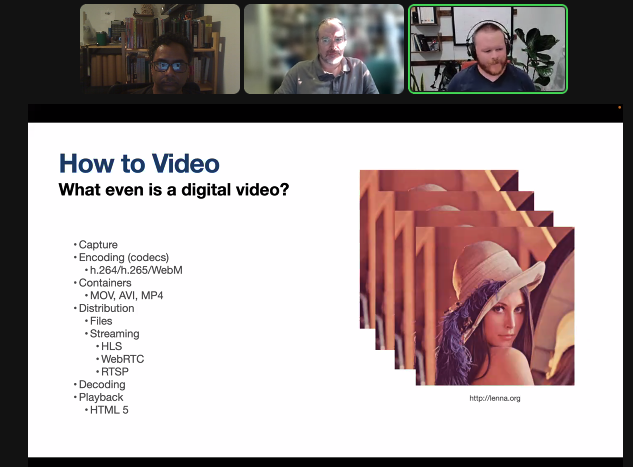

> Check out @antlerboy's new post, "What kind of transformation could you unlock by digging down to underlying purpose?". https://antlerboy.medium.com/what-kind-of-transformation-could-you-unlock-by-digging-down-to-underlying-purpose-499ab1d194e9?source=rss-97852f5a56ae------2

 [Mon Aug 01 06:58:50 +0000 2022](https://twitter.com/yak_collective/status/1553998673796792320)

----

> Weekly distributed systems study call on the yak discord starting at the top of the hour. 15-min freeread, then 45-min discussion. Today: our own yak @antlerboy on systems | cybernetics | complexity. Reading and discussing https://stream.syscoi.com/2020/05/06/a-very-rough-and-par

 [Mon Aug 01 14:38:21 +0000 2022](https://twitter.com/yak_collective/status/1554114313551581184)

----

> Check out @antlerboy's new post, "No, it’s not a £70bn contract for Net Zero — it’s a sole prime supplier call-off framework across…". https://antlerboy.medium.com/no-its-not-a-70bn-contract-for-net-zero-it-s-a-sole-prime-supplier-call-off-framework-across-a1fef421126f?source=rss-97852f5a56ae------2

 [Tue Aug 02 08:08:40 +0000 2022](https://twitter.com/yak_collective/status/1554378637889224704)

----

> Check out @antlerboy's new post, "I don’t mean mentors, one-to-one relationships where someone really helps you develop and grow.". https://antlerboy.medium.com/i-dont-mean-mentors-one-to-one-relationships-where-someone-really-helps-you-develop-and-grow-fe7878998ef5?source=rss-97852f5a56ae------2

 [Wed Aug 03 06:58:50 +0000 2022](https://twitter.com/yak_collective/status/1554723449834291200)

----

> Check out @anthilemoon's new post, "Create a network of thoughts with Steffen Bleher and Michael von Hohnhorst, co-founders of Capacities". https://nesslabs.com/capacities-featured-tool?utm_source=rss&utm_medium=rss&utm_campaign=capacities-featured-tool

 [Thu Aug 04 11:45:29 +0000 2022](https://twitter.com/yak_collective/status/1555157973785255938)

----

> Weekly open online governance study group call starting now on the YC discord. This week looking at the creation of new cities with @Matthew_Sweet #yakbot

 [Fri Aug 05 16:00:14 +0000 2022](https://twitter.com/yak_collective/status/1555584475328823299)

----

> Check out @vgr's new newsletter, "August 2022 Core Dump". https://studio.ribbonfarm.com/p/august-2022-core-dump

 [Sat Aug 06 00:17:36 +0000 2022](https://twitter.com/yak_collective/status/1555709640444362759)

----

> Check out @antlerboy's new post, "Systems thinking practitioner, level 7, from Cherith Simmons with SCiO (England and Wales…". https://antlerboy.medium.com/systems-thinking-practitioner-level-7-from-cherith-simmons-with-scio-england-and-wales-87b8ca78158e?source=rss-97852f5a56ae------2

 [Sat Aug 06 05:19:28 +0000 2022](https://twitter.com/yak_collective/status/1555785608899055616)

----

> Check out @antlerboy's new post, "Transduction — leading transformation — Issue #59". https://antlerboy.medium.com/transduction-leading-transformation-issue-59-e0d7c522c8e9?source=rss-97852f5a56ae------2

 [Sat Aug 06 13:48:38 +0000 2022](https://twitter.com/yak_collective/status/1555913744282226688)

----

Replying to [@yak_collective](https://twitter.com/yak_collective/status/1541146069073002496)

> 14/ "Architecture for Networked Rovers" - Talk by @not_replica is up on our YouTube channel
> 
> http://bit.ly/3BLYCsr
> 
> https://www.youtube.com/watch?v=t6Ge-bAiS4Q

 [Sun Aug 07 08:52:01 +0000 2022](https://twitter.com/yak_collective/status/1556201484756320256)

----

Replying to [@yak_collective](https://twitter.com/yak_collective/status/1556201484756320256)

> 15/ "Read-Write-(Execute) Roverics" - Talk and updates about NIM YakRover build by @vgr is up on YouTube
> 
> http://bit.ly/3BLYCsr
> 
> https://www.youtube.com/watch?v=4Ad8EY2Xxno

 [Sun Aug 07 08:55:03 +0000 2022](https://twitter.com/yak_collective/status/1556202249570885634)

----

> Latest Yak Collective fermi-gym question: How many electrons does it take to light up a city? https://discord.gg/fW7HKbyu #yakbot

 [Mon Aug 08 16:50:57 +0000 2022](https://twitter.com/yak_collective/status/1556684399227424768)

----

> yak rover session in progress, on Video for Rovers, with @rhettford #yakbot 
> 
> 

 [Tue Aug 09 04:07:17 +0000 2022](https://twitter.com/yak_collective/status/1556854606986186753)

----

> Check out @anthilemoon's new post, "Can you get a doctorate online, and should you?". https://nesslabs.com/online-doctorate-phd-distance-learning?utm_source=rss&utm_medium=rss&utm_campaign=online-doctorate-phd-distance-learning

 [Wed Aug 10 09:00:47 +0000 2022](https://twitter.com/yak_collective/status/1557290856415100929)

----

> At 12pm ET we're reading a review of Lorraine Daston's Rules: A Short History of What We Live By: https://www.newyorker.com/science/elements/why-do-we-obey-rules #yakbot

 [Fri Aug 12 15:59:46 +0000 2022](https://twitter.com/yak_collective/status/1558121072565882882)

----

> Check out @vgr's new newsletter, "Eventfulness". https://studio.ribbonfarm.com/p/eventfulness

 [Fri Aug 12 21:12:49 +0000 2022](https://twitter.com/yak_collective/status/1558199852265340929)

----

> Check out @antlerboy's new post, "I’m planning a new cohort of the RedQuadrant tool shed — might this be valuable to you or someone…". https://antlerboy.medium.com/im-planning-a-new-cohort-of-the-redquadrant-tool-shed-might-this-be-valuable-to-you-or-someone-5865f9187ad8?source=rss-97852f5a56ae------2

 [Sun Aug 14 17:18:36 +0000 2022](https://twitter.com/yak_collective/status/1558865685362655233)

----

> Check out @antlerboy's new post, "The risks of ‘seeing the whole’". https://antlerboy.medium.com/the-risks-of-seeing-the-whole-ecb1f33274b4?source=rss-97852f5a56ae------2

 [Mon Aug 15 08:18:29 +0000 2022](https://twitter.com/yak_collective/status/1559092150901608448)

----

> Check out @anthilemoon's new post, "Creative aliveness: turning life into a creative adventure". https://nesslabs.com/creative-aliveness?utm_source=rss&utm_medium=rss&utm_campaign=creative-aliveness

 [Mon Aug 15 17:40:24 +0000 2022](https://twitter.com/yak_collective/status/1559233559935721474)

----

> Check out @antlerboy's new post, "Is it really change management, or are you just running interference for change that is going to…". https://antlerboy.medium.com/is-it-really-change-management-or-are-you-just-running-interference-for-change-that-is-going-to-298e55c79154?source=rss-97852f5a56ae------2

 [Fri Aug 19 07:53:45 +0000 2022](https://twitter.com/yak_collective/status/1560535475663806464)

----

> Check out @anthilemoon's new post, "Liminal Creativity". https://nesslabs.com/liminal-creativity?utm_source=rss&utm_medium=rss&utm_campaign=liminal-creativity

 [Fri Aug 19 14:30:12 +0000 2022](https://twitter.com/yak_collective/status/1560635246864994304)

----

> today’s governance chat reading, The Legacy of Hammurabi https://law.mit.edu/pub/thelegacyofhammurabi/release/3 #yakbot

 [Fri Aug 19 16:05:18 +0000 2022](https://twitter.com/yak_collective/status/1560659179198562306)

----

> Check out @vgr's new newsletter, "Beyond Hyperanthropomorphism". https://studio.ribbonfarm.com/p/beyond-hyperanthropomorphism

 [Sun Aug 21 01:02:43 +0000 2022](https://twitter.com/yak_collective/status/1561156809867534337)

----

> Check out @antlerboy's new post, "What’s your favourite warm-up exercise?". https://antlerboy.medium.com/whats-your-favourite-warm-up-exercise-e3891a90cab0?source=rss-97852f5a56ae------2

 [Mon Aug 22 11:13:55 +0000 2022](https://twitter.com/yak_collective/status/1561673015301128192)

----

> Check out @anthilemoon's new post, "Building an infopunk’s digital garden with Ida Josefiina, co-founder of Sane". https://nesslabs.com/sane-featured-tool?utm_source=rss&utm_medium=rss&utm_campaign=sane-featured-tool

 [Thu Aug 25 08:45:23 +0000 2022](https://twitter.com/yak_collective/status/1562722797864239104)

----

> today’s governance chat reading, The Not So Wild, Wild West https://mises.org/library/not-so-wild-wild-west #yakbot

 [Fri Aug 26 16:10:23 +0000 2022](https://twitter.com/yak_collective/status/1563197171595243522)

----

> Check out @vgr's new newsletter, "The End of Alpha". https://studio.ribbonfarm.com/p/the-end-of-alpha

 [Sat Aug 27 01:22:05 +0000 2022](https://twitter.com/yak_collective/status/1563336013665034241)

----

> Check out @antlerboy's new post, "Transduction — leading transformation — Issue #60". https://antlerboy.medium.com/transduction-leading-transformation-issue-60-927ecf68b1e2?source=rss-97852f5a56ae------2

 [Mon Aug 29 12:38:36 +0000 2022](https://twitter.com/yak_collective/status/1564231041589694464)

----

> Check out @tomcritchlow's new post, "Generating Agency Through Blogging". https://tomcritchlow.com/2022/08/29/blogging-agency/

 [Mon Aug 29 19:32:35 +0000 2022](https://twitter.com/yak_collective/status/1564335221281013761)

----

> Check out @antlerboy's new post, "What are the blogs or social media which you learned the most from, early on?". https://antlerboy.medium.com/what-are-the-blogs-or-social-media-which-you-learned-the-most-from-early-on-b04ade4eecc?source=rss-97852f5a56ae------2

 [Wed Aug 31 07:23:58 +0000 2022](https://twitter.com/yak_collective/status/1564876636180430848)