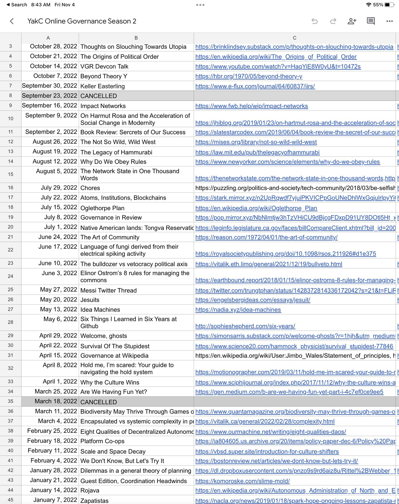

> Check out @anthilemoon's new post, "The default effect: why we renounce our ability to choose". https://nesslabs.com/default-effect?utm_source=rss&utm_medium=rss&utm_campaign=default-effect

 [Wed Nov 02 18:20:46 +0000 2022](https://twitter.com/yak_collective/status/1587872358223732737)

----

> Check out @anthilemoon's new post, "Use timeboxing to regain calmness and control with Marie Ng, founder of Llama Life". https://nesslabs.com/llama-life-featured-tool?utm_source=rss&utm_medium=rss&utm_campaign=llama-life-featured-tool

 [Thu Nov 03 08:16:04 +0000 2022](https://twitter.com/yak_collective/status/1588082569911963651)

----

> yak collective governance study group is rolling up sleeves and attempting synthesis of season 2 readings  today 😬 
> 
> 

 [Fri Nov 04 15:54:58 +0000 2022](https://twitter.com/yak_collective/status/1588560444226437120)

----

> Check out @vgr's new newsletter, "Silicon Valley Vibe Shift". https://studio.ribbonfarm.com/p/silicon-valley-vibe-shift

 [Fri Nov 04 23:22:41 +0000 2022](https://twitter.com/yak_collective/status/1588673114602438657)

----

> Check out @HiredThought's new post, "5 Lessons From a Decade of Marriage". https://hiredthought.com/2022/11/05/5-lessons-from-a-decade-of-marriage/

 [Sat Nov 05 15:22:51 +0000 2022](https://twitter.com/yak_collective/status/1588914748044853249)

----

> Check out @antlerboy's new post, "Transduction — leading transformation — Issue #67". https://antlerboy.medium.com/transduction-leading-transformation-issue-67-4262aa659317?source=rss-97852f5a56ae------2

 [Sat Nov 05 22:18:16 +0000 2022](https://twitter.com/yak_collective/status/1589019290933542915)

----

> testing testing testing #yakbot

 [Sun Nov 06 15:48:40 +0000 2022](https://twitter.com/yak_collective/status/1589283636221714434)

----

> testing with a picture #yakbot 
> 
> 

 [Sun Nov 06 15:50:15 +0000 2022](https://twitter.com/yak_collective/status/1589284034449915905)

----

> The Yak Rover weekly meeting is moving to a new time! Tuesdays 8PM UTC. Kicking off today in 30 minutes. If you've always wanted to join, drop by today. We're reviewing 2022 and brainstorming 2023 plans. https://discord.gg/wQAwr7De?event=1039606826402074624

 [Tue Nov 08 19:27:53 +0000 2022](https://twitter.com/yak_collective/status/1590063578198835200)

----

Replying to [@yak_collective](https://twitter.com/yak_collective/status/1590063578198835200)

> For reference, 8PM UTC is 12PM Pacific, 3PM ET, and 5AM Japan, and 9-11PM in EU. We hope more people from US CT and ET zone can make it now.

 [Tue Nov 08 19:29:37 +0000 2022](https://twitter.com/yak_collective/status/1590064013685141504)

----

Replying to [@yak_collective](https://twitter.com/yak_collective/status/1590064013685141504)

> Here's a slightly out-of-date intro to the project. The discord invite link in the first tweet will get you in, and you'll find zoom details once you're in. https://www.yakcollective.org/projects/yak-rover.html

 [Tue Nov 08 19:30:47 +0000 2022](https://twitter.com/yak_collective/status/1590064306686595073)

----

> Check out @antlerboy's new post, "“Be authentic!” “No, not like THAT!”". https://antlerboy.medium.com/be-authentic-no-not-like-that-d2a40706fc21?source=rss-97852f5a56ae------2

 [Wed Nov 09 08:23:26 +0000 2022](https://twitter.com/yak_collective/status/1590258750861950976)

----

> Check out @HiredThought's new post, "Ontological Pluralism". https://hiredthought.com/2022/11/09/ontological-pluralism/

 [Wed Nov 09 16:42:48 +0000 2022](https://twitter.com/yak_collective/status/1590384422268055553)