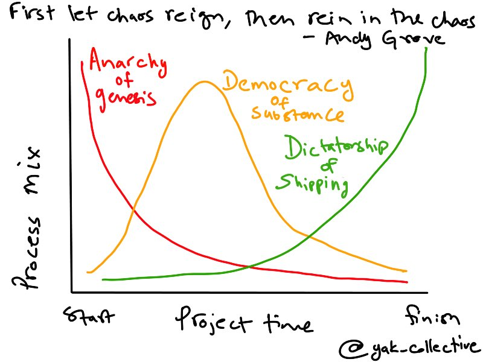
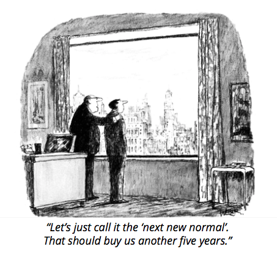

> RT @amelapay: Hosting chat for indie consultant types on @artofgig/ @yak\_collective discord server at 5pm ET   
>   
> cc @vgr

 [Sun Apr 26 19:53:57 +0000 2020](https://twitter.com/yak_collective/status/1254498972166754305)

----

> Event coming up on Yak Collective discord\! Chat led by Pam, Apr 26, 2020 02:00PM

 [Sun Apr 26 20:49:28 +0000 2020](https://twitter.com/yak_collective/status/1254512944253227009)

----

> Starting now\! https://twitter\.com/amelapay/status/1254498870752673793

 [Sun Apr 26 20:59:28 +0000 2020](https://twitter.com/yak_collective/status/1254515461489737728)

----

> Gig economy go brr https://www\.cnn\.com/2020/04/26/us/gig\-workers\-informal\-jobs\-coronavirus/index\.html

 [Mon Apr 27 03:24:45 +0000 2020](https://twitter.com/yak_collective/status/1254612420959457281)

----

> RT @SachinB91: Hosting an @artofgig Discord chat at 4PM CST\! Today we'll be reading and discussing the pmarca's "ITS TIME TO BUILD"

 [Mon Apr 27 20:31:39 +0000 2020](https://twitter.com/yak_collective/status/1254870848160378886)

----

> Event coming up on Yak Collective discord\! Discord chat hosted by Sachin, Apr 27, 2020 02:00PM

 [Mon Apr 27 20:49:38 +0000 2020](https://twitter.com/yak_collective/status/1254875373172637697)

----

> Event coming up on Yak Collective discord\! Discord chat hosted by Scott Garlinger, Apr 28, 2020 10:00AM

 [Tue Apr 28 16:49:39 +0000 2020](https://twitter.com/yak_collective/status/1255177368852971520)

----

> 

 [Wed Apr 29 05:37:59 +0000 2020](https://twitter.com/yak_collective/status/1255370726858776577)

----

> Emergent ideas\.    
>   
> Coming tomorrow\. 
> 
> 

 [Wed Apr 29 19:41:22 +0000 2020](https://twitter.com/yak_collective/status/1255582970393624576)

----

> RT @hewhocutsdown: @yak\_collective we'll be talking about using randomness strategically in 15 minutes on your regular call\-in show

 [Thu Apr 30 02:47:36 +0000 2020](https://twitter.com/yak_collective/status/1255690234886598656)

----

> Event coming up on Yak Collective discord\! Discord chat hosted by Jordan, Apr 29, 2020 08:00PM

 [Thu Apr 30 02:52:12 +0000 2020](https://twitter.com/yak_collective/status/1255691395421085696)

----

> RT @p\_millerd: The big consulting firms have stopped producing interesting ideas  
>   
> Over the past 2\+ weeks I've been helping to wrangle inter…

 [Thu Apr 30 10:06:59 +0000 2020](https://twitter.com/yak_collective/status/1255800810597908481)

----

> RT @kunksed: The @yak\_collective is fun 😄 https://twitter\.com/p\_millerd/status/1255800715227869185

 [Thu Apr 30 11:42:31 +0000 2020](https://twitter.com/yak_collective/status/1255824852100972544)

----

> RT @vinaydebrou: The @yak\_collective's first project is out and I contributed to it\-\-  
>   
> Don't Waste the Reboot  
>   
> Expect ideas outside the lim…

 [Thu Apr 30 12:28:58 +0000 2020](https://twitter.com/yak_collective/status/1255836542091870210)

----

> RT @dmcdougall: The @yak\_collective's first project is out and I contributed to it \-\-  
>   
> \*Don't Waste the Reboot\*   
>   
> 25 creative and unexpecte…

 [Thu Apr 30 15:03:59 +0000 2020](https://twitter.com/yak_collective/status/1255875550901448704)

----

> RT @SachinB91: The @yak\_collective's first project is out and I enjoyed contributing to it  
>   
> \*Don't Waste the Reboot\*  
>   
> 25 create and unexpec…

 [Thu Apr 30 15:49:02 +0000 2020](https://twitter.com/yak_collective/status/1255886889543847936)

----

> RT @SachinB91: The COVID\-19 reboot gives an opportunity for smaller companies to create marketplaces where none existed \- Cinema halls coul…

 [Thu Apr 30 15:49:10 +0000 2020](https://twitter.com/yak_collective/status/1255886923459002371)

----

> RT @commandodev: This is really, really good\. The @yak\_collective is going to be one to watch\!

 [Thu Apr 30 15:50:24 +0000 2020](https://twitter.com/yak_collective/status/1255887233829105664)

----

> And so it begins\! Our first report is out: Don’t Waste the Covid\-19 Reboot\. Stay tuned for a lot more where this came from\.  
>   
> https://yakcollective\.org/projects/yak\-wisdom

 [Thu Apr 30 16:48:55 +0000 2020](https://twitter.com/yak_collective/status/1255901959543861249)

----

> RT @collinferry: @p\_millerd @context\_ing @yak\_collective I converted the entire deck to a @RoamResearch page which I've made public here: h…

 [Thu Apr 30 18:30:55 +0000 2020](https://twitter.com/yak_collective/status/1255927628743290886)

----

> RT @tomcritchlow: So the @yak\_collective emerges today with their first report \- a sensemaking deck on the "next normal"\. Navigating uncert…

 [Thu Apr 30 18:31:20 +0000 2020](https://twitter.com/yak_collective/status/1255927732506107904)

----

> RT @krishkhubchand: just discovered @yak\_collective \.\.\. it is sooo close to the new form I was thinking of, worth reading their philosophy:…

 [Thu Apr 30 18:31:26 +0000 2020](https://twitter.com/yak_collective/status/1255927757529395201)

----

> how many layers of normal are you on  
>   
> https://yakcollective\.org/projects/yak\-wisdom 
> 
> 

 [Fri May 01 02:20:55 +0000 2020](https://twitter.com/yak_collective/status/1256045909126848512)

----

> RT @RejuvenatingRo1: I know I already retweeted this today but this is valuable stuff\.  
>   
> Everyone in business or in the \#gameB community sho…

 [Fri May 01 03:13:31 +0000 2020](https://twitter.com/yak_collective/status/1256059146824118272)