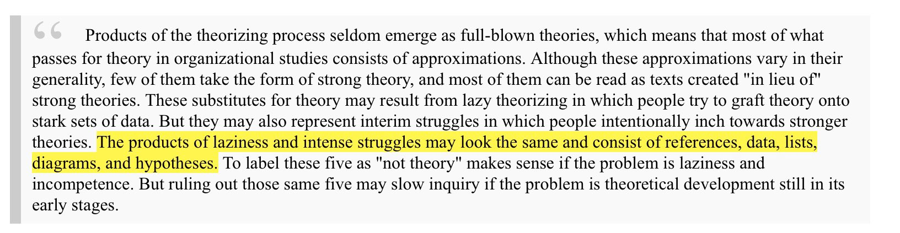

> RT @arcatan: If something in the "back to normal" business speak seems off, check out these slides by @yak\_collective https://t\.co/ikzp6nob…

 [Fri May 01 10:33:33 +0000 2020](https://twitter.com/yak_collective/status/1256169883739488256)

----

> RT @antlerboy: Why you need spoopy consulting and how to do it https://bit\.ly/2YkDLdR  
> Cc @yak\_collective

 [Fri May 01 10:33:36 +0000 2020](https://twitter.com/yak_collective/status/1256169898000121856)

----

> RT @WabiSabiFutures: I'm one of 25 independent consultants sharing 25 non\-mainstream ideas in the first @yak\_collective collaboration\.   
>   
> Do…

 [Fri May 01 10:33:40 +0000 2020](https://twitter.com/yak_collective/status/1256169912738906112)

----

> RT @tomcritchlow: From yesterday \- the Yak Collective released their first report\. It's a collection of indie, weird, alternative strategie…

 [Fri May 01 14:44:46 +0000 2020](https://twitter.com/yak_collective/status/1256233103787544576)

----

> RT @antlerboy: About the Yak Collective https://bit\.ly/3d4yWti

 [Fri May 01 14:45:02 +0000 2020](https://twitter.com/yak_collective/status/1256233172947386369)

----

> Town hall on our Discord in 15 minutes \(9 AM PT\) to discuss our first report\! Temporary invite link \(expires in 1 hour\) https://discord\.gg/AeWya2

 [Fri May 01 15:45:59 +0000 2020](https://twitter.com/yak_collective/status/1256248509369479169)

----

> Thanks everybody who attended our first public town hall\. We’ll do these occassionally when there’s a big thing to talk about\. Sorry about the technical snafus\.\.\. this was our first attempt running a large discord chat, but we got it figured out for the most part\.

 [Fri May 01 17:16:38 +0000 2020](https://twitter.com/yak_collective/status/1256271321467510786)

----

> This is a common and valid reaction you often hear from people who have been burned by too much bullshit\. A good thought to keep in mind is Karl Weick’s thought from “what theory is not, theorizing is” https://twitter\.com/WayneVaughan/status/1256631319494189056 
> 
> 

 [Sat May 02 17:32:03 +0000 2020](https://twitter.com/yak_collective/status/1256637591824236548)

----

Replying to [@WayneVaughan and @vinaydebrou](https://twitter.com/WayneVaughan/status/1256631319494189056)

> Understandable reaction, though we don’t agree\. We’ll take your bet against us as a challenge 😎  
>   
> https://twitter\.com/yak\_collective/status/1256637591824236548?s\=21 https://twitter\.com/yak\_collective/status/1256637591824236548

 [Sat May 02 17:34:03 +0000 2020](https://twitter.com/yak_collective/status/1256638092531781632)

----

> RT @amelapay: Hosting my weekly Philosophical Grab Bag chat session on @yak\_collective Discord at 5pm ET \-   
>   
> topic is whether truly positiv…

 [Sun May 03 20:04:14 +0000 2020](https://twitter.com/yak_collective/status/1257038278492139520)

----

> Event coming up on Yak Collective discord\! Chat led by Pam, May 03, 2020 02:00PM

 [Sun May 03 20:56:11 +0000 2020](https://twitter.com/yak_collective/status/1257051351684612104)

----

> \#yakrulez https://twitter\.com/vgr/status/1257069336637784064

 [Sun May 03 22:23:02 +0000 2020](https://twitter.com/yak_collective/status/1257073208081018880)

----

Replying to [@ricegirl2](https://twitter.com/ricegirl2/status/1257120021454770179)

> Always US pacific and these tweets always go out 5\-15 minutes before

 [Mon May 04 03:47:47 +0000 2020](https://twitter.com/yak_collective/status/1257154930994892800)

----

> Event coming up on Yak Collective discord in < 15 minutes\! Yak chat hosted by Sachin Benny, May 04, 2020 02:00PM\. Temporary invite: http://zpr\.io/teWBJ

 [Mon May 04 20:55:15 +0000 2020](https://twitter.com/yak_collective/status/1257413503641620484)

----

> RT @SachinB91: Hosting a @yak\_collective chat in 18 mins\. Reading "More is different" and discussing emergent behaviors \- https://t\.co/LGPo…

 [Mon May 04 20:56:17 +0000 2020](https://twitter.com/yak_collective/status/1257413762895638528)

----

> Event coming up on Yak Collective discord in < 15 minutes\! Discord chat hosted by Tom Critchlow, May 05, 2020 07:00AM\. Temporary invite: http://zpr\.io/teWBJ

 [Tue May 05 13:54:18 +0000 2020](https://twitter.com/yak_collective/status/1257669956898095107)

----

> Event coming up on Yak Collective discord in < 15 minutes\! Yak chat hosted by Scott Garlinger, May 05, 2020 10:00AM\. Temporary invite: http://zpr\.io/teWBJ

 [Tue May 05 16:56:08 +0000 2020](https://twitter.com/yak_collective/status/1257715716515602432)

----

> Event coming up on Yak Collective discord in < 15 minutes\! Discord Chat hosted by Vinay Débrou, May 06, 2020 09:00AM\. Temporary invite: http://zpr\.io/teWBJ

 [Wed May 06 15:53:57 +0000 2020](https://twitter.com/yak_collective/status/1258062452912271361)

----

> Event coming up on Yak Collective discord in < 15 minutes\! Yak chat hosted by Jordan Peacock, May 06, 2020 08:00PM\. Temporary invite: http://zpr\.io/teWBJ

 [Thu May 07 02:49:53 +0000 2020](https://twitter.com/yak_collective/status/1258227524221485056)

----

> Event coming up on Yak Collective discord in < 15 minutes\! Yak chat hosted by Alex Wagner, May 07, 2020 09:00AM\. Temporary invite: http://zpr\.io/teWBJ

 [Thu May 07 15:49:10 +0000 2020](https://twitter.com/yak_collective/status/1258423639474659329)

----

> Event coming up on Yak Collective discord in < 15 minutes\! Online governance study group hosted by vgr, May 08, 2020 09:00AM\. Temporary invite: http://zpr\.io/teWBJ

 [Fri May 08 15:53:01 +0000 2020](https://twitter.com/yak_collective/status/1258786995565924352)

----

> Event coming up on Yak Collective discord in < 15 minutes\! \#infrastructure chat with Darren, May 09, 2020 10:00AM\. Temporary invite: http://zpr\.io/teWBJ

 [Sat May 09 16:51:07 +0000 2020](https://twitter.com/yak_collective/status/1259164004699836418)

----

> "Read my report on the future of work," he tweeted, from the comfort of a secure job in a 50\-year\-old corporation that had supplied him the desk and computer he was tweeting from\.

 [Sat May 09 19:56:12 +0000 2020](https://twitter.com/yak_collective/status/1259210584362323969)

----

> RT @amelapay: Hosting my weekly Philosophy Grab Bag chat on @yak\_collective Discord at 5pm ET \-   
>   
> this week we're talking about the 9 schoo…

 [Sun May 10 20:47:53 +0000 2020](https://twitter.com/yak_collective/status/1259585975807873024)

----

> Event coming up on Yak Collective discord in < 15 minutes\! Yak Chat led by Pamela Hobart, May 10, 2020 02:00PM\. Get invite link here: http://zpr\.io/t47UH

 [Sun May 10 20:57:44 +0000 2020](https://twitter.com/yak_collective/status/1259588457153933314)

----

Replying to [@gothwalk](https://twitter.com/gothwalk/status/1259607316296609792)

> Use your original id but set a different nickname for our server? https://www\.businessinsider\.com/how\-to\-change\-nickname\-on\-discord

 [Sun May 10 23:45:48 +0000 2020](https://twitter.com/yak_collective/status/1259630749621161984)

----

Replying to [@tylerwillis](https://twitter.com/tylerwillis/status/1259630168995291136)

> Use this http://zpr\.io/t47UH

 [Sun May 10 23:47:33 +0000 2020](https://twitter.com/yak_collective/status/1259631189800783872)

----

> Event coming up on Yak Collective discord in < 15 minutes\! Yak chat hosted by Sachin Benny, May 11, 2020 02:00PM\. Get invite link here: http://zpr\.io/t47UH

 [Mon May 11 20:54:38 +0000 2020](https://twitter.com/yak_collective/status/1259950063889121282)

----

> RT @SachinB91: Talk about literal gate keepers

 [Tue May 12 01:01:57 +0000 2020](https://twitter.com/yak_collective/status/1260012302486532098)

----

> Event coming up on Yak Collective discord in < 15 minutes\! Yak chat hosted by Scott Garlinger, May 12, 2020 10:00AM\. Get invite link here: http://zpr\.io/t47UH

 [Tue May 12 16:52:54 +0000 2020](https://twitter.com/yak_collective/status/1260251617997225985)

----

> RT @amelapay: Wednesday, 7am: cooking protein waffles w baby on one arm, thinking about my forthcoming @yak\_collective project working titl…

 [Wed May 13 15:14:34 +0000 2020](https://twitter.com/yak_collective/status/1260589260450566145)

----

> Event coming up on Yak Collective discord in < 15 minutes\! Yak chat hosted by Jordan Peacock, May 13, 2020 08:00PM\. Get invite link here: http://zpr\.io/t47UH

 [Thu May 14 02:59:54 +0000 2020](https://twitter.com/yak_collective/status/1260766760162205700)

----

> Thursdays at 9 Pacific will henceforth be newbie orientation chat\. So if you've joined recently, or planning to, attend one of these\. https://twitter\.com/alexdw5/status/1260958376370061314

 [Thu May 14 15:55:14 +0000 2020](https://twitter.com/yak_collective/status/1260961880434065410)

----

> Event coming up on Yak Collective discord in < 15 minutes\! New Yak Q&A – Hosted by Alex Wagner, May 14, 2020 09:00AM\. Get invite link here: http://zpr\.io/t47UH

 [Thu May 14 15:58:05 +0000 2020](https://twitter.com/yak_collective/status/1260962598008340482)

----

> CFP: The New Old Home  
>   
> The Yak Collective is thinking about the present & future of domestic life: remote work, education, parenting, consumer products, architecture/design etc\.  
>   
> Submit a contribution idea here: https://forms\.gle/QQbfVervANoC34dp9  
>   
> direct questions to @amelapay

 [Fri May 15 15:42:37 +0000 2020](https://twitter.com/yak_collective/status/1261321093060743168)

----

> Event coming up on Yak Collective discord in < 15 minutes\! Online governance study group hosted by vgr, May 15, 2020 09:00AM\. Get invite link here: http://zpr\.io/t47UH

 [Fri May 15 15:49:54 +0000 2020](https://twitter.com/yak_collective/status/1261322927372480512)

----

> Event coming up on Yak Collective discord in < 15 minutes\! \#infrastructure chat with Darren, May 16, 2020 10:00AM\. Get invite link here: http://zpr\.io/t47UH

 [Sat May 16 16:45:33 +0000 2020](https://twitter.com/yak_collective/status/1261699318228099072)

----

> Our first report, released on April 30 following a rapid 2\-week sprint, is really a sort of demonstration of the first capability we are seriously working to develop \-\- running pop\-up think tanks\. https://twitter\.com/yak\_collective/status/1255901959543861249

 [Sat May 16 19:56:58 +0000 2020](https://twitter.com/yak_collective/status/1261747488970518528)

----

Replying to [@yak\_collective](https://twitter.com/yak_collective/status/1261747488970518528)

> If your organization is facing a complex challenge and needs to rapidly throw a bunch of diverse external minds at it, we're it\! We'll pop\-up\-think\-tank the hell out of your challenge 😎  
>   
> Take a look at our first report \-\- we can do something like that for you in < 3 weeks

 [Sat May 16 20:00:11 +0000 2020](https://twitter.com/yak_collective/status/1261748301168177152)

----

> Event coming up on Yak Collective discord in < 15 minutes\! Yak Chat led by Pamela Hobart, May 17, 2020 02:00PM\. Get invite link here: http://zpr\.io/t47UH

 [Sun May 17 20:47:25 +0000 2020](https://twitter.com/yak_collective/status/1262122573430693893)

----

> The yak collective website will be down briefly for maintenance while we do a dns switchover\.   
>   
> Thank you for your patience\. Please do not adjust your sets\.

 [Mon May 18 04:19:53 +0000 2020](https://twitter.com/yak_collective/status/1262236441125416962)

----

> Event coming up on Yak Collective discord in < 15 minutes\! Yak chat hosted by Sachin Benny, May 18, 2020 02:00PM\. Get invite link here: http://zpr\.io/t47UH

 [Mon May 18 20:54:51 +0000 2020](https://twitter.com/yak_collective/status/1262486833851781120)

----

> Event coming up on Yak Collective discord in < 15 minutes\! Yak chat hosted by Scott Garlinger, May 19, 2020 10:00AM\. Get invite link here: http://zpr\.io/t47UH

 [Tue May 19 16:52:16 +0000 2020](https://twitter.com/yak_collective/status/1262788171504463874)

----

Replying to [@DevDistracted](https://twitter.com/DevDistracted/status/1262729036091977728)

> We might turn that off in future but just an added layer of friction for now to block griefers etc

 [Tue May 19 22:02:38 +0000 2020](https://twitter.com/yak_collective/status/1262866279850864646)

----

> On tonight's menu, at 6PM PST @hewhocutsdown will be streaming the roleplaying game Dialect on the Yak Collective Discord server; using it to create new language communities and flesh out one post\-pandemic future\.

 [Thu May 21 00:52:26 +0000 2020](https://twitter.com/yak_collective/status/1263271397255548930)

----

> Event coming up on Yak Collective discord in < 15 minutes\! Dialect RPG \- Yak chat hosted by Jordan Peacock, May 20, 2020 06:00PM\. Get invite link here: http://zpr\.io/t47UH

 [Thu May 21 00:57:45 +0000 2020](https://twitter.com/yak_collective/status/1263272737491075073)

----

> Event coming up on Yak Collective discord in < 15 minutes\! New Yak Q&A – Hosted by Alex Wagner, May 21, 2020 09:00AM\. Get invite link here: http://zpr\.io/t47UH

 [Thu May 21 15:50:38 +0000 2020](https://twitter.com/yak_collective/status/1263497438205181953)

----

> Event coming up on Yak Collective discord in < 15 minutes\! Online governance study group hosted by vgr, May 22, 2020 09:00AM\. Get invite link here: http://zpr\.io/t47UH

 [Fri May 22 15:54:56 +0000 2020](https://twitter.com/yak_collective/status/1263860906523594753)

----

> Event coming up on Yak Collective discord in < 15 minutes\! \#infrastructure chat with Darren, May 23, 2020 10:00AM\. Get invite link here: http://zpr\.io/t47UH

 [Sat May 23 16:46:49 +0000 2020](https://twitter.com/yak_collective/status/1264236354445160450)

----

> Event coming up on Yak Collective discord in < 15 minutes\! Yak Chat led by Pamela Hobart, May 24, 2020 02:00PM\. Get invite link here: http://zpr\.io/t47UH

 [Sun May 24 20:47:19 +0000 2020](https://twitter.com/yak_collective/status/1264659263860989962)

----

> Event coming up on Yak Collective discord in < 15 minutes\! Yak chat hosted by Scott Garlinger, May 26, 2020 10:00AM\. Get invite link here: http://zpr\.io/t47UH

 [Tue May 26 16:45:32 +0000 2020](https://twitter.com/yak_collective/status/1265323192438132738)

----

> 🤔 https://twitter\.com/GeoffLewisOrg/status/1264984355056898054

 [Wed May 27 04:05:59 +0000 2020](https://twitter.com/yak_collective/status/1265494435191820291)

----

> Event coming up on Yak Collective discord in < 15 minutes\! Yak chat hosted by Jordan Peacock, May 27, 2020 08:00PM\. Get invite link here: http://zpr\.io/t47UH

 [Thu May 28 02:47:17 +0000 2020](https://twitter.com/yak_collective/status/1265837017763586049)

----

> Event coming up on Yak Collective discord in < 15 minutes\! New Yak Q&A – Hosted by Alex Wagner, May 28, 2020 09:00AM\. Get invite link here: http://zpr\.io/t47UH

 [Thu May 28 16:00:07 +0000 2020](https://twitter.com/yak_collective/status/1266036540234399745)

----

> Event coming up on Yak Collective discord in < 15 minutes\! Online governance study group hosted by vgr, May 29, 2020 09:00AM\. Get invite link here: http://zpr\.io/t47UH

 [Fri May 29 15:54:03 +0000 2020](https://twitter.com/yak_collective/status/1266397402304520196)

----

> Event coming up on Yak Collective discord in < 15 minutes\! \#infrastructure chat with Darren, May 30, 2020 10:00AM\. Get invite link here: http://zpr\.io/t47UH

 [Sat May 30 16:48:35 +0000 2020](https://twitter.com/yak_collective/status/1266773511345000450)

----

> Event coming up on Yak Collective discord in < 15 minutes\! Yak Chat led by Pamela Hobart, May 31, 2020 02:00PM\. Get invite link here: http://zpr\.io/t47UH

 [Sun May 31 20:48:47 +0000 2020](https://twitter.com/yak_collective/status/1267196347595337731)