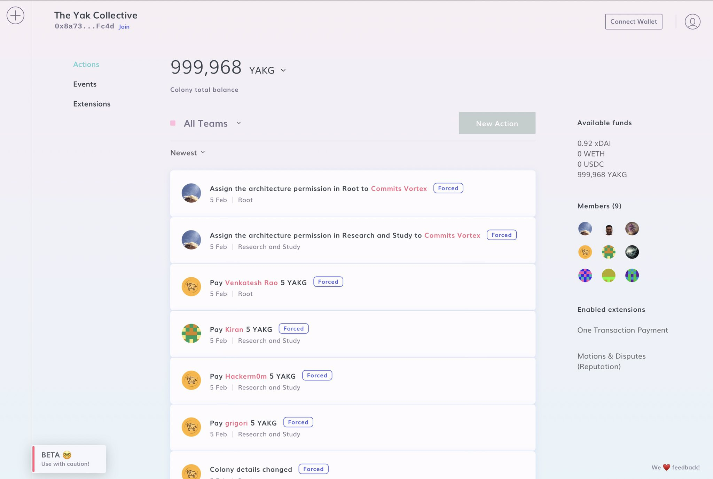
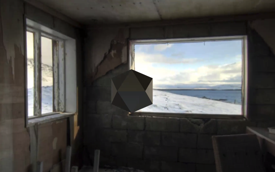

> Today's featured yak: Eric Platon \(@not\_replica\) \- \(GOF\)AI, Consciousness, Biology, Space https://www\.yakcollective\.org/members/100037/\#20220201

 [Tue Feb 01 17:04:58 +0000 2022](https://twitter.com/yak_collective/status/1488559010743730181)

----

> recording of Monday’s read about ethereum layer 2 ecosystem &lt;https://ethereum\.org/en/developers/docs/scaling/layer\-2\-rollups/&gt; posted to YouTube https://youtu\.be/lzXv85RcFgw \#yakbot

 [Tue Feb 01 21:49:19 +0000 2022](https://twitter.com/yak_collective/status/1488630569948880900)

----

> Check out @randylubin's new post, "Launching the Foresight Games community and website"\. https://blog\.randylubin\.com/launching\-foresight\-games\-community\-and\-website

 [Wed Feb 02 04:00:43 +0000 2022](https://twitter.com/yak_collective/status/1488724033902456835)

----

> Today's featured yak: Michael de la Maza  https://www\.yakcollective\.org/members/100064/\#20220202

 [Wed Feb 02 04:09:29 +0000 2022](https://twitter.com/yak_collective/status/1488726241955962880)

----

> Check out @antlerboy's new post, "We can ‘level up’ by transforming commissioning"\. https://antlerboy\.medium\.com/we\-can\-level\-up\-by\-transforming\-commissioning\-ee6bf52b539c?source\=rss\-97852f5a56ae\-\-\-\-\-\-2

 [Wed Feb 02 09:33:27 +0000 2022](https://twitter.com/yak_collective/status/1488807769205575680)

----

> Verifying my identity for @viamirror  
>   
> sig:0x5bd10860a51d6628f1d8a0afd56f7487f92a65b4ab3255b7a92ddc8dd0311a120a6d0d4f4680975a6ea50df7e378ea0fcb3b8080721a63063092c95bd1c7413b1b  
>   
> https://mirror\.xyz

 [Thu Feb 03 00:24:38 +0000 2022](https://twitter.com/yak_collective/status/1489032041601458178)

----

> Check out @anthilemoon's new post, "Exploring the power of augmented intentionality with Welf von Hören, founder of Potential"\. https://nesslabs\.com/potential\-featured\-tool?utm\_source\=rss&utm\_medium\=rss&utm\_campaign\=potential\-featured\-tool

 [Thu Feb 03 16:20:39 +0000 2022](https://twitter.com/yak_collective/status/1489272631736078340)

----

> Today's featured yak: Jascha  https://www\.yakcollective\.org/members/100005/\#20220203

 [Thu Feb 03 16:34:46 +0000 2022](https://twitter.com/yak_collective/status/1489276182705156096)

----

> The Yak Collective online governance study group will be on the Mirror town hall in \~30 minutes to discuss the paper we’re releasing soon https://twitter\.com/viamirror/status/1489287272436580354

 [Thu Feb 03 17:27:19 +0000 2022](https://twitter.com/yak_collective/status/1489289410310930432)

----

> Today's featured yak: Jordan Allen \(@quickdrawyall\) \- Business Development &amp; Revenue Generation https://www\.yakcollective\.org/members/100055/\#20220204

 [Fri Feb 04 17:04:30 +0000 2022](https://twitter.com/yak_collective/status/1489646056275161091)

----

Replying to [@not\_replica, @maierfenster, @vgr and @jaschawilcox](https://twitter.com/yak_collective/status/1486391005620363265)

> 3/ YakRover Group Discussion on OS for Rovers aka BOS up you YouTube\. @maierfenster, @not\_replica, @vgr, @rhettford, @anurajenp and Brian Smith try to answer \-   
> Where does an OS for Rovers begin and end? What should an OS for Rovers do for its users?   
>   
> https://www\.youtube\.com/watch?v\=83AzBSOb4ew

 [Fri Feb 04 17:06:08 +0000 2022](https://twitter.com/yak_collective/status/1489646464850608128)

----

> Check out @antlerboy's new post, "Transduction — leading transformation — Issue \#36"\. https://antlerboy\.medium\.com/transduction\-leading\-transformation\-issue\-36\-f35068cbe1a9?source\=rss\-97852f5a56ae\-\-\-\-\-\-2

 [Fri Feb 04 23:13:53 +0000 2022](https://twitter.com/yak_collective/status/1489739012529025027)

----

> Today's featured yak: Zhan Li \(@thezhanly\) \- Scenarios, Foresight, Futurist Studies &amp; PE/VC https://www\.yakcollective\.org/members/100072/\#20220205

 [Sat Feb 05 17:04:36 +0000 2022](https://twitter.com/yak_collective/status/1490008469096775682)

----

> The Yak Collective is piloting a DAO experiment on @joincolony 
> 
> 

 [Sat Feb 05 18:42:05 +0000 2022](https://twitter.com/yak_collective/status/1490033001505247233)

----

Replying to [@yak\_collective](https://twitter.com/yak_collective/status/1489646464850608128)

> 4/ YakRover session on "How to start Rover Robotics in Any Budget" by @anurajenp is up on YouTube  
>   
> https://www\.youtube\.com/watch?v\=ncfQBI6xQeQ

 [Sun Feb 06 15:57:19 +0000 2022](https://twitter.com/yak_collective/status/1490353924599160844)

----

> Today's featured yak: Hugo Macedo \(@macedoh\) \- Humans are a curious subject https://www\.yakcollective\.org/members/100027/\#20220206

 [Sun Feb 06 17:09:15 +0000 2022](https://twitter.com/yak_collective/status/1490372027261325322)

----

> Check out @antlerboy's new post, "Pathological liars: they’re out there, and we keep giving them power"\. https://antlerboy\.medium\.com/pathological\-liars\-theyre\-out\-there\-and\-we\-keep\-giving\-them\-power\-b9e3fe703d40?source\=rss\-97852f5a56ae\-\-\-\-\-\-2

 [Mon Feb 07 08:23:55 +0000 2022](https://twitter.com/yak_collective/status/1490602210857824260)

----

> Today's featured yak: Paul Millerd \(@p\_millerd\) https://www\.yakcollective\.org/members/100078/\#20220207

 [Mon Feb 07 08:29:33 +0000 2022](https://twitter.com/yak_collective/status/1490603625785311232)

----

> Check out @tomcritchlow's new post, "Electric Tables V0\.2"\. http://tomcritchlow\.com/2022/02/07/electric\-tables\-v2/

 [Mon Feb 07 13:57:24 +0000 2022](https://twitter.com/yak_collective/status/1490686133424082946)

----

> The Yak Rover project tonight will discuss the "three laws of roverics" \-\- inspiration from Asimov's 3 laws of robotics for rover design https://twitter\.com/vgr/status/1490858088840445953

 [Tue Feb 08 01:22:07 +0000 2022](https://twitter.com/yak_collective/status/1490858449085005825)

----

Replying to [@yak\_collective](https://twitter.com/yak_collective/status/1490858449085005825)

> If you're interested, join the Yak Collective at this link and show up at 9:45 PM Pacific Time tonight \(Zoom link will be posted in the Discord\) https://www\.yakcollective\.org/join/

 [Tue Feb 08 01:23:09 +0000 2022](https://twitter.com/yak_collective/status/1490858708380774401)

----

> Interested in the 3 Laws of Roverics? &lt;@\!692110789657755728&gt; will frame them at the YakRover meeting\. Please join us today Feb\. 8th at 5:45 UTC \! \#yakbot

 [Tue Feb 08 02:43:18 +0000 2022](https://twitter.com/yak_collective/status/1490878879816462336)

----

> Today's featured yak: Ben Mosior \(@HiredThought\) \- curator of strange and interesting methods https://www\.yakcollective\.org/members/100080/\#20220208

 [Tue Feb 08 17:09:08 +0000 2022](https://twitter.com/yak_collective/status/1491096773129080833)

----

> Recording of Monday’s group read of Moxie's My first impressions of web3 piece &lt;https://moxie\.org/2022/01/07/web3\-first\-impressions\.html&gt; posted to YouTube https://youtu\.be/ptPF5\_2yFFU \#yakbot

 [Tue Feb 08 20:28:08 +0000 2022](https://twitter.com/yak_collective/status/1491146853534023687)

----

> Check out @antlerboy's new post, "Your help needed — Supporting Adult Social Care Commissioners — Strategic Commissioning Options…"\. https://antlerboy\.medium\.com/your\-help\-needed\-supporting\-adult\-social\-care\-commissioners\-strategic\-commissioning\-options\-17436fa50dc2?source\=rss\-97852f5a56ae\-\-\-\-\-\-2

 [Wed Feb 09 11:38:25 +0000 2022](https://twitter.com/yak_collective/status/1491375930983518210)

----

> Today's featured yak: Tracy Brinkerhoff  https://www\.yakcollective\.org/members/100060/\#20220209

 [Wed Feb 09 11:49:46 +0000 2022](https://twitter.com/yak_collective/status/1491378789804392450)

----

> Check out @vgr's new newsletter, "Derangements"\. https://studio\.ribbonfarm\.com/p/derangements

 [Thu Feb 10 06:42:45 +0000 2022](https://twitter.com/yak_collective/status/1491663915469742085)

----

> Today's featured yak: Jay Kalawar  https://www\.yakcollective\.org/members/100070/\#20220210

 [Thu Feb 10 06:49:14 +0000 2022](https://twitter.com/yak_collective/status/1491665546886139906)

----

> Check out @anthilemoon's new post, "Augmenting product work with Rishank Pandey, co\-founder of Workduck"\. https://nesslabs\.com/workduck\-featured\-tool?utm\_source\=rss&utm\_medium\=rss&utm\_campaign\=workduck\-featured\-tool

 [Thu Feb 10 14:41:00 +0000 2022](https://twitter.com/yak_collective/status/1491784268116279296)

----

> Today's featured yak: Thomas Hollands \(@tdoggyholhol\) \- Marketing Strategy and Strategic Marketing https://www\.yakcollective\.org/members/100023/\#20220211

 [Fri Feb 11 17:04:11 +0000 2022](https://twitter.com/yak_collective/status/1492182689750913038)

----

> excellent governance chat reading today https://vbsd\.super\.site/introduction\-for\-culture\-shifters \#yakbot

 [Fri Feb 11 17:08:06 +0000 2022](https://twitter.com/yak_collective/status/1492183674904788997)

----

> Check out @antlerboy's new post, "Transduction — leading transformation — Issue \#37"\. https://antlerboy\.medium\.com/transduction\-leading\-transformation\-issue\-37\-ca188528f564?source\=rss\-97852f5a56ae\-\-\-\-\-\-2

 [Sat Feb 12 09:18:51 +0000 2022](https://twitter.com/yak_collective/status/1492427973890297859)

----

> Today's featured yak: David McDougall \(@dmcdougall\) https://www\.yakcollective\.org/members/100076/\#20220212

 [Sat Feb 12 09:19:43 +0000 2022](https://twitter.com/yak_collective/status/1492428193323700224)

----

> Today's featured yak: Sumit Paul\-Choudhury  https://www\.yakcollective\.org/members/100081/\#20220213

 [Sun Feb 13 17:09:06 +0000 2022](https://twitter.com/yak_collective/status/1492908703477125123)

----

> @rhettford will update on the "Stubborn Pursuit of a Path" at the YakRover meeting tomorrow\. Please join us on Feb\. 15th at 5:45 UTC \! \#yakbot

 [Mon Feb 14 12:56:01 +0000 2022](https://twitter.com/yak_collective/status/1493207401310441473)

----

> Check out @antlerboy's new post, "Do you know a trainer, facilitator, or consultant — and how do they feel about their job?"\. https://antlerboy\.medium\.com/do\-you\-know\-a\-trainer\-facilitator\-or\-consultant\-and\-how\-do\-they\-feel\-about\-their\-job\-b1cae3f926ec?source\=rss\-97852f5a56ae\-\-\-\-\-\-2

 [Mon Feb 14 12:58:14 +0000 2022](https://twitter.com/yak_collective/status/1493207958427213824)

----

> Today's featured yak: Thomas Verhagen \(@thomasverhagen\) https://www\.yakcollective\.org/members/100051/\#20220214

 [Mon Feb 14 13:04:58 +0000 2022](https://twitter.com/yak_collective/status/1493209653777420293)

----

> UPDATE @rhettford will update on the "Stubborn Pursuit of a Path" at the YakRover meeting tomorrow\. Please join us on Feb\. 15th at 5:00 UTC \! 45 minutes earlier than previously posted \#yakbot

 [Mon Feb 14 14:52:11 +0000 2022](https://twitter.com/yak_collective/status/1493236635533815808)

----

> Today's featured yak: Chris Reid \(@careid0\) https://www\.yakcollective\.org/members/100087/\#20220215

 [Tue Feb 15 17:09:53 +0000 2022](https://twitter.com/yak_collective/status/1493633676088913924)

----

> Check out @antlerboy's new post, "Have you seen data, ‘best practice’, benchmarking, or ‘learning’ applied in ways which block…"\. https://antlerboy\.medium\.com/have\-you\-seen\-data\-best\-practice\-benchmarking\-or\-learning\-applied\-in\-ways\-which\-block\-24d27479bcb4?source\=rss\-97852f5a56ae\-\-\-\-\-\-2

 [Wed Feb 16 12:18:53 +0000 2022](https://twitter.com/yak_collective/status/1493922832534941697)

----

> Today's featured yak: Maier Fenster \(@maierfenster\) \- Distilling and then leveraging your ideas https://www\.yakcollective\.org/members/100020/\#20220216

 [Wed Feb 16 12:34:42 +0000 2022](https://twitter.com/yak_collective/status/1493926810362462208)

----

> Check out @randylubin's new post, "Story Synth Video Tours"\. https://blog\.randylubin\.com/story\-synth\-video\-tours

 [Thu Feb 17 01:31:05 +0000 2022](https://twitter.com/yak_collective/status/1494122195798401026)

----

> Today's featured yak: Randy Lubin \(@randylubin\) https://www\.yakcollective\.org/members/100074/\#20220217

 [Thu Feb 17 01:44:19 +0000 2022](https://twitter.com/yak_collective/status/1494125525543133187)

----

> Check out @anthilemoon's new post, "Nurturing thoughtful relationships with the co\-founders of Clay"\. https://nesslabs\.com/clay\-featured\-tool?utm\_source\=rss&utm\_medium\=rss&utm\_campaign\=clay\-featured\-tool

 [Thu Feb 17 10:25:51 +0000 2022](https://twitter.com/yak_collective/status/1494256773670309891)

----

> Today's featured yak: Claire Peters  https://www\.yakcollective\.org/members/100082/\#20220218

 [Fri Feb 18 17:09:29 +0000 2022](https://twitter.com/yak_collective/status/1494720739844444166)

----

> divide and conquer session in the governance chat: discussing the 7 case studies in this excellent report by the platform cooperativism consortium and the berggruen institute https://ia804605\.us\.archive\.org/20/items/policy\-paper\-dec\-6/Policy%20Paper%20%28Dec%206\.2%29\.pdf \#yakbot

 [Fri Feb 18 17:13:19 +0000 2022](https://twitter.com/yak_collective/status/1494721705301970946)

----

> Check out @vgr's new newsletter, "Theory\-Shaped Debris"\. https://studio\.ribbonfarm\.com/p/theory\-shaped\-debris

 [Fri Feb 18 22:34:53 +0000 2022](https://twitter.com/yak_collective/status/1494802628001337344)

----

> Today's featured yak: Benjamin Taylor \(@antlerboy\) \- systems \| cybernetics \| complexity https://www\.yakcollective\.org/members/100047/\#20220219

 [Sat Feb 19 17:09:38 +0000 2022](https://twitter.com/yak_collective/status/1495083165894983688)

----

> The first Yak Collective NFT has dropped: the Yak Online Governance Primer on Mirror https://yakcollective\.mirror\.xyz/aJdO\_SO3gw34cLtwBwNC2OD3s0YT3us9C\-C2NNPQ\_us \#yakbot

 [Sat Feb 19 20:15:08 +0000 2022](https://twitter.com/yak_collective/status/1495129847265435649)

----

> Today's featured yak: Drew Shiel \(@gothwalk\) \- Independent Domestic Historian https://www\.yakcollective\.org/members/100090/\#20220220

 [Sun Feb 20 17:14:08 +0000 2022](https://twitter.com/yak_collective/status/1495446685945942021)

----

> Check out @antlerboy's new post, "Why is being in the wrong frame so hilarious? And what are the implications for business?"\. https://antlerboy\.medium\.com/why\-is\-being\-in\-the\-wrong\-frame\-so\-hilarious\-and\-what\-are\-the\-implications\-for\-business\-a892b4752d86?source\=rss\-97852f5a56ae\-\-\-\-\-\-2

 [Mon Feb 21 13:33:48 +0000 2022](https://twitter.com/yak_collective/status/1495753625439723521)

----

> Today's featured yak: Jenna Dixon \(@jdbb\) \- communications &amp; digital operations https://www\.yakcollective\.org/members/100018/\#20220221

 [Mon Feb 21 13:49:13 +0000 2022](https://twitter.com/yak_collective/status/1495757506232135681)

----

> Today's featured yak: Nita Baum \(@bfree\_live\) https://www\.yakcollective\.org/members/100058/\#20220222

 [Tue Feb 22 04:49:55 +0000 2022](https://twitter.com/yak_collective/status/1495984174230085636)

----

> Yak Rover meeting, @not\_replica presenting on his automated concept learning for robots, bsaed on sensor data\. 
> 
> 

 [Tue Feb 22 05:13:39 +0000 2022](https://twitter.com/yak_collective/status/1495990144431628291)

----

Replying to [@vgr and @not\_replica](https://twitter.com/yak_collective/status/1495990144431628291)

> This is how Eric's tank rover internally thinks of changing data\.\.\. inception style concept rendering directly from sensor data\. This tankroid dreams of electric icosahedrons\. Sheep coming next\. 
> 
> 

 [Tue Feb 22 05:24:54 +0000 2022](https://twitter.com/yak_collective/status/1495992978359287810)

----

Replying to [@vgr and @not\_replica](https://twitter.com/yak_collective/status/1495992978359287810)

> The idea here, beyond fun, is to render data states in a way that is suitable as input to machine learning\.\.\. the shape grows bigger when disk starts getting full in this case\. Can do high\-dimensional states\.

 [Tue Feb 22 05:27:26 +0000 2022](https://twitter.com/yak_collective/status/1495993613133701121)

----

> Today's featured yak: Pamela Hobart \(@amelapay\) \- Philosopher, Mother of 3 https://www\.yakcollective\.org/members/100068/\#20220223

 [Wed Feb 23 01:51:58 +0000 2022](https://twitter.com/yak_collective/status/1496301779532845056)

----

> Check out @antlerboy's new post, "What does seeing the different worlds that make up an organisation show you?"\. https://antlerboy\.medium\.com/what\-does\-seeing\-the\-different\-worlds\-that\-make\-up\-an\-organisation\-show\-you\-cb25cb4eea49?source\=rss\-97852f5a56ae\-\-\-\-\-\-2

 [Wed Feb 23 10:13:55 +0000 2022](https://twitter.com/yak_collective/status/1496428098660798473)

----

> Check out @anthilemoon's new post, "Scaling peer\-to\-peer learning with Jennifer Smith, founder of Scribe"\. https://nesslabs\.com/scribe\-featured\-tool?utm\_source\=rss&utm\_medium\=rss&utm\_campaign\=scribe\-featured\-tool

 [Thu Feb 24 15:05:22 +0000 2022](https://twitter.com/yak_collective/status/1496863832744079366)

----

> Today's featured yak: Shreeda Segan \(@freeshreeda\) \- Design Thinker &amp; Writer https://www\.yakcollective\.org/members/100044/\#20220224

 [Thu Feb 24 15:09:42 +0000 2022](https://twitter.com/yak_collective/status/1496864921799249927)

----

Replying to [@yak\_collective](https://twitter.com/yak_collective/status/1490353924599160844)

> 5/ Check out the great session "Newbots: A new era of Robotics" by @jaschawilcox for YakRover meetup on YouTube  
>   
> Don't forget to subscribe: https://bit\.ly/3BLYCsr  
>   
> https://youtu\.be/cs44U8R33uk

 [Thu Feb 24 15:32:01 +0000 2022](https://twitter.com/yak_collective/status/1496870539620663301)

----

> Today's featured yak: Mike Wimsatt  https://www\.yakcollective\.org/members/100093/\#20220225

 [Fri Feb 25 17:09:40 +0000 2022](https://twitter.com/yak_collective/status/1497257500843950095)

----

> Check out @vgr's new newsletter, "Teeth and Identity"\. https://studio\.ribbonfarm\.com/p/teeth\-and\-identity

 [Sat Feb 26 01:17:09 +0000 2022](https://twitter.com/yak_collective/status/1497380178435133443)

----

> Today's featured yak: Sachin Benny \(@sachinb91\) https://www\.yakcollective\.org/members/100013/\#20220226

 [Sat Feb 26 01:29:23 +0000 2022](https://twitter.com/yak_collective/status/1497383257423417346)

----

> Today's featured yak: Chris Clark \(@chrisclark1729\) \- Freelance Data Projects https://www\.yakcollective\.org/members/100061/\#20220227

 [Sun Feb 27 17:09:22 +0000 2022](https://twitter.com/yak_collective/status/1497982199014076420)

----

> Check out @antlerboy's new post, "Transduction — leading transformation — Issue \#39"\. https://antlerboy\.medium\.com/transduction\-leading\-transformation\-issue\-39\-e8d572eb46ff?source\=rss\-97852f5a56ae\-\-\-\-\-\-2

 [Mon Feb 28 06:48:19 +0000 2022](https://twitter.com/yak_collective/status/1498188296618483712)

----

> Today's featured yak: Amanda Reeves \(@WabiSabiFutures\) https://www\.yakcollective\.org/members/100086/\#20220228

 [Mon Feb 28 07:04:41 +0000 2022](https://twitter.com/yak_collective/status/1498192414804221953)

----

> @sai\_prasanna will present his research plans on Reinforcement Learning for Robotics at the YakRover meeting this week\. Please join us on March 1st at 5:00 UTC \! \#yakbot

 [Tue Mar 01 00:11:18 +0000 2022](https://twitter.com/yak_collective/status/1498450772144664578)