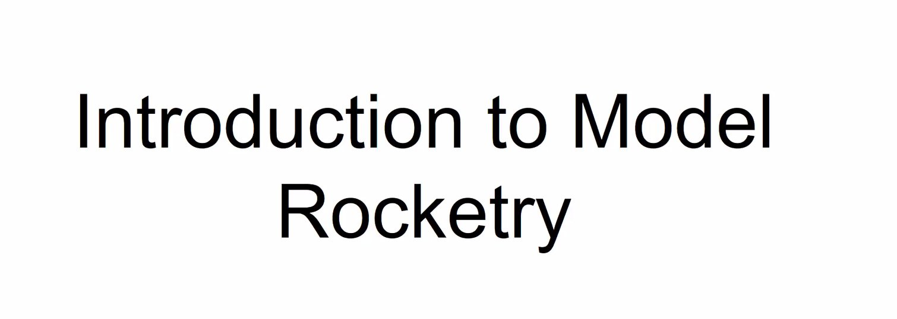

> Today's featured yak: Anuraj R \(@anurajenp\) \- Curious \| Roboticist https://www\.yakcollective\.org/members/100039/\#20220301

 [Tue Mar 01 17:14:03 +0000 2022](https://twitter.com/yak_collective/status/1498708155584458754)

----

> Check out @antlerboy's new post, "When is \#selforganization… not? And does it matter?"\. https://antlerboy\.medium\.com/when\-is\-selforganization\-not\-and\-does\-it\-matter\-74f3a12a6f0a?source\=rss\-97852f5a56ae\-\-\-\-\-\-2

 [Wed Mar 02 10:38:20 +0000 2022](https://twitter.com/yak_collective/status/1498970957276495877)

----

> Today's featured yak: Siva Swaroop  https://www\.yakcollective\.org/members/100091/\#20220302

 [Wed Mar 02 10:44:11 +0000 2022](https://twitter.com/yak_collective/status/1498972428659273734)

----

> Check out @anthilemoon's new post, "Creating the perfect hybrid work space with Craig Doig, co\-founder of Markee"\. https://nesslabs\.com/markee\-featured\-tool?utm\_source\=rss&utm\_medium\=rss&utm\_campaign\=markee\-featured\-tool

 [Thu Mar 03 13:10:46 +0000 2022](https://twitter.com/yak_collective/status/1499371708108742661)

----

> Today's featured yak: Chris Butler \(@chrizbot\) \- Chaotic good product manager https://www\.yakcollective\.org/members/100006/\#20220303

 [Thu Mar 03 13:24:42 +0000 2022](https://twitter.com/yak_collective/status/1499375212869079040)

----

> Today's featured yak: Tom Critchlow \(@tomcritchlow\) https://www\.yakcollective\.org/members/100063/\#20220304

 [Fri Mar 04 17:19:39 +0000 2022](https://twitter.com/yak_collective/status/1499796726231748611)

----

> Check out @antlerboy's new post, "Transduction — leading transformation — Issue \#40"\. https://antlerboy\.medium\.com/transduction\-leading\-transformation\-issue\-40\-782aaf42bd48?source\=rss\-97852f5a56ae\-\-\-\-\-\-2

 [Fri Mar 04 17:48:49 +0000 2022](https://twitter.com/yak_collective/status/1499804068943994885)

----

Replying to [@jaschawilcox](https://twitter.com/yak_collective/status/1496870539620663301)

> 6/ Check out @vgr's talk on "The Three Laws of Roverics" inspired from Asimov's Three Laws of Robotics, followed by discussion of different fictional robots, 3 laws applied to Rover OS, a small python demo of the 3 laws and more  
>   
> http://bit\.ly/3BLYCsr  
>   
> https://www\.youtube\.com/watch?v\=cVyWWwa1O\_4

 [Fri Mar 04 18:42:09 +0000 2022](https://twitter.com/yak_collective/status/1499817491199102983)

----

> Check out @vgr's new newsletter, "Transaction\-Cost Utopias Reconsidered"\. https://studio\.ribbonfarm\.com/p/transaction\-cost\-utopias\-reconsidered

 [Sat Mar 05 02:17:33 +0000 2022](https://twitter.com/yak_collective/status/1499932094264455174)

----

> Today's featured yak: Murilo Loureiro  https://www\.yakcollective\.org/members/100073/\#20220305

 [Sat Mar 05 02:29:28 +0000 2022](https://twitter.com/yak_collective/status/1499935091912552450)

----

> Today's featured yak: Jordan Peacock \(@hewhocutsdown\) \- CEO, Becoming Machinic; Founder, Sortilege https://www\.yakcollective\.org/members/100036/\#20220306

 [Sun Mar 06 17:14:39 +0000 2022](https://twitter.com/yak_collective/status/1500520245970227209)

----

> Check out @p\_millerd's new post, "From Blog to Book: How To Self\-Publish On Your Own Terms"\. https://think\-boundless\.com/blog\-to\-book/?utm\_source\=rss&utm\_medium\=rss&utm\_campaign\=blog\-to\-book

 [Mon Mar 07 00:22:17 +0000 2022](https://twitter.com/yak_collective/status/1500627864701521920)

----

> Check out @randylubin's new post, "First round of Story Synth Microgrants disbursed – plenty more remaining\!"\. https://blog\.randylubin\.com/first\-round\-of\-story\-synth\-microgrants\-disbursed\-plenty\-more\-remaining

 [Mon Mar 07 00:40:24 +0000 2022](https://twitter.com/yak_collective/status/1500632423008243713)

----

> Today's featured yak: Prashant Gandhi  https://www\.yakcollective\.org/members/100066/\#20220307

 [Mon Mar 07 00:44:07 +0000 2022](https://twitter.com/yak_collective/status/1500633356312223747)

----

> Check out @antlerboy's new post, "What’s your favourite management euphemism?"\. https://antlerboy\.medium\.com/whats\-your\-favourite\-management\-euphemism\-bab5127348c1?source\=rss\-97852f5a56ae\-\-\-\-\-\-2

 [Mon Mar 07 11:58:53 +0000 2022](https://twitter.com/yak_collective/status/1500803167835066372)

----

> Check out the latest edition of the Yak Talk newsletter, "The Yak Online Governance Primer"\. https://yakcollective\.substack\.com/p/the\-yak\-online\-governance\-primer

 [Tue Mar 08 01:19:43 +0000 2022](https://twitter.com/yak_collective/status/1501004702758187011)

----

> Today Brian Smith will talk about rovers and rocketry at the YakRover meeting\. Please join us on March 8th at 5:00 UTC \! \#yakbot

 [Tue Mar 08 01:28:16 +0000 2022](https://twitter.com/yak_collective/status/1501006857309245447)

----

> Today's featured yak: Kannen Ramsamy  \- Writer https://www\.yakcollective\.org/members/100085/\#20220308

 [Tue Mar 08 01:34:25 +0000 2022](https://twitter.com/yak_collective/status/1501008402700455940)

----

> Check out @p\_millerd's new post, "Unlocking your creative engine: How to create a virtuous cycle for creating and sharing online"\. https://think\-boundless\.com/creativity/?utm\_source\=rss&utm\_medium\=rss&utm\_campaign\=creativity

 [Tue Mar 08 02:11:52 +0000 2022](https://twitter.com/yak_collective/status/1501017829763694605)

----

> Model rocketry session at the Yak Rover weekly meeting 
> 
> 

 [Tue Mar 08 05:06:31 +0000 2022](https://twitter.com/yak_collective/status/1501061780222607362)

----

> Check out @tomcritchlow's new post, "Building a Digital Homestead, Bit by Brick"\. http://tomcritchlow\.com/2022/03/08/architecture\-blogging/

 [Tue Mar 08 17:37:44 +0000 2022](https://twitter.com/yak_collective/status/1501250828757352458)

----

> New newsletter issue on our first NFT project, and a look at our blockchain roadmap explorations\.   
>   
> https://yakcollective\.substack\.com/p/the\-yak\-online\-governance\-primer?s\=w

 [Tue Mar 08 19:17:34 +0000 2022](https://twitter.com/yak_collective/status/1501275954802401280)

----

> Check out @antlerboy's new post, "The blue dot and the terrible dance of power"\. https://antlerboy\.medium\.com/the\-blue\-dot\-and\-the\-terrible\-dance\-of\-power\-632c2429d1b2?source\=rss\-97852f5a56ae\-\-\-\-\-\-2

 [Wed Mar 09 11:23:48 +0000 2022](https://twitter.com/yak_collective/status/1501519112786386946)

----

> Today's featured yak: Maggie Appleton  https://www\.yakcollective\.org/members/100056/\#20220309

 [Wed Mar 09 11:34:07 +0000 2022](https://twitter.com/yak_collective/status/1501521709492584448)

----

> Check out @randylubin's new post, "1926 Game Jam Winners"\. https://blog\.randylubin\.com/1926\-game\-jam\-winners

 [Wed Mar 09 21:20:16 +0000 2022](https://twitter.com/yak_collective/status/1501669219204747265)

----

> Today's featured yak: Ryan Hume  \- Industrial Designer \+ Illustrator \+ Music Technologist https://www\.yakcollective\.org/members/100069/\#20220310

 [Thu Mar 10 14:24:35 +0000 2022](https://twitter.com/yak_collective/status/1501926996359720960)

----

> Check out @anthilemoon's new post, "Creating your web of knowledge with Scrintal"\. https://nesslabs\.com/creating\-your\-web\-of\-knowledge\-with\-scrintal?utm\_source\=rss&utm\_medium\=rss&utm\_campaign\=creating\-your\-web\-of\-knowledge\-with\-scrintal

 [Thu Mar 10 14:25:05 +0000 2022](https://twitter.com/yak_collective/status/1501927125351387146)

----

> Check out @anthilemoon's new post, "Building your web of knowledge with Scrintal"\. https://nesslabs\.com/scrintal\-featured\-tool?utm\_source\=rss&utm\_medium\=rss&utm\_campaign\=scrintal\-featured\-tool

 [Thu Mar 10 15:00:16 +0000 2022](https://twitter.com/yak_collective/status/1501935976653807624)

----

> Check out @antlerboy's new post, "Transduction — leading transformation — Issue \#41"\. https://antlerboy\.medium\.com/transduction\-leading\-transformation\-issue\-41\-2862bbaa8767?source\=rss\-97852f5a56ae\-\-\-\-\-\-2

 [Fri Mar 11 14:13:45 +0000 2022](https://twitter.com/yak_collective/status/1502286660939231232)

----

> Today's featured yak: Darren Kong \(@varietalxyz\) https://www\.yakcollective\.org/members/100025/\#20220311

 [Fri Mar 11 14:19:21 +0000 2022](https://twitter.com/yak_collective/status/1502288067972980736)

----

> Check out @vgr's new newsletter, "Lands of Lorecraft"\. https://studio\.ribbonfarm\.com/p/lands\-of\-lorecraft

 [Sat Mar 12 04:42:28 +0000 2022](https://twitter.com/yak_collective/status/1502505278960513024)

----

> Today's featured yak: Praful Mathur  https://www\.yakcollective\.org/members/100075/\#20220312

 [Sat Mar 12 04:44:28 +0000 2022](https://twitter.com/yak_collective/status/1502505783136858122)

----

> Today's featured yak: Grigori Milov  https://www\.yakcollective\.org/members/100079/\#20220313

 [Sun Mar 13 16:04:35 +0000 2022](https://twitter.com/yak_collective/status/1503039326342496256)

----

> Check out @antlerboy's new post, "How good are you at getting rejected?"\. https://antlerboy\.medium\.com/how\-good\-are\-you\-at\-getting\-rejected\-24c674378caf?source\=rss\-97852f5a56ae\-\-\-\-\-\-2

 [Mon Mar 14 10:48:27 +0000 2022](https://twitter.com/yak_collective/status/1503322157631344641)

----

> Today's featured yak: Phil Wolff \(@evanwolf\) https://www\.yakcollective\.org/members/100053/\#20220314

 [Mon Mar 14 10:54:31 +0000 2022](https://twitter.com/yak_collective/status/1503323682764206080)

----

> Today's featured yak: Erik Sandberg  https://www\.yakcollective\.org/members/100088/\#20220315

 [Tue Mar 15 16:09:01 +0000 2022](https://twitter.com/yak_collective/status/1503765218706567172)

----

> Check out @tomcritchlow's new post, "Holding \(and scrolling\) attention"\. http://tomcritchlow\.com/2022/03/15/holding\-scrolling\-attention/

 [Tue Mar 15 20:02:13 +0000 2022](https://twitter.com/yak_collective/status/1503823907794608128)

----

> Check out @antlerboy's new post, "What’s your dream role — if you didn’t even have to leave your current job?"\. https://antlerboy\.medium\.com/whats\-your\-dream\-role\-if\-you\-didn\-t\-even\-have\-to\-leave\-your\-current\-job\-76ab9c5f1431?source\=rss\-97852f5a56ae\-\-\-\-\-\-2

 [Wed Mar 16 10:28:06 +0000 2022](https://twitter.com/yak_collective/status/1504041810624139268)

----

> Today's featured yak: Scott Garlinger \(@scott\_garlinger\) \- Director of Business Development, Groupmuse; A\.I\. Operator, Dynasty https://www\.yakcollective\.org/members/100022/\#20220316

 [Wed Mar 16 10:34:21 +0000 2022](https://twitter.com/yak_collective/status/1504043384926834694)

----

> Check out @anthilemoon's new post, "How to become a brain myth buster"\. https://nesslabs\.com/brain\-myth\-buster?utm\_source\=rss&utm\_medium\=rss&utm\_campaign\=brain\-myth\-buster

 [Thu Mar 17 12:00:41 +0000 2022](https://twitter.com/yak_collective/status/1504427500943855626)

----

> Today's featured yak: Vlad Mehakovic \(@vladiim\) https://www\.yakcollective\.org/members/100077/\#20220317

 [Thu Mar 17 12:04:19 +0000 2022](https://twitter.com/yak_collective/status/1504428414505267200)

----

> Check out @chrizbot's new post, "Identity problems get bigger in the metaverse"\. https://chrizbot\.medium\.com/identity\-problems\-get\-bigger\-in\-the\-metaverse\-b091d05f8952?source\=rss\-ba6349c9c628\-\-\-\-\-\-2

 [Thu Mar 17 18:27:49 +0000 2022](https://twitter.com/yak_collective/status/1504524926472142856)

----

> Check out @chrizbot's new post, "Recommendations for all of us"\. https://chrizbot\.medium\.com/recommendations\-for\-all\-of\-us\-fd4c94a3a651?source\=rss\-ba6349c9c628\-\-\-\-\-\-2

 [Thu Mar 17 21:07:47 +0000 2022](https://twitter.com/yak_collective/status/1504565180717535234)

----

> Today's featured yak: Anne\-Laure Le Cunff \(@anthilemoon\) https://www\.yakcollective\.org/members/100071/\#20220318

 [Fri Mar 18 16:04:04 +0000 2022](https://twitter.com/yak_collective/status/1504851135210967043)

----

> Check out @vgr's new newsletter, "Lore as Imaginative Irony"\. https://studio\.ribbonfarm\.com/p/lore\-as\-imaginative\-irony

 [Fri Mar 18 23:37:19 +0000 2022](https://twitter.com/yak_collective/status/1504965200021274627)

----

> Check out @antlerboy's new post, "Transduction — leading transformation — Issue \#42"\. https://antlerboy\.medium\.com/transduction\-leading\-transformation\-issue\-42\-1d8521bcf6be?source\=rss\-97852f5a56ae\-\-\-\-\-\-2

 [Sat Mar 19 09:38:02 +0000 2022](https://twitter.com/yak_collective/status/1505116375290941440)

----

> Today's featured yak: Justice \(@being\_on\_line\) \- everything digital https://www\.yakcollective\.org/members/100048/\#20220319

 [Sat Mar 19 09:49:06 +0000 2022](https://twitter.com/yak_collective/status/1505119160392638464)

----

> Check out @chrizbot's new post, "How does the Roomba really feel about dog poop?\!"\. https://uxdesign\.cc/how\-does\-the\-roomba\-really\-feel\-about\-dog\-poop\-c590bcfb8834?source\=rss\-ba6349c9c628\-\-\-\-\-\-2

 [Sat Mar 19 10:07:39 +0000 2022](https://twitter.com/yak_collective/status/1505123829592514565)

----

> Today's featured yak: Harry Pottash  \- Philosopher &amp; Investor https://www\.yakcollective\.org/members/100084/\#20220320

 [Sun Mar 20 16:04:44 +0000 2022](https://twitter.com/yak_collective/status/1505576080266215427)

----

> Check out @p\_millerd's new post, "Ship, Quit &amp; Learn – A Framework for Finding Work Worth Doing"\. https://think\-boundless\.com/ship/?utm\_source\=rss&utm\_medium\=rss&utm\_campaign\=ship

 [Mon Mar 21 02:51:09 +0000 2022](https://twitter.com/yak_collective/status/1505738755482820616)

----

> Today's featured yak: Vinay Débrou \(@vinaydebrou\) https://www\.yakcollective\.org/members/100019/\#20220321

 [Mon Mar 21 02:54:45 +0000 2022](https://twitter.com/yak_collective/status/1505739663444791297)

----

> Check out @antlerboy's new post, "Why I Am Against Capitalisation \(Or, Actually, Capitals\)"\. https://antlerboy\.medium\.com/why\-i\-am\-against\-capitalisation\-or\-actually\-capitals\-bd1c81380d93?source\=rss\-97852f5a56ae\-\-\-\-\-\-2

 [Mon Mar 21 11:13:51 +0000 2022](https://twitter.com/yak_collective/status/1505865266332372993)

----

> Looking forward to @richiebonilla and @0xCaryn joining this week's &lt;@&amp;702921933653672037&gt;\_collective blockchain governance call to talk about   
> @clarityteams and where they're going with web3 features 🔥 Today 11 EDT on the YakC Discord server voice channel http://yakcollective\.org

 [Mon Mar 21 13:34:45 +0000 2022](https://twitter.com/yak_collective/status/1505900724487659530)

----

> RT @yak\_collective: Looking forward to @richiebonilla and @0xCaryn joining this week's &lt;@&amp;702921933653672037&gt;\_collective blockchain governa…

 [Mon Mar 21 14:11:32 +0000 2022](https://twitter.com/yak_collective/status/1505909980096045056)

----

> The YakRover group is collecting a trove of links on rover news and broader picture\. Open discussion in a few hours\! Please come join us this March 22nd at 5:00 UTC \! \#yakbot

 [Tue Mar 22 00:27:19 +0000 2022](https://twitter.com/yak_collective/status/1506064946420932617)

----

> Check out @antlerboy's new post, "Taking systems thinking practice to a new level"\. https://antlerboy\.medium\.com/taking\-systems\-thinking\-practice\-to\-a\-new\-level\-9c3e430b3352?source\=rss\-97852f5a56ae\-\-\-\-\-\-2

 [Wed Mar 23 08:08:42 +0000 2022](https://twitter.com/yak_collective/status/1506543447280435205)

----

> Today's featured yak: Victor Hill  https://www\.yakcollective\.org/members/100067/\#20220323

 [Wed Mar 23 08:09:25 +0000 2022](https://twitter.com/yak_collective/status/1506543628319182848)

----

> Check out @anthilemoon's new post, "Productivity addiction: when we become obsessed with productivity"\. https://nesslabs\.com/productivity\-addiction?utm\_source\=rss&utm\_medium\=rss&utm\_campaign\=productivity\-addiction

 [Thu Mar 24 14:40:20 +0000 2022](https://twitter.com/yak_collective/status/1507004389990539282)

----

> Today's featured yak: Benjamin Smith  \- Qualitative researcher https://www\.yakcollective\.org/members/100046/\#20220324

 [Thu Mar 24 14:44:26 +0000 2022](https://twitter.com/yak_collective/status/1507005425337569295)

----

> Today's featured yak: Vaughn Tan \(@vaughn\_tan\) https://www\.yakcollective\.org/members/100092/\#20220325

 [Fri Mar 25 16:04:01 +0000 2022](https://twitter.com/yak_collective/status/1507387841113997313)

----

> Check out @tomcritchlow's new post, "Narrative Logs"\. http://tomcritchlow\.com/2022/03/25/narrative\-logs/

 [Fri Mar 25 16:27:23 +0000 2022](https://twitter.com/yak_collective/status/1507393718831177729)

----

> Check out @antlerboy's new post, "Transduction — leading transformation — Issue \#43"\. https://antlerboy\.medium\.com/transduction\-leading\-transformation\-issue\-43\-d283cf875443?source\=rss\-97852f5a56ae\-\-\-\-\-\-2

 [Fri Mar 25 16:53:49 +0000 2022](https://twitter.com/yak_collective/status/1507400372352131133)

----

> Check out @vgr's new newsletter, "Raw Lore"\. https://studio\.ribbonfarm\.com/p/raw\-lore

 [Sat Mar 26 00:27:20 +0000 2022](https://twitter.com/yak_collective/status/1507514504531390470)

----

> Today's featured yak: Nathan Chen \(@iam\_nChen\) https://www\.yakcollective\.org/members/100015/\#20220326

 [Sat Mar 26 00:29:50 +0000 2022](https://twitter.com/yak_collective/status/1507515130392809474)

----

> \`this is a test\` \#yakbot

 [Sun Mar 27 15:17:28 +0000 2022](https://twitter.com/yak_collective/status/1508100901751435274)

----

> \`hello world, by @necopinus \#yaks\-at\-work\` \#yakbot

 [Sun Mar 27 15:24:59 +0000 2022](https://twitter.com/yak_collective/status/1508102793802002441)

----

> Today's featured yak: Martha Balaile \(@MythologyStudio\) https://www\.yakcollective\.org/members/100057/\#20220327

 [Sun Mar 27 16:04:46 +0000 2022](https://twitter.com/yak_collective/status/1508112803881795588)

----

> Check out @antlerboy's new post, "Announcing two ‘new’ podcasts… coming soon\! \(With bonus puppy pics\)"\. https://antlerboy\.medium\.com/announcing\-two\-new\-podcasts\-coming\-soon\-with\-bonus\-puppy\-pics\-ac3e047f6567?source\=rss\-97852f5a56ae\-\-\-\-\-\-2

 [Mon Mar 28 12:03:56 +0000 2022](https://twitter.com/yak_collective/status/1508414584805285896)

----

> Today's featured yak: Alex Dobrenko \(@Dobrenkz\) \- Improviser / Writer / Filmmaker https://www\.yakcollective\.org/members/100065/\#20220328

 [Mon Mar 28 12:10:10 +0000 2022](https://twitter.com/yak_collective/status/1508416152158060544)

----

> Today's featured yak: Venkatesh Rao \(@vgr\) \- Independent consultant https://www\.yakcollective\.org/members/100041/\#20220329

 [Tue Mar 29 16:04:25 +0000 2022](https://twitter.com/yak_collective/status/1508837489724821512)

----

> Today's featured yak: Drew Schorno \(@dschorno\) \- Clown school graduate; Failed startup alumni https://www\.yakcollective\.org/members/100089/\#20220330

 [Wed Mar 30 16:07:04 +0000 2022](https://twitter.com/yak_collective/status/1509200546196242436)

----

> Check out @anthilemoon's new post, "What is neurodiversity?"\. https://nesslabs\.com/what\-is\-neurodiversity?utm\_source\=rss&utm\_medium\=rss&utm\_campaign\=what\-is\-neurodiversity

 [Thu Mar 31 14:39:26 +0000 2022](https://twitter.com/yak_collective/status/1509540881963143172)

----

> Today's featured yak: Nathan Acks \(@nathan\_acks\) \- Armchair futurist\. Defense against the dark arts\. https://www\.yakcollective\.org/members/100007/\#20220331

 [Thu Mar 31 14:43:35 +0000 2022](https://twitter.com/yak_collective/status/1509541926722285570)