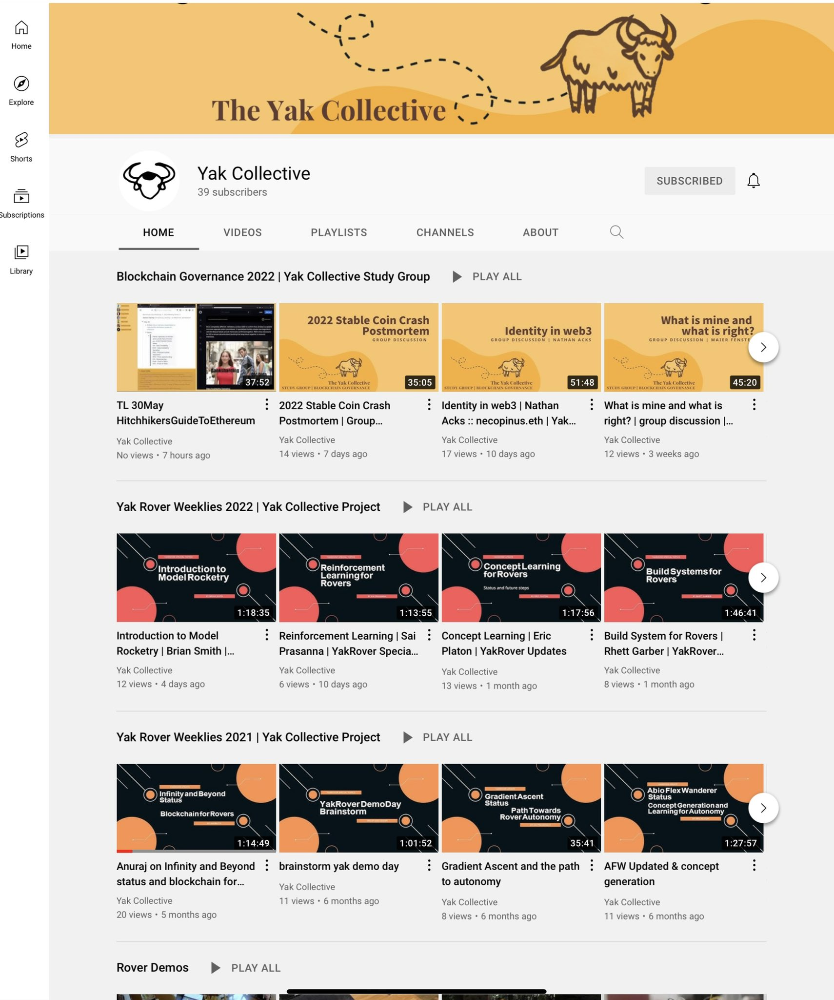

> Today's featured yak: Anuraj R \(@anurajenp\) \- Curious \| Roboticist https://www\.yakcollective\.org/members/100039/\#20220501

 [Sun May 01 16:05:05 +0000 2022](https://twitter.com/yak_collective/status/1520796459058221057)

----

> Today's featured yak: Siva Swaroop  https://www\.yakcollective\.org/members/100091/\#20220502

 [Mon May 02 16:04:22 +0000 2022](https://twitter.com/yak_collective/status/1521158664622649344)

----

> Today's featured yak: Chris Butler \(@chrizbot\) \- Chaotic good product manager https://www\.yakcollective\.org/members/100006/\#20220503

 [Tue May 03 16:04:56 +0000 2022](https://twitter.com/yak_collective/status/1521521197254651905)

----

> Check out @antlerboy's new post, "What I’ve learned from my puppy\."\. https://antlerboy\.medium\.com/what\-ive\-learned\-from\-my\-puppy\-d8e4e5096fcc?source\=rss\-97852f5a56ae\-\-\-\-\-\-2

 [Wed May 04 07:08:22 +0000 2022](https://twitter.com/yak_collective/status/1521748551306563584)

----

> Today's featured yak: Tom Critchlow \(@tomcritchlow\) https://www\.yakcollective\.org/members/100063/\#20220504

 [Wed May 04 07:14:43 +0000 2022](https://twitter.com/yak_collective/status/1521750153400623104)

----

> Check out @anthilemoon's new post, "Weak arguments and how to spot them"\. https://nesslabs\.com/weak\-arguments\-and\-how\-to\-spot\-them?utm\_source\=rss&utm\_medium\=rss&utm\_campaign\=weak\-arguments\-and\-how\-to\-spot\-them

 [Thu May 05 14:50:51 +0000 2022](https://twitter.com/yak_collective/status/1522227327547187200)

----

> Today's featured yak: Murilo Loureiro  https://www\.yakcollective\.org/members/100073/\#20220505

 [Thu May 05 14:59:59 +0000 2022](https://twitter.com/yak_collective/status/1522229625996328962)

----

> Check out @anthilemoon's new post, "Control your time to free your mind with Nunzio Martinello, founder of Akiflow"\. https://nesslabs\.com/akiflow\-featured\-tool?utm\_source\=rss&utm\_medium\=rss&utm\_campaign\=akiflow\-featured\-tool

 [Thu May 05 15:05:08 +0000 2022](https://twitter.com/yak_collective/status/1522230924892647427)

----

> Check out @tomcritchlow's new post, "Some Notes on Executive Dashboards"\. http://tomcritchlow\.com/2022/05/06/executive\-dashboards/

 [Fri May 06 14:47:48 +0000 2022](https://twitter.com/yak_collective/status/1522588949650284544)

----

> Today's featured yak: Jordan Peacock \(@hewhocutsdown\) \- CEO, Becoming Machinic; Founder, Sortilege https://www\.yakcollective\.org/members/100036/\#20220506

 [Fri May 06 14:54:46 +0000 2022](https://twitter.com/yak_collective/status/1522590701376221185)

----

> Check out @antlerboy's new post, "Transduction — leading transformation — Issue \#49"\. https://antlerboy\.medium\.com/transduction\-leading\-transformation\-issue\-49\-add4102cba0e?source\=rss\-97852f5a56ae\-\-\-\-\-\-2

 [Fri May 06 17:18:40 +0000 2022](https://twitter.com/yak_collective/status/1522626915949060096)

----

> Check out @vgr's new newsletter, "Ozymandias Problems"\. https://studio\.ribbonfarm\.com/p/ozymandias\-problems

 [Sat May 07 03:52:28 +0000 2022](https://twitter.com/yak_collective/status/1522786415616086017)

----

> Today's featured yak: Prashant Gandhi  https://www\.yakcollective\.org/members/100066/\#20220507

 [Sat May 07 03:54:11 +0000 2022](https://twitter.com/yak_collective/status/1522786850905239554)

----

> Today's featured yak: Kannen Ramsamy  \- Writer https://www\.yakcollective\.org/members/100085/\#20220508

 [Sun May 08 16:04:20 +0000 2022](https://twitter.com/yak_collective/status/1523332983930986498)

----

> Check out @antlerboy's new post, "Are you anti\-war, or pro\-peace?"\. https://antlerboy\.medium\.com/are\-you\-anti\-war\-or\-pro\-peace\-d04ddbf8633d?source\=rss\-97852f5a56ae\-\-\-\-\-\-2

 [Mon May 09 06:38:34 +0000 2022](https://twitter.com/yak_collective/status/1523552992456282112)

----

> Today's featured yak: Maggie Appleton  https://www\.yakcollective\.org/members/100056/\#20220509

 [Mon May 09 06:54:53 +0000 2022](https://twitter.com/yak_collective/status/1523557100923891712)

----

> Today's featured yak: Ryan Hume  \- Industrial Designer \+ Illustrator \+ Music Technologist https://www\.yakcollective\.org/members/100069/\#20220510

 [Tue May 10 16:04:42 +0000 2022](https://twitter.com/yak_collective/status/1524057851949375490)

----

> Check out @antlerboy's new post, "What is meta\-rationality?"\. https://antlerboy\.medium\.com/what\-is\-meta\-rationality\-dade04b9386a?source\=rss\-97852f5a56ae\-\-\-\-\-\-2

 [Wed May 11 08:48:54 +0000 2022](https://twitter.com/yak_collective/status/1524310568047366146)

----

> Today's featured yak: Darren Kong \(@varietalxyz\) https://www\.yakcollective\.org/members/100025/\#20220511

 [Wed May 11 08:54:46 +0000 2022](https://twitter.com/yak_collective/status/1524312043330973697)

----

> Check out @anthilemoon's new post, "Self\-organized knowledge management with George Levin, CEO of Hints"\. https://nesslabs\.com/hints\-featured\-tool?utm\_source\=rss&utm\_medium\=rss&utm\_campaign\=hints\-featured\-tool

 [Thu May 12 11:09:32 +0000 2022](https://twitter.com/yak_collective/status/1524708347290820608)

----

> Today's featured yak: Praful Mathur  https://www\.yakcollective\.org/members/100075/\#20220512

 [Thu May 12 11:16:53 +0000 2022](https://twitter.com/yak_collective/status/1524710199046586368)

----

> Check out @tomcritchlow's new post, "Reflecting on things I failed to get done at Google"\. http://tomcritchlow\.com/2022/05/12/google\-ideas/

 [Thu May 12 13:31:57 +0000 2022](https://twitter.com/yak_collective/status/1524744189711470594)

----

> Today's featured yak: Grigori Milov  https://www\.yakcollective\.org/members/100079/\#20220513

 [Fri May 13 16:04:37 +0000 2022](https://twitter.com/yak_collective/status/1525144997951160320)

----

> Check out @antlerboy's new post, "Transduction — leading transformation — Issue \#50"\. https://antlerboy\.medium\.com/transduction\-leading\-transformation\-issue\-50\-7948fd89ef94?source\=rss\-97852f5a56ae\-\-\-\-\-\-2

 [Fri May 13 16:53:46 +0000 2022](https://twitter.com/yak_collective/status/1525157363677790209)

----

> Check out @vgr's new newsletter, "Graph Minds "\. https://studio\.ribbonfarm\.com/p/graph\-minds

 [Sat May 14 03:02:32 +0000 2022](https://twitter.com/yak_collective/status/1525310566331564033)

----

> Today's featured yak: Phil Wolff \(@evanwolf\) https://www\.yakcollective\.org/members/100053/\#20220514

 [Sat May 14 03:14:29 +0000 2022](https://twitter.com/yak_collective/status/1525313574951964672)

----

> Today's featured yak: Erik Sandberg  https://www\.yakcollective\.org/members/100088/\#20220515

 [Sun May 15 16:04:39 +0000 2022](https://twitter.com/yak_collective/status/1525869781475270656)

----

> Check out @antlerboy's new post, "Apportunity 2022 — the solutions pla"\. https://antlerboy\.medium\.com/apportunity\-2022\-the\-solutions\-pla\-244c286a49b4?source\=rss\-97852f5a56ae\-\-\-\-\-\-2

 [Mon May 16 07:48:37 +0000 2022](https://twitter.com/yak_collective/status/1526107336372363264)

----

> Today's featured yak: Scott Garlinger \(@scott\_garlinger\) \- Director of Business Development, Groupmuse; A\.I\. Operator, Dynasty https://www\.yakcollective\.org/members/100022/\#20220516

 [Mon May 16 07:54:38 +0000 2022](https://twitter.com/yak_collective/status/1526108851254218752)

----

> Today's featured yak: Vlad Mehakovic \(@vladiim\) https://www\.yakcollective\.org/members/100077/\#20220517

 [Tue May 17 16:04:30 +0000 2022](https://twitter.com/yak_collective/status/1526594520032346112)

----

> Check out @antlerboy's new post, "More monkeys and bananas in organisation"\. https://antlerboy\.medium\.com/more\-monkeys\-and\-bananas\-in\-organisation\-2f8ae980f9f4?source\=rss\-97852f5a56ae\-\-\-\-\-\-2

 [Wed May 18 07:58:32 +0000 2022](https://twitter.com/yak_collective/status/1526834609895653377)

----

> Today's featured yak: Anne\-Laure Le Cunff \(@anthilemoon\) https://www\.yakcollective\.org/members/100071/\#20220518

 [Wed May 18 07:59:49 +0000 2022](https://twitter.com/yak_collective/status/1526834929287327745)

----

> Check out @antlerboy's new post, "systems change, convening, practice, leadership, sustainability, chat… SIX systems events coming up…"\. https://antlerboy\.medium\.com/systems\-change\-convening\-practice\-leadership\-sustainability\-chat\-six\-systems\-events\-coming\-up\-db2d6814555?source\=rss\-97852f5a56ae\-\-\-\-\-\-2

 [Thu May 19 10:43:40 +0000 2022](https://twitter.com/yak_collective/status/1527238554820255750)

----

> Today's featured yak: Justice \(@being\_on\_line\) \- everything digital https://www\.yakcollective\.org/members/100048/\#20220519

 [Thu May 19 10:49:09 +0000 2022](https://twitter.com/yak_collective/status/1527239934138011650)

----

> Check out @anthilemoon's new post, "Planning your intentions and ambitions with Ashutosh Priyadarshy, founder of Sunsama"\. https://nesslabs\.com/sunsama\-featured\-tool?utm\_source\=rss&utm\_medium\=rss&utm\_campaign\=sunsama\-featured\-tool

 [Thu May 19 13:35:44 +0000 2022](https://twitter.com/yak_collective/status/1527281854503854080)

----

Replying to [@yak\_collective](https://twitter.com/yak_collective/status/1518304721852895233)

> 9\) @sai\_prasanna's talk on "Intro to Reinforcement Learning for Rovers"  
>   
> http://bit\.ly/3BLYCsr  
>   
> https://www\.youtube\.com/watch?v\=aMmx3izvIZY

 [Fri May 20 03:50:23 +0000 2022](https://twitter.com/yak_collective/status/1527496934377799688)

----

> Check out @tomcritchlow's new post, "Blogging Streaks &amp; Freaks"\. http://tomcritchlow\.com/2022/05/20/streaks/

 [Fri May 20 14:13:13 +0000 2022](https://twitter.com/yak_collective/status/1527653674427863059)

----

> Today's featured yak: Vaughn Tan \(@vaughn\_tan\) https://www\.yakcollective\.org/members/100092/\#20220520

 [Fri May 20 14:20:02 +0000 2022](https://twitter.com/yak_collective/status/1527655392611909632)

----

> Check out @vgr's new newsletter, "Graph Minds Notebook"\. https://studio\.ribbonfarm\.com/p/graph\-minds\-notebook

 [Fri May 20 22:22:51 +0000 2022](https://twitter.com/yak_collective/status/1527776896079081472)

----

> Check out @vgr's new newsletter, "Big Graph of Mud"\. https://studio\.ribbonfarm\.com/p/big\-graph\-of\-mud

 [Fri May 20 23:08:12 +0000 2022](https://twitter.com/yak_collective/status/1527788307840749571)

----

> Today's featured yak: Vinay Débrou \(@vinaydebrou\) https://www\.yakcollective\.org/members/100019/\#20220521

 [Sat May 21 16:04:39 +0000 2022](https://twitter.com/yak_collective/status/1528044105921662977)

----

> Today's featured yak: Martha Balaile \(@MythologyStudio\) https://www\.yakcollective\.org/members/100057/\#20220522

 [Sun May 22 16:09:21 +0000 2022](https://twitter.com/yak_collective/status/1528407678229557248)

----

> Talk by @necopinus on "Identity in web3" for @yak\_collective's Blockchain Governance Study Group up on YouTube  
>   
> http://bit\.ly/3BLYCsr  
>   
> https://www\.youtube\.com/watch?v\=nURagp85XFk

 [Sun May 22 17:40:45 +0000 2022](https://twitter.com/yak_collective/status/1528430680971132936)

----

> Check out @antlerboy's new post, "Do things fit into neat categories?"\. https://antlerboy\.medium\.com/do\-things\-fit\-into\-neat\-categories\-ef07133eb173?source\=rss\-97852f5a56ae\-\-\-\-\-\-2

 [Mon May 23 08:28:31 +0000 2022](https://twitter.com/yak_collective/status/1528654092230328320)

----

> Today's featured yak: Alex Dobrenko \(@Dobrenkz\) \- Improviser / Writer / Filmmaker https://www\.yakcollective\.org/members/100065/\#20220523

 [Mon May 23 08:44:22 +0000 2022](https://twitter.com/yak_collective/status/1528658083148353536)

----

> Blockchain Governance Study Group trying to do a post\-mortem of the recent stable coin crash  
>   
> http://bit\.ly/3BLYCsr  
>   
> https://www\.youtube\.com/watch?v\=UAGQUS1b3dc

 [Mon May 23 16:59:16 +0000 2022](https://twitter.com/yak_collective/status/1528782627150372865)

----

> Today's featured yak: Benjamin Smith  \- Qualitative researcher https://www\.yakcollective\.org/members/100046/\#20220524

 [Tue May 24 16:14:31 +0000 2022](https://twitter.com/yak_collective/status/1529133754475855880)

----

> Check out @antlerboy's new post, "What is success and what is failure on LinkedIn? In business? In life?"\. https://antlerboy\.medium\.com/what\-is\-success\-and\-what\-is\-failure\-on\-linkedin\-in\-business\-in\-life\-d5bcbdcc8ad9?source\=rss\-97852f5a56ae\-\-\-\-\-\-2

 [Wed May 25 09:33:49 +0000 2022](https://twitter.com/yak_collective/status/1529395300544172034)

----

> Today's featured yak: Drew Schorno \(@dschorno\) \- Clown school graduate; Failed startup alumni https://www\.yakcollective\.org/members/100089/\#20220525

 [Wed May 25 09:39:22 +0000 2022](https://twitter.com/yak_collective/status/1529396698384064512)

----

> Today's featured yak: Nathan Chen \(@iam\_nChen\) \-\-future/members/100015\.html\#20220526

 [Thu May 26 02:39:45 +0000 2022](https://twitter.com/yak_collective/status/1529653487394594817)

----

> Check out @anthilemoon's new post, "Building an extension of your mind with Tobias van Schneider, co\-founder of mymind"\. https://nesslabs\.com/mymind\-featured\-tool?utm\_source\=rss&utm\_medium\=rss&utm\_campaign\=mymind\-featured\-tool

 [Thu May 26 12:05:30 +0000 2022](https://twitter.com/yak_collective/status/1529795862892773385)

----

Replying to [@yak\_collective](https://twitter.com/yak_collective/status/1527496934377799688)

> 10/ @BGS\_Bronx's great talk on "Introduction to Model Rocketry"  
>   
> http://bit\.ly/3BLYCsr  
>   
> https://www\.youtube\.com/watch?v\=jQCiHXIMe2g

 [Thu May 26 19:40:03 +0000 2022](https://twitter.com/yak_collective/status/1529910252673585169)

----

> Check out @vgr's new newsletter, "Surrender and Assimilation"\. https://studio\.ribbonfarm\.com/p/surrender\-and\-assimilation

 [Fri May 27 20:42:23 +0000 2022](https://twitter.com/yak_collective/status/1530288327009640448)

----

> Check out @tomcritchlow's new post, "Subterranean Blogging"\. http://tomcritchlow\.com/2022/05/29/underground\-blogging/

 [Mon May 30 02:22:34 +0000 2022](https://twitter.com/yak_collective/status/1531098713057284097)

----

> Check out @antlerboy's new post, "What can the past of work teach us about the future?"\. https://antlerboy\.medium\.com/what\-can\-the\-past\-of\-work\-teach\-us\-about\-the\-future\-1315b2a08bb1?source\=rss\-97852f5a56ae\-\-\-\-\-\-2

 [Mon May 30 07:03:33 +0000 2022](https://twitter.com/yak_collective/status/1531169426204147713)

----

> in our new fermi gym channel we’re trying to estimate the water\-holding capacity of a towel from first principles 😆 \#yakbot

 [Mon May 30 22:28:37 +0000 2022](https://twitter.com/yak_collective/status/1531402225670569985)

----

> The Yak Collective YouTube channel is turning into quite the archive\. @anurajenp has turned it into an efficient pipeline\. 
> 
> 

 [Mon May 30 23:34:25 +0000 2022](https://twitter.com/yak_collective/status/1531418784304492544)

----

> Web3 folks: is there a lightweight blockchain that can be deployed privately on a VPN \(OpenVPN\) across a restricted set of devices? Mostly RPi class boards, but potentially also some microcontrollers\.  Basically run an internal closed IoT economy that may bridge over to ethereum?

 [Tue May 31 16:10:24 +0000 2022](https://twitter.com/yak_collective/status/1531669434330275841)

----

> Out\-take from the AI workshop prompt track in the yak collective this week https://twitter\.com/vgr/status/1531685197120274432

 [Tue May 31 17:21:07 +0000 2022](https://twitter.com/yak_collective/status/1531687228463689729)