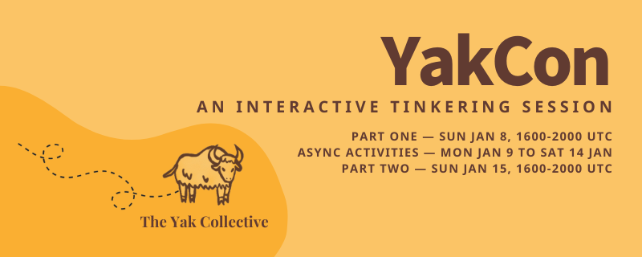
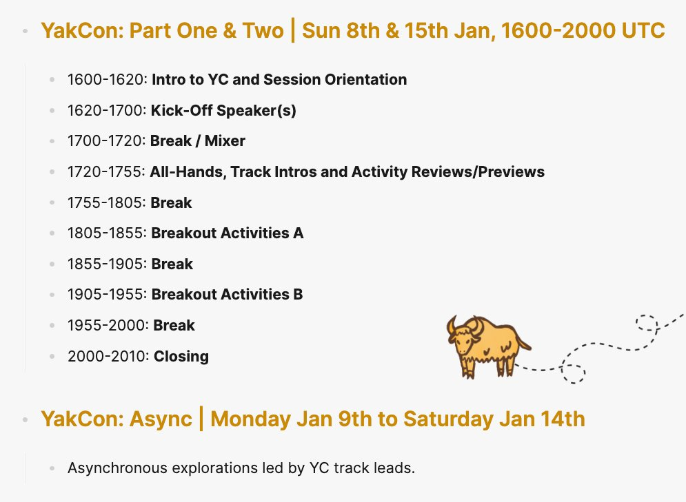

> Check out @HiredThought's new post, "Your Ideal January 1st"\. https://hiredthought\.com/2023/01/02/your\-ideal\-january\-1st/

 [Mon Jan 02 17:32:24 +0000 2023](https://twitter.com/yak_collective/status/1609965847828652033)

----

> Check out @randylubin's new post, "Gaming Like It’s 1927"\. https://blog\.randylubin\.com/gaming\-like\-it\-s\-1927

 [Mon Jan 02 21:55:39 +0000 2023](https://twitter.com/yak_collective/status/1610032096923328513)

----

> Check out @randylubin's new post, "2022 Recap"\. https://blog\.randylubin\.com/2022\-recap

 [Tue Jan 03 05:16:03 +0000 2023](https://twitter.com/yak_collective/status/1610142927287734278)

----

> Check out the latest edition of the Yak Talk newsletter, "Come join us at YakCon"\. https://yakcollective\.substack\.com/p/come\-join\-us\-at\-yakcon

 [Tue Jan 03 18:29:52 +0000 2023](https://twitter.com/yak_collective/status/1610342695930568706)

----

> Next week, the Yak Collective is doing the first YakCon: an interactive tinkering session\. Two virtual meetups on consecutive Sundays \(the 8th and 15th\) book\-ending a week of tinkering and exploration on our various activity tracks\. 
> 
> 

 [Tue Jan 03 18:32:53 +0000 2023](https://twitter.com/yak_collective/status/1610343456429473793)

----

Replying to [@yak\_collective](https://twitter.com/yak_collective/status/1610343456429473793)

> You can register here \(the event is free\): https://lu\.ma/yakcon  
>   
> The two bookend synchronous sessions will be 1600\-2000 UTC \(morning in the US, afternoons in Europe, late evening/night in Asia\)\. In between there will be curated activities on our Discord\.

 [Tue Jan 03 18:35:57 +0000 2023](https://twitter.com/yak_collective/status/1610344227053137921)

----

Replying to [@yak\_collective](https://twitter.com/yak_collective/status/1610344227053137921)

> You can learn more here: https://yakcollective\.substack\.com/p/come\-join\-us\-at\-yakcon

 [Tue Jan 03 18:37:23 +0000 2023](https://twitter.com/yak_collective/status/1610344587213824000)

----

> Check out @antlerboy's new post, "There’s a problem with \#AdaptiveLeadership\."\. https://antlerboy\.medium\.com/theres\-a\-problem\-with\-adaptiveleadership\-de47e1a93039?source\=rss\-97852f5a56ae\-\-\-\-\-\-2

 [Wed Jan 04 09:58:45 +0000 2023](https://twitter.com/yak_collective/status/1610576458623098883)

----

> Check out @vaughn\_tan's new newsletter, "Thinking together about not\-knowing\."\. https://uncertaintymindset\.substack\.com/p/thinking\-together\-about\-not\-knowing

 [Wed Jan 04 14:28:31 +0000 2023](https://twitter.com/yak_collective/status/1610644347371806720)

----

> Check out @sachinb91's new post, "\#20 Dating Advice For Men"\. https://summerlightning\.substack\.com/p/20\-dating\-advice\-for\-men

 [Thu Jan 05 04:27:51 +0000 2023](https://twitter.com/yak_collective/status/1610855572823228417)

----

> Check out @vgr's new newsletter, "Logics of Caring"\. https://studio\.ribbonfarm\.com/p/logics\-of\-caring

 [Sat Jan 07 05:22:25 +0000 2023](https://twitter.com/yak_collective/status/1611594079350964224)

----

> YakCon nears\.  
>   
> It's a week\-long interactive tinkering session hosted by the Yak Collective, with two virtual meetups \(on Sunday 8th and 15th Jan\) joined by a week of asynchronous activities \(curated by volunteer track leads\) on our Discord\.

 [Sat Jan 07 08:43:18 +0000 2023](https://twitter.com/yak_collective/status/1611644634471567362)

----

Replying to [@yak\_collective](https://twitter.com/yak_collective/status/1611644634471567362)

> You can register for it here: https://lu\.ma/yakcon  
>   
> \(And you probably should; it's approaching max viable capacity\)

 [Sat Jan 07 08:44:19 +0000 2023](https://twitter.com/yak_collective/status/1611644890873487362)

----

Replying to [@yak\_collective](https://twitter.com/yak_collective/status/1611644890873487362)

> Or you can stick around and learn more about what YakCon Part One, YakCon Part Two and the spanning Async Week actually involve\.\.\.

 [Sat Jan 07 08:44:43 +0000 2023](https://twitter.com/yak_collective/status/1611644993264914432)

----

Replying to [@yak\_collective](https://twitter.com/yak_collective/status/1611644993264914432)

> The plan for YakCon Part One and Two?  
>   
> Both sessions will begin with a quick introduction to the Yak Collective and either a quick review of 2022 \(Part One\) or a quick preview of 2023 \(Part Two\)\. This will be followed by our guest speakers\.

 [Sat Jan 07 08:45:23 +0000 2023](https://twitter.com/yak_collective/status/1611645158826573825)

----

Replying to [@yak\_collective](https://twitter.com/yak_collective/status/1611645158826573825)

> In Part One, @kilianbutler will give us some insight into productising machine learning research\.  
>   
> He knows a little \(actually, a lot\) about this; he's Head of Product at Papercup\. They're working on rapid automated dubbing that preserves the expressivity of the original content\.

 [Sat Jan 07 08:47:10 +0000 2023](https://twitter.com/yak_collective/status/1611645605851402246)

----

Replying to [@kilianbutler](https://twitter.com/yak_collective/status/1611645605851402246)

> In Part Two, we'll be hearing from @mcaseyjr and @DanGrover\.

 [Sat Jan 07 08:48:08 +0000 2023](https://twitter.com/yak_collective/status/1611645849183846400)

----

Replying to [@kilianbutler, @mcaseyjr, @DanGrover and @mcaseyjr](https://twitter.com/yak_collective/status/1611645849183846400)

> will be tackling a difficult question: "Can Crypto Close the $4 Trillion SME Financing Gap?"  
>   
> He specialises in investment and entrepreneurship in complex markets facing capital scarcity — whether that's by geography \(think Africa\) or vertical \(think life sciences\)\.

 [Sat Jan 07 08:48:59 +0000 2023](https://twitter.com/yak_collective/status/1611646066260058114)

----

Replying to [@kilianbutler, @mcaseyjr and @DanGrover](https://twitter.com/yak_collective/status/1611646066260058114)

> @DanGrover—designer, engineer, entrepreneur—will be exploring the possibility that simulation games might be what the world needs right now\.

 [Sat Jan 07 08:49:27 +0000 2023](https://twitter.com/yak_collective/status/1611646182660481024)

----

Replying to [@kilianbutler, @mcaseyjr and @DanGrover](https://twitter.com/yak_collective/status/1611646182660481024)

> Once the speakers have spoke \(and fielded some challenging questions\), we can get into the actual activities of YC\. The infinite games currently being played by @yak\_collective\.

 [Sat Jan 07 08:50:09 +0000 2023](https://twitter.com/yak_collective/status/1611646360259887104)

----

Replying to [@kilianbutler, @mcaseyjr and @DanGrover](https://twitter.com/yak_collective/status/1611646360259887104)

> We'll take a brief tour through:  
>   
> \- Rover building and distributed systems studies  
> \- The Fermi Gym  
> \- Governance studies  
> \- Infrastructure activities  
> \- YC's pop\-up consulting projects  
> \- YakFit  
>   
> Some other nascent activities will probably get a namedrop, too\.

 [Sat Jan 07 08:50:59 +0000 2023](https://twitter.com/yak_collective/status/1611646568800690177)

----

Replying to [@kilianbutler, @mcaseyjr and @DanGrover](https://twitter.com/yak_collective/status/1611646568800690177)

> In Part One, this round robin will be more focused on recent activity\. In Part Two, there'll be a little more focus on upcoming activities and possibilities\.

 [Sat Jan 07 08:51:25 +0000 2023](https://twitter.com/yak_collective/status/1611646678771138561)

----

Replying to [@kilianbutler, @mcaseyjr and @DanGrover](https://twitter.com/yak_collective/status/1611646678771138561)

> With the all\-hands ticked off, the breakouts begin\.  
>   
> In these, you'll be able to participate in a session based on some recurring YC activities:  
>   
> \- The Fermi Gym OR robotics and distributed systems studies \(Breakout A\)  
> \- Infrastructure OR governance studies \(Breakout B\)

 [Sat Jan 07 08:52:19 +0000 2023](https://twitter.com/yak_collective/status/1611646905947230215)

----

Replying to [@kilianbutler, @mcaseyjr and @DanGrover](https://twitter.com/yak_collective/status/1611646905947230215)

> Breakouts in Part One lay the groundwork for things taking place during Async Week\.  
>   
> "Async Week" is a fancy name for asynchronous activities \(curated by volunteer track leads\) on our Discord\.  
>   
> Breakouts in Part Two will bring together the efforts from Part One and Async Week\.

 [Sat Jan 07 08:53:04 +0000 2023](https://twitter.com/yak_collective/status/1611647093822603265)

----

Replying to [@kilianbutler, @mcaseyjr and @DanGrover](https://twitter.com/yak_collective/status/1611647093822603265)

> The end of the breakout sessions marks the end of the event for the day\. To close, there may be a few comments, some questions or even a discussion\.

 [Sat Jan 07 08:53:32 +0000 2023](https://twitter.com/yak_collective/status/1611647208750993409)

----

Replying to [@kilianbutler, @mcaseyjr and @DanGrover](https://twitter.com/yak_collective/status/1611647208750993409)

> And we can neither confirm nor deny the existence of a secret afterparty\.

 [Sat Jan 07 08:54:00 +0000 2023](https://twitter.com/yak_collective/status/1611647327579643904)

----

Replying to [@kilianbutler, @mcaseyjr and @DanGrover](https://twitter.com/yak_collective/status/1611647327579643904)

> YakCon sounds great, right? Register for it here: https://lu\.ma/yakcon 
> 
> 

 [Sat Jan 07 08:55:32 +0000 2023](https://twitter.com/yak_collective/status/1611647712729989122)

----

> YaKCon Part One is kicking off in 45 minutes\.  
>   
> ICYMI: it's a week\-long interactive tinkering session hosted by the Yak Collective, with two virtual meetups \(today and next Sunday\) joined by a week of asynchronous activities \(curated by volunteer track leads\) on our Discord\.

 [Sun Jan 08 15:15:54 +0000 2023](https://twitter.com/yak_collective/status/1612105824826019842)

----

Replying to [@yak\_collective](https://twitter.com/yak_collective/status/1612105824826019842)

> Head here to register for it: http://lu\.ma/yakcon\.

 [Sun Jan 08 15:17:27 +0000 2023](https://twitter.com/yak_collective/status/1612106212367077383)

----

Replying to [@yak\_collective](https://twitter.com/yak_collective/status/1612106212367077383)

> And head to the link below to get access to the YC Discord, the place for live event comments, discussion, questions, as well as activities during Async Week\.  
>   
> https://www\.yakcollective\.org/join\.html

 [Sun Jan 08 15:19:50 +0000 2023](https://twitter.com/yak_collective/status/1612106815004606467)

----

Replying to [@yak\_collective](https://twitter.com/yak_collective/status/1612106815004606467)

> The curious among you can check out the agenda for the sessions here: https://twitter\.com/yak\_collective/status/1611644634471567362

 [Sun Jan 08 15:22:02 +0000 2023](https://twitter.com/yak_collective/status/1612107365142102021)

----

> Kicking off YakCon, we have Killian Butler talking about productizing ML research\.

 [Sun Jan 08 16:28:06 +0000 2023](https://twitter.com/yak_collective/status/1612123992894353409)

----

> Intros to breakout sessions wrapping up now\.\.\. we'll kick off with fermi gym and distributed systems/robotics breakout groups, and then move on to governance studies and infrastructure breakouts\. Each is a hands\-on activity\.

 [Sun Jan 08 17:47:07 +0000 2023](https://twitter.com/yak_collective/status/1612143878014140416)

----

> Just wrapped first pair of YakCon breakout sessions\. Played a little distributed robotics paper game in one session, and solved some fermi estimation problems in the other\. Now in second set: infrastructure group and governance group\.

 [Sun Jan 08 19:24:34 +0000 2023](https://twitter.com/yak_collective/status/1612168403682463745)

----

> And that's a wrap for Part 1 of YakCon, a Good Time was had by all\. We now head into a week of asychronous activities on our Discord, followed by another Sunday session next week\.

 [Sun Jan 08 20:16:36 +0000 2023](https://twitter.com/yak_collective/status/1612181497582321666)

----

> Schedule for week \(all times UTC\):  
>   
> Mon, 1600: Distributed Systems  discusses cache coherence  
>   
> Tue, 2000: Rover group discusses SLAM in Unity  
>   
> Thu, 1600: @necopinus infrastructure office hour  
>   
> Fri, 1700: Governance group chat on rules  
>   
> All week: Fermi gym problems, YakFit chat

 [Sun Jan 08 20:22:46 +0000 2023](https://twitter.com/yak_collective/status/1612183050632462337)

----

> Check out @sachinb91's new post, "\#21 Fast Cars Save Friendships"\. https://summerlightning\.substack\.com/p/21\-fast\-cars\-save\-friendships

 [Mon Jan 09 02:17:56 +0000 2023](https://twitter.com/yak_collective/status/1612272431644680194)

----

> Check out @p\_millerd's new post, "Leaning Into Ambition &amp; Deeper Commitments: \(Still\) Enjoying The Journey in 2022"\. https://think\-boundless\.com/2022\-annual\-review/?utm\_source\=rss&utm\_medium\=rss&utm\_campaign\=2022\-annual\-review

 [Mon Jan 09 14:16:48 +0000 2023](https://twitter.com/yak_collective/status/1612453337080774658)

----

> YakCon: Part 1 review, Part 2 preview\. If you missed it, you can catch up here, and still sneak in for Part 2\. https://yakcollective\.substack\.com/p/yakcon\-part\-1\-review\-part\-2\-preview?sd\=pf

 [Mon Jan 09 21:52:47 +0000 2023](https://twitter.com/yak_collective/status/1612568088523984896)

----

> Check out the latest edition of the Yak Talk newsletter, "YakCon Part 1 Review, Part 2 Preview"\. https://yakcollective\.substack\.com/p/yakcon\-part\-1\-review\-part\-2\-preview

 [Mon Jan 09 21:59:32 +0000 2023](https://twitter.com/yak_collective/status/1612569789725122560)

----

> Yak Rover weekly meeting, discussing SLAM navigation in Unity game engine today\.

 [Tue Jan 10 20:14:57 +0000 2023](https://twitter.com/yak_collective/status/1612905859071496193)

----

> Check out @antlerboy's new post, "What haunts your fever dreams?"\. https://antlerboy\.medium\.com/what\-haunts\-your\-fever\-dreams\-9aefa653060d?source\=rss\-97852f5a56ae\-\-\-\-\-\-2

 [Wed Jan 11 09:23:29 +0000 2023](https://twitter.com/yak_collective/status/1613104299407511552)

----

> Check out @vaughn\_tan's new newsletter, "Introducing not\-knowing\."\. https://uncertaintymindset\.substack\.com/p/introducing\-not\-knowing

 [Wed Jan 11 12:26:04 +0000 2023](https://twitter.com/yak_collective/status/1613150248649596928)

----

> Check out @tomcritchlow's new post, "Building a New Project in Public"\. https://tomcritchlow\.com/2023/01/11/figma\-knowledge\-workers/

 [Wed Jan 11 22:04:01 +0000 2023](https://twitter.com/yak_collective/status/1613295693602381826)

----

> Check out @sachinb91's new post, "\#22 Are these vibes in the room with us right now?"\. https://summerlightning\.substack\.com/p/22\-are\-these\-vibes\-in\-the\-room\-with

 [Thu Jan 12 00:03:04 +0000 2023](https://twitter.com/yak_collective/status/1613325651372564480)

----

> Check out @evanwolf's new post, "Identity of Things: verifiable credentials are safer for IoT systems"\. https://wider\.team/2023/01/12/mapped\-oauth\-and\-verifiable\-credentials\-for\-iot/

 [Thu Jan 12 08:41:07 +0000 2023](https://twitter.com/yak_collective/status/1613456025100615682)

----

> Check out @anthilemoon's new post, "Change fatigue: When our brain’s adaptive capacity is depleted"\. https://nesslabs\.com/change\-fatigue?utm\_source\=rss&utm\_medium\=rss&utm\_campaign\=change\-fatigue

 [Thu Jan 12 17:10:26 +0000 2023](https://twitter.com/yak_collective/status/1613584196420751365)

----

> Check out @anthilemoon's new post, "Eliminating the productivity paradox with Tariq Rauf, founder and CEO of Qatalog"\. https://nesslabs\.com/qatalog\-featured\-tool?utm\_source\=rss&utm\_medium\=rss&utm\_campaign\=qatalog\-featured\-tool

 [Thu Jan 12 17:56:20 +0000 2023](https://twitter.com/yak_collective/status/1613595748985077795)

----

> Check out @sachinb91's new post, "\#23 Bible Belt Blues "\. https://summerlightning\.substack\.com/p/23\-bible\-belt\-blues

 [Fri Jan 13 20:27:35 +0000 2023](https://twitter.com/yak_collective/status/1613996199538790425)

----

> Part One and Async Week make up two thirds of YakCon, our week\-long interactive tinkering session\. Tomorrow's Part Two \(1600\-2000 UTC\) concludes the event\.

 [Sat Jan 14 17:22:39 +0000 2023](https://twitter.com/yak_collective/status/1614312046685732866)

----

Replying to [@yak\_collective](https://twitter.com/yak_collective/status/1614312046685732866)

> For Part One we had around thirty participants \(\+/\- 5\) for the full session, inc\. a mixture of active and inactive Yaks and newcomers\. General consensus: everyone enjoyed themselves\.

 [Sat Jan 14 17:23:12 +0000 2023](https://twitter.com/yak_collective/status/1614312187647893505)

----

Replying to [@yak\_collective](https://twitter.com/yak_collective/status/1614312187647893505)

> The talk that @kilianbutler gave to kick the session off was focused on productising machine learning research\. You can check it out on our YouTube channel here: https://www\.youtube\.com/watch?v\=Zl1\-zt0zQ28

 [Sat Jan 14 17:24:02 +0000 2023](https://twitter.com/yak_collective/status/1614312396125790208)

----

Replying to [@kilianbutler](https://twitter.com/yak_collective/status/1614312396125790208)

> Then—after whirlwind tours of YC activity in 2022—we got into two rounds of breakouts\.

 [Sat Jan 14 17:24:22 +0000 2023](https://twitter.com/yak_collective/status/1614312479227613184)

----

Replying to [@kilianbutler](https://twitter.com/yak_collective/status/1614312479227613184)

> The first breakout gave participants two choices:  
>   
> \- Enter the Fermi Gym and attempt a roughly\-right answer to a sensor\-focused problem  
> \- Orient themselves in the terrain of distributed robotics via a pebble automata puzzle

 [Sat Jan 14 17:24:55 +0000 2023](https://twitter.com/yak_collective/status/1614312618038001672)

----

Replying to [@kilianbutler](https://twitter.com/yak_collective/status/1614312618038001672)

> The second breakout gave participants another choice:  
>   
> \- Read an essay on rules and discuss their common invocations \(as models, as algorithms, as laws\)  
> \- Receive an introduction to YC's infrastructure and ideate opportunities for expansion, improvement and experimentation

 [Sat Jan 14 17:25:37 +0000 2023](https://twitter.com/yak_collective/status/1614312795876610048)

----

Replying to [@kilianbutler](https://twitter.com/yak_collective/status/1614312795876610048)

> Spanning the gap between last week's Part One and tomorrow's Part Two was Async Week, which saw a smattering of activity on the YC Discord\. This included reading drops, the regular recurring sync sessions and dialogues in different channels\.

 [Sat Jan 14 17:26:04 +0000 2023](https://twitter.com/yak_collective/status/1614312909529661444)

----

Replying to [@kilianbutler](https://twitter.com/yak_collective/status/1614312909529661444)

> Part Two will utilise the same essential structure as Part One:  
>   
> \- Guest speakers  
> \- All\-hands intro to YC and 2023 activity previews  
> \- Two rounds of breakouts \(Fermi Gym or distributed robotics; governance or infrastructure\)

 [Sat Jan 14 17:26:44 +0000 2023](https://twitter.com/yak_collective/status/1614313076081266689)

----

Replying to [@kilianbutler](https://twitter.com/yak_collective/status/1614313076081266689)

> The difference will be in our guest speakers\. For Part Two we have, rather appropriately, two speakers\.

 [Sat Jan 14 17:27:02 +0000 2023](https://twitter.com/yak_collective/status/1614313153159913474)

----

Replying to [@kilianbutler and @mcaseyjr](https://twitter.com/yak_collective/status/1614313153159913474)

> will be tackling the difficult question: "Can Crypto Close the $4 Trillion SME Financing Gap?"

 [Sat Jan 14 17:28:13 +0000 2023](https://twitter.com/yak_collective/status/1614313449806348288)

----

Replying to [@kilianbutler, @mcaseyjr and @mcaseyjr](https://twitter.com/yak_collective/status/1614313449806348288)

> specialises in investment and entrepreneurship in complex markets facing capital scarcity — whether that's by geography \(think Africa\) or vertical \(think life sciences\)\. It's an interesting playspace to be in\.

 [Sat Jan 14 17:28:40 +0000 2023](https://twitter.com/yak_collective/status/1614313563312594944)

----

Replying to [@kilianbutler and @mcaseyjr](https://twitter.com/yak_collective/status/1614313563312594944)

> For example, in the linked piece he highlighted four dynamics shaping global private markets today\.  
>   
> https://porticoadvisers\.com/2022/09/14/four\-dynamics/

 [Sat Jan 14 17:30:09 +0000 2023](https://twitter.com/yak_collective/status/1614313935699693568)

----

Replying to [@kilianbutler and @mcaseyjr](https://twitter.com/yak_collective/status/1614313935699693568)

> \.\.\.the dynamics:  
>   
> \- Primary fundraising is extremely challenging  
> \- Consolidation is transforming the strategic landscape  
> \- The difficult macro environment is necessitating novel liquidity solutions  
> \- Crypto is emerging as an institutional asset class

 [Sat Jan 14 17:30:37 +0000 2023](https://twitter.com/yak_collective/status/1614314053844828163)

----

Replying to [@kilianbutler and @mcaseyjr](https://twitter.com/yak_collective/status/1614314053844828163)

> @mcaseyjr'll be providing some insight into how these dynamics—and others—are unfolding and the impact they're having\.

 [Sat Jan 14 17:31:01 +0000 2023](https://twitter.com/yak_collective/status/1614314153249841163)

----

Replying to [@kilianbutler and @mcaseyjr](https://twitter.com/yak_collective/status/1614314153249841163)

> Our second speaker is @DanGrover\. He'll be expanding upon and contextualising his essay, Simulation Games Might Be What The World Needs Now\.  
>   
> http://dangrover\.com/blog/2022/09/24/sim\-games\.html\.

 [Sat Jan 14 17:32:14 +0000 2023](https://twitter.com/yak_collective/status/1614314459295531009)

----

Replying to [@kilianbutler, @mcaseyjr and @DanGrover](https://twitter.com/yak_collective/status/1614314459295531009)

> SPOILER ALERT: a screenshot of my favourite snippet from the essay\. 
> 
> 

 [Sat Jan 14 17:35:42 +0000 2023](https://twitter.com/yak_collective/status/1614315331001909255)

----

Replying to [@kilianbutler, @mcaseyjr and @DanGrover](https://twitter.com/yak_collective/status/1614315331001909255)

> And that's just the speakers\.  
>   
> YakCon Part Two is shaping up to be as fun as Part One\. Come and join the party\.  
>   
> Register for Part Two here: https://lu\.ma/yakcon

 [Sat Jan 14 17:37:07 +0000 2023](https://twitter.com/yak_collective/status/1614315689535315979)

----

Replying to [@kilianbutler, @mcaseyjr and @DanGrover](https://twitter.com/yak_collective/status/1614315689535315979)

> And don't forget to join the YC Discord beforehand: https://www\.yakcollective\.org/join\.html  
>   
> That'll be where all the fun peri\-event dialogue happens\.

 [Sat Jan 14 17:38:32 +0000 2023](https://twitter.com/yak_collective/status/1614316047653380098)

----

> Check out @vgr's new newsletter, "The Permaweird"\. https://studio\.ribbonfarm\.com/p/the\-permaweird

 [Sun Jan 15 02:22:48 +0000 2023](https://twitter.com/yak_collective/status/1614447980077092866)

----

> Check out the latest edition of the Yak Talk newsletter, "YakCon Part 2"\. https://yakcollective\.substack\.com/p/yakcon\-part\-2

 [Sun Jan 15 04:05:28 +0000 2023](https://twitter.com/yak_collective/status/1614473820168982530)

----

> YakCon Part 2 now underway\. Mike Casey talking about using crypto to close the 4T SME financing gap

 [Sun Jan 15 16:32:43 +0000 2023](https://twitter.com/yak_collective/status/1614661869008228360)

----

> YakCon: Now Dan Grover talking about simulation games

 [Sun Jan 15 16:46:24 +0000 2023](https://twitter.com/yak_collective/status/1614665315744616449)

----

> Check out @p\_millerd's new post, "Find The Others Community"\. https://think\-boundless\.com/find\-the\-others\-community/?utm\_source\=rss&utm\_medium\=rss&utm\_campaign\=find\-the\-others\-community

 [Mon Jan 16 02:46:20 +0000 2023](https://twitter.com/yak_collective/status/1614816292514447368)

----

> Check out @evanwolf's new post, "What if your identity ecosystem caused pollution? "\. https://wider\.team/2023/01/17/what\-if\-your\-identity\-ecosystem\-caused\-pollution/

 [Tue Jan 17 19:41:26 +0000 2023](https://twitter.com/yak_collective/status/1615434137615142913)

----

> Check out @antlerboy's new post, "The problem with consulting"\. https://antlerboy\.medium\.com/the\-problem\-with\-consulting\-99b5ae083cf?source\=rss\-97852f5a56ae\-\-\-\-\-\-2

 [Wed Jan 18 11:18:58 +0000 2023](https://twitter.com/yak_collective/status/1615670075696054274)

----

> Check out @vaughn\_tan's new newsletter, "Meaning\-making makes us human \(for now\)\."\. https://uncertaintymindset\.substack\.com/p/meaning\-making\-makes\-us\-human\-for

 [Wed Jan 18 12:33:53 +0000 2023](https://twitter.com/yak_collective/status/1615688930006892544)

----

> Check out @sachinb91's new post, "\#24 Jacket Lore"\. https://summerlightning\.substack\.com/p/24\-jacket\-lore

 [Wed Jan 18 19:12:35 +0000 2023](https://twitter.com/yak_collective/status/1615789265069162512)

----

> Check out @anthilemoon's new post, "Reinventing the digital assistant with George Levin, founder of Hints"\. https://nesslabs\.com/hints\-featured\-tool\-2?utm\_source\=rss&utm\_medium\=rss&utm\_campaign\=hints\-featured\-tool\-2

 [Thu Jan 19 15:51:54 +0000 2023](https://twitter.com/yak_collective/status/1616101148120735745)

----

> Check out @anthilemoon's new post, "The Paradox of Goals"\. https://nesslabs\.com/the\-paradox\-of\-goals?utm\_source\=rss&utm\_medium\=rss&utm\_campaign\=the\-paradox\-of\-goals

 [Thu Jan 19 18:15:38 +0000 2023](https://twitter.com/yak_collective/status/1616137322461814785)

----

> Check out @tomcritchlow's new post, "Digital Bricolage &amp; Web Foraging"\. https://tomcritchlow\.com/2023/01/20/digital\-bricolage/

 [Fri Jan 20 15:44:53 +0000 2023](https://twitter.com/yak_collective/status/1616461770469658625)

----

> Check out @vgr's new newsletter, "Disturbed Realities"\. https://studio\.ribbonfarm\.com/p/disturbed\-realities

 [Sat Jan 21 05:57:40 +0000 2023](https://twitter.com/yak_collective/status/1616676381928181760)

----

> Videos of each of the three talks from YakCon are now out\.

 [Sat Jan 21 10:51:53 +0000 2023](https://twitter.com/yak_collective/status/1616750425926950913)

----

Replying to [@yak\_collective](https://twitter.com/yak_collective/status/1616750425926950913)

> First up: @kilianbutler's talk on productising machine learning research\. https://www\.youtube\.com/watch?v\=Zl1\-zt0zQ28&list\=PLrJaiS43TxmZurvvz0ntOHRxALV6td6xz&index\=1

 [Sat Jan 21 10:52:53 +0000 2023](https://twitter.com/yak_collective/status/1616750674087231488)

----

Replying to [@kilianbutler](https://twitter.com/yak_collective/status/1616750674087231488)

> Second: @DanGrover's Simulation Games Might Be What the World Needs Now\. https://www\.youtube\.com/watch?v\=JZhn2hwhSYs

 [Sat Jan 21 10:54:51 +0000 2023](https://twitter.com/yak_collective/status/1616751171611287554)

----

Replying to [@kilianbutler and @DanGrover](https://twitter.com/yak_collective/status/1616751171611287554)

> Finally: @mcaseyjr's Can Crypto Close the $4 Trillion SME Financing Gap? https://www\.youtube\.com/watch?v\=MuroVDNtpJg

 [Sat Jan 21 10:56:06 +0000 2023](https://twitter.com/yak_collective/status/1616751485324349440)

----

> Check out @HiredThought's new post, "Things I do when I start a consulting project\."\. https://hiredthought\.com/2023/01/23/things\-i\-do\-when\-i\-start\-a\-consulting\-project/

 [Mon Jan 23 16:49:13 +0000 2023](https://twitter.com/yak_collective/status/1617565124407050259)

----

> Check out @randylubin's new post, "Near future worldbuilding with Dungeon23"\. https://blog\.randylubin\.com/near\-future\-worldbuilding\-with\-dungeon23

 [Mon Jan 23 16:57:48 +0000 2023](https://twitter.com/yak_collective/status/1617567284146454537)

----

> Check out @evanwolf's new post, "Wider Team had a verifiable 2022"\. https://wider\.team/2023/01/24/wider\-team\-had\-a\-verifiable\-2022/

 [Tue Jan 24 13:45:52 +0000 2023](https://twitter.com/yak_collective/status/1617881371632111625)

----

> Check out @sachinb91's new post, "\#25 Sauna Zeitgeist "\. https://summerlightning\.substack\.com/p/25\-sauna\-zeitgeist

 [Wed Jan 25 00:34:03 +0000 2023](https://twitter.com/yak_collective/status/1618044492531093505)

----

> Check out @antlerboy's new post, "I am in dispute with Hunter Boots"\. https://antlerboy\.medium\.com/i\-am\-in\-dispute\-with\-hunter\-boots\-3c7207f58d43?source\=rss\-97852f5a56ae\-\-\-\-\-\-2

 [Wed Jan 25 09:28:54 +0000 2023](https://twitter.com/yak_collective/status/1618179091831685120)

----

> Check out @anthilemoon's new post, "Thinking Beyond the Brain: Why Neuroplasticity is Overhyped"\. https://nesslabs\.com/neuroplasticity?utm\_source\=rss&utm\_medium\=rss&utm\_campaign\=neuroplasticity

 [Thu Jan 26 10:41:56 +0000 2023](https://twitter.com/yak_collective/status/1618559858113921024)

----

> Check out @anthilemoon's new post, "Free your notes with Laurent Cozic, founder of Joplin"\. https://nesslabs\.com/joplin\-featured\-tool?utm\_source\=rss&utm\_medium\=rss&utm\_campaign\=joplin\-featured\-tool

 [Thu Jan 26 14:54:01 +0000 2023](https://twitter.com/yak_collective/status/1618623298962604032)

----

> Check out @tomcritchlow's new post, "The Magic of Small Databases"\. https://tomcritchlow\.com/2023/01/27/small\-databases/

 [Fri Jan 27 19:22:15 +0000 2023](https://twitter.com/yak_collective/status/1619053189738758147)

----

> Check out @sachinb91's new post, "\#26 You Are So Money Baby"\. https://summerlightning\.substack\.com/p/26\-you\-are\-so\-money\-baby

 [Sat Jan 28 01:34:40 +0000 2023](https://twitter.com/yak_collective/status/1619146909762953217)

----

> Check out @vgr's new newsletter, "Contours of Thawing Time"\. https://studio\.ribbonfarm\.com/p/contours\-of\-thawing\-time

 [Sat Jan 28 03:53:23 +0000 2023](https://twitter.com/yak_collective/status/1619181822125948928)

----

> Check out @anthilemoon's new post, "Vectors of Action"\. https://nesslabs\.com/vectors\-of\-action?utm\_source\=rss&utm\_medium\=rss&utm\_campaign\=vectors\-of\-action

 [Tue Jan 31 17:21:41 +0000 2023](https://twitter.com/yak_collective/status/1620472400335740966)

----

> Check out @sachinb91's new post, "Below The Interface"\. https://summerlightning\.substack\.com/p/below\-the\-interface

 [Tue Jan 31 17:23:13 +0000 2023](https://twitter.com/yak_collective/status/1620472786257846292)