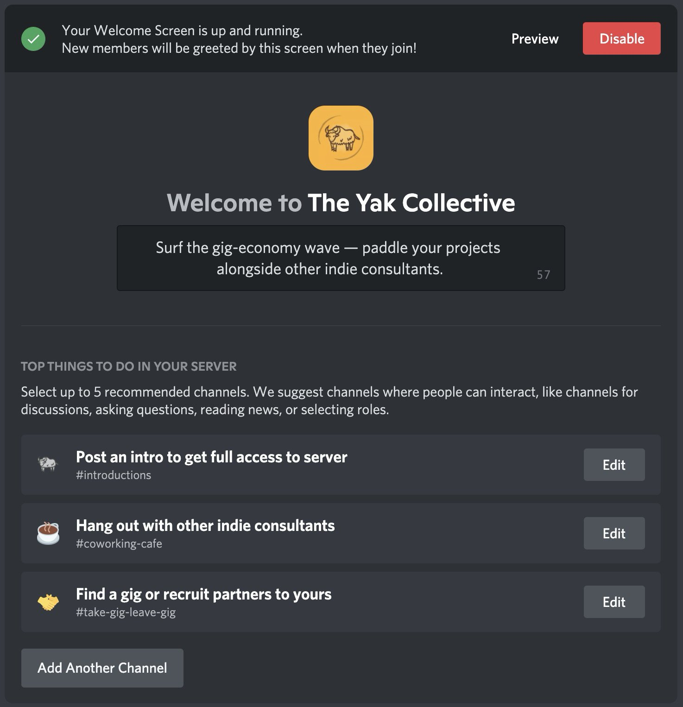
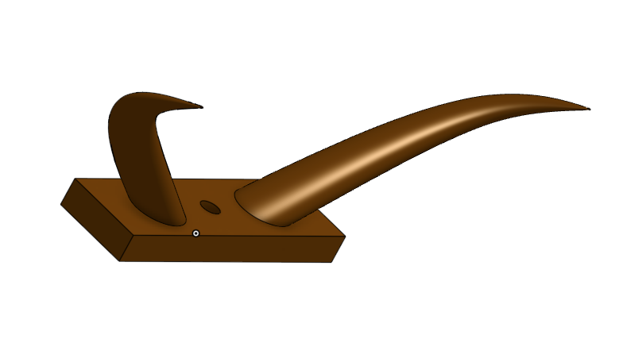
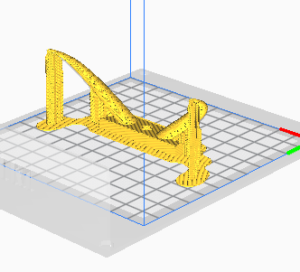
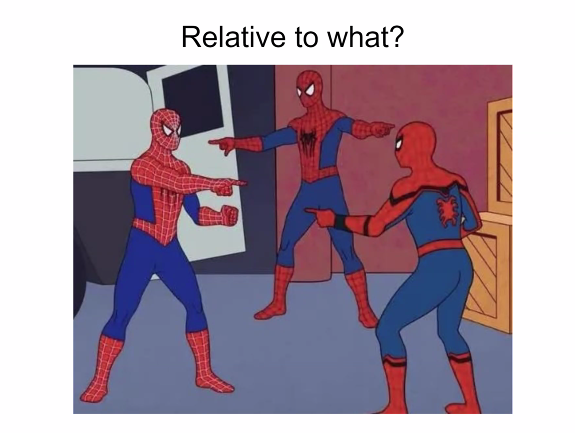

> Check out @antlerboy's new post, "The power of names, part two— @antlerboy"\. https://antlerboy\.medium\.com/the\-power\-of\-names\-part\-two\-antlerboy\-babe5604064c?source\=rss\-97852f5a56ae\-\-\-\-\-\-2

 [Thu Jul 01 07:28:37 +0000 2021](https://twitter.com/yak_collective/status/1410500576442519552)

----

> Today's featured yak: Jordan Peacock \(@hewhocutsdown\) \- CEO, Becoming Machinic; Founder, Sortilege https://www\.yakcollective\.org/members/peacock\-jordan/\#20210701

 [Thu Jul 01 07:34:37 +0000 2021](https://twitter.com/yak_collective/status/1410502083351089154)

----

> Check out @anthilemoon's new post, "Not\-to\-do list: a conscious way to break bad habits"\. https://nesslabs\.com/not\-to\-do\-list?utm\_source\=rss&utm\_medium\=rss&utm\_campaign\=not\-to\-do\-list

 [Thu Jul 01 11:20:44 +0000 2021](https://twitter.com/yak_collective/status/1410558990682103809)

----

> Check out @evanwolf's new post, "IDoT Tempos: Cadence, Lifecycles, and the Long Now"\. https://wider\.team/2021/07/01/time/

 [Thu Jul 01 19:15:07 +0000 2021](https://twitter.com/yak_collective/status/1410678371323977732)

----

> Check out @vgr's new newsletter, "The REALIST Stack"\. https://studio\.ribbonfarm\.com/p/the\-realist\-stack

 [Thu Jul 01 22:47:31 +0000 2021](https://twitter.com/yak_collective/status/1410731825010397184)

----

> Today's featured yak: Chris Clark \(@chrisclark1729\) \- Freelance Data Projects https://www\.yakcollective\.org/members/clark\-chris/\#20210702

 [Fri Jul 02 16:04:31 +0000 2021](https://twitter.com/yak_collective/status/1410992794643091459)

----

> \#yakborg hello world 2021\-07\-03 on this day

 [Sat Jul 03 15:15:10 +0000 2021](https://twitter.com/yak_collective/status/1411342762197360640)

----

> \#yakborg hanging out on the server with &lt;@\!700747835402092624&gt; working on &lt;\#809070388621082635&gt; 
> 
> 

 [Sat Jul 03 15:17:12 +0000 2021](https://twitter.com/yak_collective/status/1411343274908999681)

----

> hi @anurajenp looking forward to bots bots bots https://twitter\.com/yak\_collective/status/1411343274908999681

 [Sat Jul 03 15:18:47 +0000 2021](https://twitter.com/yak_collective/status/1411343673237848070)

----

> \#yakborg hoping to land on Mars soon

 [Sat Jul 03 15:31:02 +0000 2021](https://twitter.com/yak_collective/status/1411346752742039558)

----

> Today's featured yak: Kannen Ramsamy  \- Writer \| Communications \| Policy  
>  https://www\.yakcollective\.org/members/ramsamy\-kannen/\#20210703

 [Sat Jul 03 16:04:01 +0000 2021](https://twitter.com/yak_collective/status/1411355054460837888)

----

> \#yakborg rover season in full swing

 [Sat Jul 03 16:55:50 +0000 2021](https://twitter.com/yak_collective/status/1411368093616689161)

----

> \#yakborg tweets come via from our discord, join us there for deeper conversations

 [Sat Jul 03 20:39:34 +0000 2021](https://twitter.com/yak_collective/status/1411424398263869445)

----

> Today's featured yak: Alex Dobrenko \(@Dobrenkz\) \- Improviser / Writer / Filmmaker https://www\.yakcollective\.org/members/dobrenko\-alex/\#20210704

 [Sun Jul 04 16:04:20 +0000 2021](https://twitter.com/yak_collective/status/1411717522555035651)

----

> \#yakborg just finishing up this week's Yak trails project exhaust and Discord convos update\. coming shortly to https://yakcollective\.substack\.com

 [Sun Jul 04 21:14:12 +0000 2021](https://twitter.com/yak_collective/status/1411795503000477696)

----

> Check out the latest edition of the Yak Talk newsletter, "Yak trails 2021\-07\-04"\. https://yakcollective\.substack\.com/p/yak\-trails\-2021\-07\-04

 [Sun Jul 04 22:29:30 +0000 2021](https://twitter.com/yak_collective/status/1411814452668866563)

----

> annnnd it’s out there\. Yak trails for this week \| jd https://yakcollective\.substack\.com/p/yak\-trails\-2021\-07\-04 \#yakbot

 [Sun Jul 04 23:18:50 +0000 2021](https://twitter.com/yak_collective/status/1411826868827865089)

----

> And the Yaks stampede on\.\.\. this week's highlight outtake is @maierfenster slides from his internal rover project presentation https://twitter\.com/yak\_collective/status/1411814452668866563

 [Sun Jul 04 23:25:33 +0000 2021](https://twitter.com/yak_collective/status/1411828559295832067)

----

> RT @yak\_collective: Check out the latest edition of the Yak Talk newsletter, "Yak trails 2021\-07\-04"\. https://yakcollective\.substack\.com/p/yak\-trails\-2021\-07\-04

 [Sun Jul 04 23:25:55 +0000 2021](https://twitter.com/yak_collective/status/1411828652359053316)

----

> Check out @antlerboy's new post, "Moving into turbulence, uncertainty, novelty, and ambiguity"\. https://antlerboy\.medium\.com/moving\-into\-turbulence\-uncertainty\-novelty\-and\-ambiguity\-9ecb6dca8f3c?source\=rss\-97852f5a56ae\-\-\-\-\-\-2

 [Mon Jul 05 07:23:05 +0000 2021](https://twitter.com/yak_collective/status/1411948735337222146)

----

> Today's featured yak: Shreeda Segan \(@freeshreeda\) \- Design Thinker &amp; Writer https://www\.yakcollective\.org/members/segan\-shreeda/\#20210705

 [Mon Jul 05 07:24:40 +0000 2021](https://twitter.com/yak_collective/status/1411949133972246528)

----

> Check out @evanwolf's new post, "Smarter IoT and Healthcare"\. https://wider\.team/2021/07/05/aiandidot/

 [Mon Jul 05 16:30:05 +0000 2021](https://twitter.com/yak_collective/status/1412086392411283460)

----

> Check out @p\_millerd's new post, "Ben Hunt on Industrially Necessary Paths &amp; How To Live In The Now"\. https://think\-boundless\.com/ben\-hunt/?utm\_source\=rss&utm\_medium\=rss&utm\_campaign\=ben\-hunt

 [Tue Jul 06 13:11:20 +0000 2021](https://twitter.com/yak_collective/status/1412398762358722564)

----

> Today's featured yak: Thomas Hollands \(@tdoggyholhol\) \- Writing and Strategy https://www\.yakcollective\.org/members/hollands\-thomas/\#20210706

 [Tue Jul 06 13:14:28 +0000 2021](https://twitter.com/yak_collective/status/1412399552125095936)

----

> Check out @antlerboy's new post, "The critical role of procurement in public value outcomes"\. https://antlerboy\.medium\.com/the\-critical\-role\-of\-procurement\-in\-public\-value\-outcomes\-2c13f59db27?source\=rss\-97852f5a56ae\-\-\-\-\-\-2

 [Wed Jul 07 08:23:10 +0000 2021](https://twitter.com/yak_collective/status/1412688628761911297)

----

> Today's featured yak: Benjamin Taylor \(@antlerboy\) https://www\.yakcollective\.org/members/taylor\-benjamin/\#20210707

 [Wed Jul 07 08:24:08 +0000 2021](https://twitter.com/yak_collective/status/1412688875181445121)

----

> Check out @anthilemoon's new post, "Building a knowledge garden with Kosmik"\. https://nesslabs\.com/kosmik\-featured\-tool?utm\_source\=rss&utm\_medium\=rss&utm\_campaign\=kosmik\-featured\-tool

 [Wed Jul 07 14:40:35 +0000 2021](https://twitter.com/yak_collective/status/1412783607949713409)

----

> Check out @antlerboy's new post, "Transduction — leading transformation — Issue \#3"\. https://antlerboy\.medium\.com/transduction\-leading\-transformation\-issue\-3\-7b907c0923f5?source\=rss\-97852f5a56ae\-\-\-\-\-\-2

 [Wed Jul 07 20:53:20 +0000 2021](https://twitter.com/yak_collective/status/1412877413671972866)

----

> Check out @antlerboy's new post, "Essential practices for organisation — talk on 13 July"\. https://antlerboy\.medium\.com/essential\-practices\-for\-organisation\-talk\-on\-13\-july\-f3f1320f347c?source\=rss\-97852f5a56ae\-\-\-\-\-\-2

 [Thu Jul 08 07:28:17 +0000 2021](https://twitter.com/yak_collective/status/1413037205669490688)

----

> Today's featured yak: Murilo Loureiro  https://www\.yakcollective\.org/members/loureiro\-murilo/\#20210708

 [Thu Jul 08 07:34:37 +0000 2021](https://twitter.com/yak_collective/status/1413038798393561090)

----

> Check out @anthilemoon's new post, "The willpower paradox: when confident self\-talk becomes counterproductive"\. https://nesslabs\.com/willpower\-paradox?utm\_source\=rss&utm\_medium\=rss&utm\_campaign\=willpower\-paradox

 [Thu Jul 08 08:35:07 +0000 2021](https://twitter.com/yak_collective/status/1413054025654837249)

----

> Check out @vgr's new newsletter, "Accidental Designs \-\- 2"\. https://studio\.ribbonfarm\.com/p/accidental\-designs\-2

 [Thu Jul 08 22:57:49 +0000 2021](https://twitter.com/yak_collective/status/1413271131881095175)

----

> Alright round 3 of our collaborative meta\-analysis of governance readings\! Let's get going\. \#yakbot

 [Fri Jul 09 15:58:31 +0000 2021](https://twitter.com/yak_collective/status/1413527996598730754)

----

> Today's featured yak: Nathan Acks \(@nathan\_acks\) \- Armchair futurist\. Defense against the dark arts\. https://www\.yakcollective\.org/members/acks\-nathan/\#20210709

 [Fri Jul 09 16:09:19 +0000 2021](https://twitter.com/yak_collective/status/1413530717397692424)

----

> @anurajenp and @jdbb jumping on the Discord call channel right now to work bots and the Yak Collective get\-started\-here channel \#yakbot

 [Sat Jul 10 14:05:40 +0000 2021](https://twitter.com/yak_collective/status/1413861986698416130)

----

> Today's featured yak: Paul Millerd \(@p\_millerd\) https://www\.yakcollective\.org/members/millerd\-paul/\#20210710

 [Sat Jul 10 16:09:30 +0000 2021](https://twitter.com/yak_collective/status/1413893148208766977)

----

> made a 3d model of yak horns that can be 3d printed and bolted on to any of our robots\.\.\. forms in onshape\) \#yakbot 
> 
> 

 [Sun Jul 11 00:34:29 +0000 2021](https://twitter.com/yak_collective/status/1414020231874367488)

----

> okay support structure for 3d printing not too bad \#yakbot 
> 
> 

 [Sun Jul 11 00:38:50 +0000 2021](https://twitter.com/yak_collective/status/1414021328684953602)

----

> RT @yak\_collective: made a 3d model of yak horns that can be 3d printed and bolted on to any of our robots\.\.\. forms in onshape\) \#yakbot htt…

 [Sun Jul 11 00:41:41 +0000 2021](https://twitter.com/yak_collective/status/1414022046590275586)

----

> Today's featured yak: Charlie Bilsland \(@charliebilsland\) \- Space / Strategy / Commercials https://www\.yakcollective\.org/members/bilsland\-charlie/\#20210711

 [Sun Jul 11 16:04:11 +0000 2021](https://twitter.com/yak_collective/status/1414254199550976002)

----

> Check out @antlerboy's new post, "Wouldn’t it be good if you could improve your changes of successful change?"\. https://antlerboy\.medium\.com/wouldnt\-it\-be\-good\-if\-you\-could\-improve\-your\-changes\-of\-successful\-change\-cdf68fe69bda?source\=rss\-97852f5a56ae\-\-\-\-\-\-2

 [Mon Jul 12 07:03:33 +0000 2021](https://twitter.com/yak_collective/status/1414480534797967362)

----

> Today's featured yak: Rodrigo Pinto \(@Rodrigo\_plp\) https://www\.yakcollective\.org/members/pinto\-rodrigo/\#20210712

 [Mon Jul 12 07:04:24 +0000 2021](https://twitter.com/yak_collective/status/1414480748325789697)

----

> Check out @antlerboy's new post, "what could the role of government and public services look like in the 21st Century and beyond?"\. https://antlerboy\.medium\.com/what\-could\-the\-role\-of\-government\-and\-public\-services\-look\-like\-in\-the\-21st\-century\-and\-beyond\-7ac71ea38492?source\=rss\-97852f5a56ae\-\-\-\-\-\-2

 [Tue Jul 13 07:08:42 +0000 2021](https://twitter.com/yak_collective/status/1414844217659117568)

----

> Today's featured yak: Tom Critchlow \(@tomcritchlow\) https://www\.yakcollective\.org/members/critchlow\-tom/\#20210713

 [Tue Jul 13 07:14:26 +0000 2021](https://twitter.com/yak_collective/status/1414845660533252098)

----

> Check out @chrizbot's new post, "Teach your team by making learning look more like working"\. https://chrizbot\.medium\.com/teach\-your\-team\-by\-making\-learning\-look\-more\-like\-working\-ee20fff6c793?source\=rss\-ba6349c9c628\-\-\-\-\-\-2

 [Tue Jul 13 15:27:14 +0000 2021](https://twitter.com/yak_collective/status/1414969676300525574)

----

> Check out @antlerboy's new post, "Cybernetics is not the banana\."\. https://antlerboy\.medium\.com/cybernetics\-is\-not\-the\-banana\-ea35e49f8f24?source\=rss\-97852f5a56ae\-\-\-\-\-\-2

 [Wed Jul 14 07:13:40 +0000 2021](https://twitter.com/yak_collective/status/1415207856689799168)

----

> Today's featured yak: Amanda Reeves \(@WabiSabiFutures\) https://www\.yakcollective\.org/members/reeves\-amanda/\#20210714

 [Wed Jul 14 07:14:08 +0000 2021](https://twitter.com/yak_collective/status/1415207973811593217)

----

> Check out @anthilemoon's new post, "Protected: Taking back control of our time with the co\-founder of Hera"\. https://nesslabs\.com/hera\-featured\-tool?utm\_source\=rss&utm\_medium\=rss&utm\_campaign\=hera\-featured\-tool

 [Wed Jul 14 08:10:37 +0000 2021](https://twitter.com/yak_collective/status/1415222186126741504)

----

> Today's featured yak: Prashant Gandhi  https://www\.yakcollective\.org/members/gandhi\-prashant/\#20210715

 [Thu Jul 15 02:29:35 +0000 2021](https://twitter.com/yak_collective/status/1415498751637086210)

----

> Check out @antlerboy's new post, "This week I spoke at \#leanagileUK on ‘five core practices’ for effective organisations"\. https://antlerboy\.medium\.com/this\-week\-i\-spoke\-at\-leanagileuk\-on\-five\-core\-practices\-for\-effective\-organisations\-c3625b487de3?source\=rss\-97852f5a56ae\-\-\-\-\-\-2

 [Thu Jul 15 07:13:45 +0000 2021](https://twitter.com/yak_collective/status/1415570263744319494)

----

> Check out @anthilemoon's new post, "Is there a perfect productivity system?"\. https://nesslabs\.com/perfect\-productivity\-system?utm\_source\=rss&utm\_medium\=rss&utm\_campaign\=perfect\-productivity\-system

 [Thu Jul 15 07:40:40 +0000 2021](https://twitter.com/yak_collective/status/1415577035217514496)

----

> Check out @vgr's new newsletter, "Superhistory Redux"\. https://studio\.ribbonfarm\.com/p/superhistory\-redux

 [Fri Jul 16 02:42:07 +0000 2021](https://twitter.com/yak_collective/status/1415864293124358145)

----

> Today's featured yak: Toby Shorin \(@tobyshorin\) https://www\.yakcollective\.org/members/shorin\-toby/\#20210716

 [Fri Jul 16 02:49:26 +0000 2021](https://twitter.com/yak_collective/status/1415866132842655744)

----

> Today's featured yak: Jay Kalawar  https://www\.yakcollective\.org/members/kalawar\-jay/\#20210717

 [Sat Jul 17 16:04:33 +0000 2021](https://twitter.com/yak_collective/status/1416428621015756803)

----

> @nathan\_acks and @jdbb pushed the yak member portal close to launch on a Discord coworking call today 🔥 \#yakbot

 [Sat Jul 17 23:16:32 +0000 2021](https://twitter.com/yak_collective/status/1416537330131800073)

----

> Today's featured yak: Thomas Verhagen \(@thomasverhagen\) https://www\.yakcollective\.org/members/verhagen\-thomas/\#20210718

 [Sun Jul 18 16:04:28 +0000 2021](https://twitter.com/yak_collective/status/1416790985414164488)

----

> Check out @antlerboy's new post, "What does ‘freedom day’ mean to you?"\. https://antlerboy\.medium\.com/what\-does\-freedom\-day\-mean\-to\-you\-c4fb6b770d18?source\=rss\-97852f5a56ae\-\-\-\-\-\-2

 [Mon Jul 19 06:58:36 +0000 2021](https://twitter.com/yak_collective/status/1417016002550894592)

----

> Today's featured yak: Hugo Macedo \(@macedoh\) \- Humans are a curious subject https://www\.yakcollective\.org/members/macedo\-hugo/\#20210719

 [Mon Jul 19 07:04:21 +0000 2021](https://twitter.com/yak_collective/status/1417017448671465473)

----

> Intro to GPS session with @jaschawilcox for the yak rover meeting today

 [Tue Jul 20 04:49:56 +0000 2021](https://twitter.com/yak_collective/status/1417346009647120386)

----

Replying to [@jaschawilcox](https://twitter.com/yak_collective/status/1417346009647120386)

> The opening slide is promising\. We do things differently around here\. 
> 
> 

 [Tue Jul 20 04:51:56 +0000 2021](https://twitter.com/yak_collective/status/1417346512250572800)

----

> Today's featured yak: Maggie Appleton  https://www\.yakcollective\.org/members/appleton\-maggie/\#20210720

 [Tue Jul 20 16:04:41 +0000 2021](https://twitter.com/yak_collective/status/1417515818674442242)

----

> Check out @chrizbot's new post, "Communal computing, part 2"\. https://chrizbot\.medium\.com/communal\-computing\-part\-2\-f9f74087d929?source\=rss\-ba6349c9c628\-\-\-\-\-\-2

 [Tue Jul 20 16:12:18 +0000 2021](https://twitter.com/yak_collective/status/1417517733827198978)

----

> Check out @antlerboy's new post, "‘Honest, guv’nor’ — how to use change management for evil"\. https://antlerboy\.medium\.com/honest\-guvnor\-how\-to\-use\-change\-management\-for\-evil\-399fdcebd0f7?source\=rss\-97852f5a56ae\-\-\-\-\-\-2

 [Wed Jul 21 07:08:25 +0000 2021](https://twitter.com/yak_collective/status/1417743249846964226)

----

> Today's featured yak: Ben Mosior \(@HiredThought\) https://www\.yakcollective\.org/members/mosior\-ben/\#20210721

 [Wed Jul 21 07:14:33 +0000 2021](https://twitter.com/yak_collective/status/1417744793090863106)

----

> Check out @vgr's new newsletter, "One Tenth of a Second"\. https://studio\.ribbonfarm\.com/p/one\-tenth\-of\-a\-second

 [Wed Jul 21 23:52:49 +0000 2021](https://twitter.com/yak_collective/status/1417996013286170627)

----

> Check out @antlerboy's new post, "My little freedom day poll: results"\. https://antlerboy\.medium\.com/my\-little\-freedom\-day\-poll\-results\-1b588537780?source\=rss\-97852f5a56ae\-\-\-\-\-\-2

 [Thu Jul 22 07:33:45 +0000 2021](https://twitter.com/yak_collective/status/1418112012270329861)

----

> Today's featured yak: Chris Butler \(@chrizbot\) \- Chaotic good product manager https://www\.yakcollective\.org/members/butler\-chris/\#20210722

 [Thu Jul 22 07:39:38 +0000 2021](https://twitter.com/yak_collective/status/1418113494247948292)

----

> Check out @anthilemoon's new post, "How to quantify our focus with the founder of Rize"\. https://nesslabs\.com/rize\-featured\-tool?utm\_source\=rss&utm\_medium\=rss&utm\_campaign\=rize\-featured\-tool

 [Thu Jul 22 13:00:46 +0000 2021](https://twitter.com/yak_collective/status/1418194309250273282)

----

> Check out @anthilemoon's new post, "The rise of fake scientists"\. https://nesslabs\.com/the\-rise\-of\-fake\-scientists?utm\_source\=rss&utm\_medium\=rss&utm\_campaign\=the\-rise\-of\-fake\-scientists

 [Thu Jul 22 16:50:29 +0000 2021](https://twitter.com/yak_collective/status/1418252119371624451)

----

> Today's featured yak: Harry Pottash  \- Philosopher &amp; Investor https://www\.yakcollective\.org/members/pottash\-harry/\#20210723

 [Fri Jul 23 16:04:23 +0000 2021](https://twitter.com/yak_collective/status/1418602905502830593)

----

> Check out @chrizbot's new post, "World of Work\-Craft"\. https://chrizbot\.medium\.com/world\-of\-work\-craft\-1ee1d47e1f3c?source\=rss\-ba6349c9c628\-\-\-\-\-\-2

 [Fri Jul 23 16:12:19 +0000 2021](https://twitter.com/yak_collective/status/1418604900942958595)

----

> Check out @antlerboy's new post, "Transduction — leading transformation — Issue \#5"\. https://antlerboy\.medium\.com/transduction\-leading\-transformation\-issue\-5\-f11e4463a4f1?source\=rss\-97852f5a56ae\-\-\-\-\-\-2

 [Fri Jul 23 23:13:27 +0000 2021](https://twitter.com/yak_collective/status/1418710883975540742)

----

> Check out @antlerboy's new post, "Transduction — leading transformation — Issue \#4"\. https://antlerboy\.medium\.com/transduction\-leading\-transformation\-issue\-4\-5b0026dfeacf?source\=rss\-97852f5a56ae\-\-\-\-\-\-2

 [Fri Jul 23 23:13:27 +0000 2021](https://twitter.com/yak_collective/status/1418710882071236615)

----

> Check out @antlerboy's new post, "Transduction — leading transformation — Issue \#6"\. https://antlerboy\.medium\.com/transduction\-leading\-transformation\-issue\-6\-9e3537be9ba7?source\=rss\-97852f5a56ae\-\-\-\-\-\-2

 [Fri Jul 23 23:13:28 +0000 2021](https://twitter.com/yak_collective/status/1418710886383071232)

----

> Check out @antlerboy's new post, "Transduction — leading transformation — Issue \#7"\. https://antlerboy\.medium\.com/transduction\-leading\-transformation\-issue\-7\-9565dc44d1b5?source\=rss\-97852f5a56ae\-\-\-\-\-\-2

 [Sat Jul 24 07:13:10 +0000 2021](https://twitter.com/yak_collective/status/1418831607172055045)

----

> Today's featured yak: Vinay Débrou \(@vinaydebrou\) https://www\.yakcollective\.org/members/debrou\-vinay/\#20210724

 [Sat Jul 24 07:19:43 +0000 2021](https://twitter.com/yak_collective/status/1418833253956456451)

----

> watching @nathan\_acks and @anurajenp fire up https://docs\.sendgrid\.com/api\-reference/how\-to\-use\-the\-sendgrid\-v3\-api/ with https://www\.postman\.com/ 🧗🏽 @jdbb \#yakbot

 [Sat Jul 24 16:46:13 +0000 2021](https://twitter.com/yak_collective/status/1418975821281251328)

----

> Today's featured yak: Erik Sandberg  https://www\.yakcollective\.org/members/sandberg\-erik/\#20210725

 [Sun Jul 25 16:04:11 +0000 2021](https://twitter.com/yak_collective/status/1419327631137382401)

----

> Check out @randylubin's new post, "San Bruno Mountain"\. https://blog\.randylubin\.com/san\-bruno\-mountain

 [Sun Jul 25 21:00:29 +0000 2021](https://twitter.com/yak_collective/status/1419402197436096516)

----

> Check out @antlerboy's new post, "What pattern are you stuck in? Are you happy with it?"\. https://antlerboy\.medium\.com/what\-pattern\-are\-you\-stuck\-in\-are\-you\-happy\-with\-it\-333be483817e?source\=rss\-97852f5a56ae\-\-\-\-\-\-2

 [Mon Jul 26 09:53:16 +0000 2021](https://twitter.com/yak_collective/status/1419596675572719622)

----

> Today's featured yak: Victor Hill  https://www\.yakcollective\.org/members/hill\-victor/\#20210726

 [Mon Jul 26 09:54:46 +0000 2021](https://twitter.com/yak_collective/status/1419597050434490371)

----

> Excellent @yakrover meeting with guest @davidtlang talking about experiences from OpenROV project, which provided a lot of the inspiration for the Yak Rover project\.

 [Tue Jul 27 06:06:56 +0000 2021](https://twitter.com/yak_collective/status/1419902102134935555)

----

> Check out @antlerboy's new post, "CPORT task definition"\. https://antlerboy\.medium\.com/cport\-task\-definition\-ae1f8c24ccea?source\=rss\-97852f5a56ae\-\-\-\-\-\-2

 [Tue Jul 27 09:53:21 +0000 2021](https://twitter.com/yak_collective/status/1419959084204400640)

----

> Today's featured yak: Siva Swaroop  https://www\.yakcollective\.org/members/swaroop\-siva/\#20210727

 [Tue Jul 27 09:54:33 +0000 2021](https://twitter.com/yak_collective/status/1419959384822751259)

----

> Check out @antlerboy's new post, "The Human Knot\."\. https://antlerboy\.medium\.com/the\-human\-knot\-7793c971953c?source\=rss\-97852f5a56ae\-\-\-\-\-\-2

 [Wed Jul 28 07:58:31 +0000 2021](https://twitter.com/yak_collective/status/1420292571738345474)

----

> Today's featured yak: Anne\-Laure Le Cunff \(@anthilemoon\) https://www\.yakcollective\.org/members/le\-cunff\-anne\-laure/\#20210728

 [Wed Jul 28 07:59:15 +0000 2021](https://twitter.com/yak_collective/status/1420292754148560896)

----

> Check out @anthilemoon's new post, "Building a swarm of thoughts with the founders of Napkin"\. https://nesslabs\.com/napkin\-featured\-tool?utm\_source\=rss&utm\_medium\=rss&utm\_campaign\=napkin\-featured\-tool

 [Thu Jul 29 10:04:56 +0000 2021](https://twitter.com/yak_collective/status/1420686774909739010)

----

> Today's featured yak: Mike Wimsatt  https://www\.yakcollective\.org/members/wimsatt\-mike/\#20210729

 [Thu Jul 29 10:15:09 +0000 2021](https://twitter.com/yak_collective/status/1420689344323592193)

----

> Check out @antlerboy's new post, "What is work?"\. https://antlerboy\.medium\.com/what\-is\-work\-c5e1b7b564c8?source\=rss\-97852f5a56ae\-\-\-\-\-\-2

 [Thu Jul 29 12:30:44 +0000 2021](https://twitter.com/yak_collective/status/1420723465309523969)

----

> Check out @vgr's new newsletter, "Summer Break"\. https://studio\.ribbonfarm\.com/p/summer\-break

 [Thu Jul 29 21:17:19 +0000 2021](https://twitter.com/yak_collective/status/1420855984818372616)

----

> Today's featured yak: David McDougall \(@dmcdougall\) https://www\.yakcollective\.org/members/mcdougall\-david/\#20210730

 [Fri Jul 30 16:04:49 +0000 2021](https://twitter.com/yak_collective/status/1421139727370137601)

----

> Check out @antlerboy's new post, "Transduction — leading transformation — Issue \#8"\. https://antlerboy\.medium\.com/transduction\-leading\-transformation\-issue\-8\-105ba0f1004c?source\=rss\-97852f5a56ae\-\-\-\-\-\-2

 [Sat Jul 31 08:03:27 +0000 2021](https://twitter.com/yak_collective/status/1421380975947395074)

----

> Today's featured yak: Nita Baum \(@bfree\_live\) https://www\.yakcollective\.org/members/baum\-nita/\#20210731

 [Sat Jul 31 08:09:38 +0000 2021](https://twitter.com/yak_collective/status/1421382533904732160)